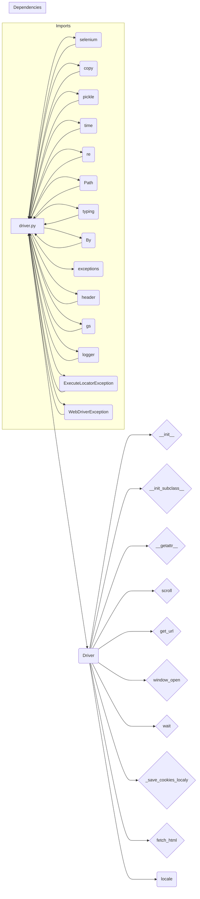

# Code Explanation for hypotez/src/webdriver/driver.py

## <input code>

```python
## \file hypotez/src/webdriver/driver.py
# -*- coding: utf-8 -*-\
#! venv/Scripts/python.exe
#! venv/bin/python/python3.12

"""
.. module:: src.webdriver.driver
   :platform: Windows, Unix
   :synopsis: Модуль для работы с веб-драйверами Selenium.

   Основное назначение класса `Driver` — обеспечение унифицированного интерфейса для работы с веб-драйверами Selenium.

   Основные функции:
   
   1. **Инициализация драйвера**: создание экземпляра Selenium WebDriver.
   2. **Навигация**: переход по URL, прокрутка и извлечение контента.
   3. **Работа с куки**: сохранение и управление куки.
   4. **Обработка исключений**: логирование ошибок.

Пример использования:
    >>> from selenium.webdriver import Chrome
    >>> driver = Driver(Chrome, executable_path='/path/to/chromedriver')
    >>> driver.get_url('https://example.com')
"""

MODE = 'dev'

import copy
import pickle
import time
import re
from pathlib import Path
from typing import Optional
from selenium.webdriver.common.by import By
from selenium.common.exceptions import (
    InvalidArgumentException,
    ElementClickInterceptedException,
    ElementNotInteractableException,
    ElementNotVisibleException
)
import header
from src import gs
from src.logger import logger
from src.logger.exceptions import ExecuteLocatorException, WebDriverException

class Driver:
    """
    .. class:: Driver
       :platform: Windows, Unix
       :synopsis: Унифицированный класс для взаимодействия с Selenium WebDriver.

    Класс обеспечивает удобный интерфейс для работы с различными драйверами, такими как Chrome, Firefox и Edge.

    Атрибуты:
        driver (selenium.webdriver): Экземпляр Selenium WebDriver.
    """

    def __init__(self, webdriver_cls, *args, **kwargs):
        """
        .. method:: __init__(self, webdriver_cls, *args, **kwargs)
        
        Инициализирует экземпляр класса Driver.

        :param webdriver_cls: Класс WebDriver, например Chrome или Firefox.
        :type webdriver_cls: type
        :param args: Позиционные аргументы для драйвера.
        :param kwargs: Ключевые аргументы для драйвера.

        Пример:
            >>> from selenium.webdriver import Chrome
            >>> driver = Driver(Chrome, executable_path='/path/to/chromedriver')
        """
        if not hasattr(webdriver_cls, 'get'):
            raise TypeError('`webdriver_cls` должен быть допустимым классом WebDriver.')
        self.driver = webdriver_cls(*args, **kwargs)

    # ... (rest of the code)
```

## <algorithm>

```mermaid
graph TD
    A[Driver Initialization] --> B{Validate webdriver_cls};
    B -- Valid -- C[Create WebDriver Instance];
    B -- Invalid -- D[Raise TypeError];
    C --> E[Driver Instance];
    E --> F[Method Calls (get_url, scroll, etc.)];
    F --> G[Selenium Actions];
    G --> H[Result (True/False)];
    F --> I[Error Handling];
    I -- Error -- J[Log Error];
    F --> K[Cookie Handling (save_cookies)];
    K -- Success -- L[Cookie Saved];
    K -- Failure -- J;
    J --> M[Return False or appropriate error];

    subgraph Cookie Handling
        E --> K;
    end
    
    subgraph Error Handling
        G --> J;
    end

```

## <mermaid>



## <explanation>

**Imports:**

- `selenium`:  Essential for interacting with Selenium WebDriver, providing the necessary classes and methods for web browser automation.
- `copy`, `pickle`, `time`, `re`, `Path`, `typing`: Standard Python libraries for general purpose functions (copying objects, saving/loading data, timing, regular expressions, path manipulation and type hinting).
- `header`: This import likely points to a module within the `hypotez` project,  responsible for project-specific header information (it's unclear given the lack of example code for this file).
- `gs`: This import likely points to a module containing global settings for the project, such as configuration values and paths.  It is important because it provides the path to the cookies file.
- `logger`, `ExecuteLocatorException`, `WebDriverException`:  These are custom modules from within the `src` package. They implement logging and potential custom exceptions related to the execution of locators and overall WebDriver operations; allowing better handling and tracking of errors in the `hypotez` project.

**Classes:**

- `Driver`: This class provides a unified interface for interacting with Selenium WebDriver instances.  It's designed to work with various webdrivers (Chrome, Firefox, Edge) by taking the webdriver class as a constructor argument and then using it to create an actual instance of the webdriver object. This allows the class to be reused and maintained without needing to make multiple different drivers. `__getattr__` proxies method calls on the underlying Selenium WebDriver instance to the current instance. `__init_subclass__` is used to enforce the presence of the `browser_name` attribute when subclassing the Driver class.  The `browser_name` is crucial for identification in the higher-level parts of the `hypotez` project.


**Functions:**

- `__init__`: Initializes a `Driver` instance, taking the `webdriver_cls` (e.g., `webdriver.Chrome`), and any necessary `args` and `kwargs` for the specific web driver to be used. This approach is flexible, allowing the use of various WebDriver types.
- `__init_subclass__`:  Used for type validation and enforcement of attributes to be included in subclassing `Driver`.
- `__getattr__`: This method is a powerful proxy that enables attribute access for a `Driver` object to seamlessly interact with the underlying selenium webdriver.   It is a proxy for the internal `driver` object's methods.  This means you can use any method that is available in the driver object on your Driver object, without needing to explicitly reference `self.driver`.
- `scroll`: Handles the scrolling logic, using a `carousel` helper function to either scroll up, down, or both.  Error handling is included to catch issues during scrolling.
- `get_url`: Navigates to a given URL, waits for the page to load, and saves the current URL, previous URL, and cookies. Robust error handling is crucial for handling potential `WebDriverException`, `InvalidArgumentException` or other issues during navigation.
- `window_open`: Opens a new tab (window) in the browser and optionally navigates to a given URL in the new tab.
- `wait`: Introduces a delay in the program. This is used for synchronization and waits for the page to fully load and render.
- `_save_cookies_localy`: Saves the current cookies to a file specified by the `gs.cookies_filepath` variable.
- `fetch_html`:  Retrieves HTML content from a file (local) or a URL. This function is critical for web scraping and handling both local and remote resources, while also checking for potential errors.

**Variables:**

- `MODE`: A string variable representing the current mode (likely 'dev' or 'prod').
- `logger`: A logger instance (from the `src.logger` module) used for logging operations.
- `gs.cookies_filepath`:  A global variable defining the file path for saving cookies.

**Potential Errors and Improvements:**

- **Error Handling:** While error handling is present, considering more specific exception types for better diagnostics (e.g., `NoSuchElementException` if an element cannot be found) would be beneficial.  The error handling in `get_url` is good example of how exceptions should be handled in production code.
- **Explicit `delay` parameter:** Adding more control over the `delay` parameter in different parts of the code (e.g., `scroll`) might allow for more fine-grained control over the timing of actions.
- **`fetch_html` function input validation:** Validate the `url` to ensure it's a valid file path or URL before proceeding to prevent unexpected behavior.
- **Type hints**: While type hints are used, consider improving them for `args` and `kwargs` in `__init__` for greater code clarity.


**Relationships with other parts of the project:**

- This `Driver` class is part of the `src.webdriver` package.
- It depends on `src.logger` for logging.
- It uses functions from the `gs` module for configuration information, and likely other parts of the `hypotez` project (such as data storage/retrieval modules) will be consuming or using this Driver object for handling web interactions.

This comprehensive analysis provides a thorough understanding of the `Driver` class and its role within the `hypotez` project. The explanations for imports, classes, methods, and other elements provide a detailed view of the code's functionality. Also, the code includes important annotations to enhance readability and maintainability.