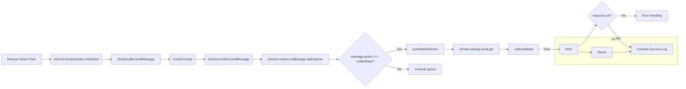

# Code Explanation: background.js

## <input code>

```javascript
// background.js

chrome.browserAction.onClicked.addListener(tab => {
    chrome.tabs.sendMessage(tab.id, { action: 'collectData', url: tab.url });
});

/**
 * 
 * This function listens for messages sent from other parts of the extension, 
 * such as content scripts or other background scripts, using the `chrome.runtime.sendMessage()` method.
*
Here's a breakdown of what each part does:
- `chrome.runtime.onMessage.addListener()`: 
This function sets up a listener for messages sent from other parts of the extension.
- `(message, sender, sendResponse) => { ... }`: This is an arrow function that defines what should happen when a message is received. It takes three parameters:
  - `message`: The message object sent from the sender.
  - `sender`: Information about the sender of the message, such as its ID and whether it is a tab or another extension.
  - `sendResponse`: A function that can be used to send a response back to the sender if needed.
- `if (message.action === 'collectData') { ... }`: This condition checks if the received message has a property named `action` with a value of `'collectData'`. This is often used to determine the purpose or type of the message.
- `sendDataToServer(message.url)`: If the received message has an action of `'collectData'`, this function calls another function named `sendDataToServer()` and passes the URL from the message as an argument. This typically triggers some action or behavior in response to the received message.
*/
chrome.runtime.onMessage.addListener((message, sender, sendResponse) => {
    if (message.action === 'collectData') {
        sendDataToServer(message.url);
    }
});

function sendDataToServer(url) {
    const serverUrl = 'http://127.0.0.1/hypotez.online/api/'; // Change to your server endpoint
    chrome.storage.local.get('collectedData', (result) => {
        const collectedData = result.collectedData;
        if (collectedData) {
            fetch(serverUrl, {
                method: 'POST',
                headers: {
                    'Content-Type': 'application/json'
                },
                body: JSON.stringify(collectedData)
            })
                .then(response => {
                    if (!response.ok) {
                        throw new Error('Failed to send data to server');
                    }
                    console.log('Data sent to server successfully');
                })
                .catch(error => {
                    console.error('Error sending data to server:', error);
                });
        } else {
            console.error('No collected data found');
        }
    });
}
```

## <algorithm>

**Workflow:**

1. **`chrome.browserAction.onClicked.addListener`:**  This listener waits for the browser action to be clicked.
    * **Input:** `tab` object with information about the active tab.
    * **Output:** Sends a message to the corresponding content script, carrying the tab's URL.
2. **`chrome.tabs.sendMessage`:** Sends a message to the active tab's content script.
    * **Input:** `tab.id` and the message object `action: 'collectData', url: tab.url`.
3. **`chrome.runtime.onMessage.addListener`:** This listener waits for messages from other parts of the extension.
    * **Input:**  The `message` object, `sender` details, and `sendResponse` callback.
    * **Output:** Calls `sendDataToServer` if the message action is `'collectData'`.
4. **`sendDataToServer`:**  Handles sending data to the server.
    * **Input:** `url` from the message.
    * **Output:** Sends a POST request to the server. Logs success/failure.
    * **Dependencies:** `chrome.storage.local` for getting collected data, `fetch` for making HTTP requests.

**Data Flow:**

Browser action click → `tab.url` → `chrome.tabs.sendMessage` → `message` to content script → `message` to background script → `sendDataToServer` function → HTTP POST request to server.

## <mermaid>



## <explanation>

**Imports (implied):**

- `chrome` is a built-in Chrome API for interacting with browser features.  No explicit import is needed in the file.

**Classes:**

- None.  The code is focused on functions and their interactions.

**Functions:**

- `chrome.browserAction.onClicked.addListener(tab => { ... })`: Listens for clicks on the browser action icon.  Takes the `tab` object as input.  This function sends a message to the content script.  No return value.

- `chrome.tabs.sendMessage(tab.id, { action: 'collectData', url: tab.url })`: Sends a message to a specific tab's content script. Takes the tab ID and a message object as input.  No return value.  Crucially sends the `url` of the active tab.

- `chrome.runtime.onMessage.addListener((message, sender, sendResponse) => { ... })`:  Listens for messages sent to the background script.  This is the core message handling logic. Takes a message, sender information, and a `sendResponse` function.  Critically checks for the `action: 'collectData'` property. No return value, but importantly, keeps the event listener open via `true` return.

- `sendDataToServer(url)`:  Sends data to the server via a POST request using the `fetch` API. Takes the `url` as input.  Does not return a value but logs success or failure messages via the `console`.


**Variables:**

- `serverUrl`: A string containing the URL of the server endpoint.  Hardcoded.  Should be replaced with a dynamically determined URL.
- `collectedData`:  The data to be sent to the server.  Retrieved via `chrome.storage.local`.  Could be a complex JSON object.  This is critical for retrieving data stored persistently in local storage.
- `message`:  A message object used for communication with other extension parts.
- `tab`:  A tab object containing details about the active tab.

**Potential Errors/Improvements:**

- **Error Handling in `sendDataToServer`:** While the code handles errors via `.catch`, it could be enhanced by logging more specific error messages (e.g., network errors) and potentially retrying the request with exponential backoff if necessary.
- **Security:** The `serverUrl` is hardcoded.  Consider using a configuration file or a more robust mechanism to avoid hardcoding sensitive information directly into the code.
- **Data Validation:** The code doesn't validate the structure of `collectedData` before sending it.  Add validation to prevent unexpected behavior on the server-side.
- **Robust URL handling:**  Check that `tab.url` exists and is a valid URL before using it.
- **Response Handling:** The `fetch` response is checked for `response.ok`. It could be improved with better error handling (e.g., checking the specific HTTP status code) and logging the full `response`.
- **Asynchronous Operations:** All asynchronous operations (i.e., `fetch`) are handled correctly, but be mindful of potential issues from chained promises.
- **Missing Error Checking for `chrome.storage`:** The code doesn't include error checks for getting data from local storage.  Add basic error checking.

**Relationship Chain:**

Browser Action Click → Background Script → Content Script (implicit) → Server.  The content script acts as a facilitator for collecting data and passing it to the background script for transmission. The browser action is the user trigger. The server is the endpoint for receiving the data.


```