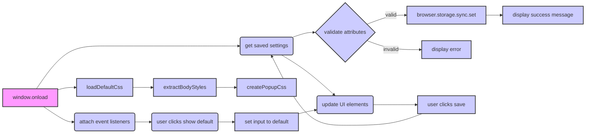

# Code Explanation for try_path_1.3.5/pages/options.js

## <input code>

```javascript
/* This Source Code Form is subject to the terms of the Mozilla Public
 * License, v. 2.0. If a copy of the MPL was not distributed with this
 * file, You can obtain one at http://mozilla.org/MPL/2.0/. */

(function (window, undefined) {
    "use strict";

    // alias
    var tx = tryxpath;
    var fu = tryxpath.functions;

    var document = window.document;

    const defaultAttributes = {
        "element": "data-tryxpath-element",
        "context": "data-tryxpath-context",
        "focused": "data-tryxpath-focused",
        "focusedAncestor": "data-tryxpath-focused-ancestor",
        "frame": "data-tryxpath-frame",
        "frameAncestor": "data-tryxpath-frame-ancestor"
    };

    const defaultPopupBodyStyles = {
        "width": "367px",
        "height": "auto"
    };

    var elementAttr, contextAttr, focusedAttr, ancestorAttr, frameAttr,
        frameAncestorAttr, style, popupBodyWidth, popupBodyHeight, message,
        testElement;

    function isValidAttrName(name) {
        try {
            testElement.setAttribute(name, "testValue");
        } catch (e) {
            return false;
        }
        return true;
    };

    function isValidAttrNames(names) {
        for (var p in names) {
            if (!isValidAttrName(names[p])) {
                return false;
            }
        }
        return true;
    };

    function isValidStyleLength(len) {
        return /^auto$|^[1-9]\d*px$/.test(len);
    };

    function loadDefaultCss() {
        return new Promise((resolve, reject) => {
            var req = new XMLHttpRequest();
            req.open("GET",
                     browser.runtime.getURL("/css/try_xpath_insert.css"));
            req.responseType = "text";
            req.onreadystatechange = function () {
                if (req.readyState === XMLHttpRequest.DONE) {
                    resolve(req.responseText);
                }
            };
            req.send();
        });
    };

    function extractBodyStyles(css) {
        var styles = {};

        var res = /width:(.+?);.*height:(.+?);/.exec(css);
        if (res) {
            styles.width = res[1];
            styles.height = res[2];
        } else {
            styles.width = "";
            styles.height = "";
        }

        return styles;
    };

    function createPopupCss(bodyStyles) {
        return "body{width:" + bodyStyles.width + ";height:"
            + bodyStyles.height + ";}";
    };

    window.addEventListener("load", () => {
        // ... (rest of the code)
    });

    testElement = document.createElement("div");

})(window);
```

## <algorithm>

This code manages the options for a browser extension (`tryxpath`). It loads default or user-provided attributes and styles, allowing users to customize how elements are identified and presented.


**Step 1: Initialization**


*   Aliases `tx` and `fu` are created for `tryxpath` and `tryxpath.functions`.
*   Default attribute values (`defaultAttributes`) and default popup body styles (`defaultPopupBodyStyles`) are defined.
*   Variables for DOM elements (e.g., `elementAttr`, `style`) are declared but not initialized.
*   `testElement` is created for attribute validation.


**Step 2: Validation Functions**


*   `isValidAttrName(name)`: Checks if an attribute name is valid by attempting to set it on `testElement`. Returns `true` if valid, `false` otherwise.
*   `isValidAttrNames(names)`: Checks if all attribute names in a list are valid.
*   `isValidStyleLength(len)`: Checks if a style length (like "367px" or "auto") is valid.


**Step 3: Loading and Extracting Styles**


*   `loadDefaultCss()`: Fetches default CSS from `/css/try_xpath_insert.css` using `XMLHttpRequest`.
*   `extractBodyStyles(css)`: Extracts width and height styles from CSS.


**Step 4: Creating Popup Styles**


*   `createPopupCss(bodyStyles)`: Constructs CSS for the popup body based on provided styles.


**Step 5: Event Handling**


*   `window.addEventListener("load", ...)`: This is the main event handler that gets triggered when the page loads.  This block handles loading of user's previous settings from storage, and updating the display with values from the `res` data received from chrome extension message passing.

*   Listeners are attached to elements like "save" and "show-default" to react to user actions.


**Step 6: Saving Options**


*   User changes to the option values are validated (invalid attributes and/or styles are blocked).
*   If validation passes, the `browser.storage.sync.set` function saves the user's updated configuration in sync storage and displays a success message on the page.


**Step 7: Loading Default Options**


*   "show-default" button sets input values to default values.


## <mermaid>



**Dependencies**:

*   `tryxpath`: Appears as an imported variable (`tx`, `fu`). This likely refers to another module or object in the project, providing the functions for handling tryxpath-related functionalities.
*   `browser.runtime.getURL()`:  Used to fetch the path to the CSS file. This indicates it's a browser extension API.
*   `XMLHttpRequest`: Used for fetching the CSS file.
*   `browser.storage.sync`: Used to persist data in browser storage. This is a browser extension API.
*   `Promise`: Part of JavaScript's standard built-in libraries for asynchronous operations.
*   `Object.create(null)`: Part of JavaScript's standard libraries.
*   `window.document`: DOM access (JavaScript standard).
*   `addEventListener`: Standard DOM event handling method.


## <explanation>

**Imports**:

*   `tryxpath`, `tryxpath.functions`:  These imports are crucial for accessing functions and variables within the `tryxpath` package, enabling the extension to utilize TryXPath's functionality and methods.  This implies a strong dependency between this file and the `tryxpath` module.

**Classes**:

There are no classes defined in this code.

**Functions**:

*   `isValidAttrName(name)`: Validates an attribute name.  It attempts to set the attribute on `testElement` to check for validity. This is important for avoiding errors during attribute setting.
*   `isValidAttrNames(names)`: Validates multiple attribute names, improving robustness.
*   `isValidStyleLength(len)`: Validates if a style length string (e.g., '367px' or 'auto') is correctly formatted. This prevents errors in handling style values.
*   `loadDefaultCss()`: Fetches default CSS from a file (`/css/try_xpath_insert.css`).  It's crucial for providing default styles to the extension. The asynchronous nature of the `Promise` is important for avoiding blocking the UI.
*   `extractBodyStyles(css)`: Extracts style values (width, height) from a CSS string.
*   `createPopupCss(bodyStyles)`: Creates a CSS style block for the popup's body, setting width and height based on the values in the bodyStyles object.
*   `onError`: This is likely a utility function from the `tryxpath.functions` module used for handling errors during asynchronous operations.

**Variables**:

*   `defaultAttributes`, `defaultPopupBodyStyles`: Configuration values defining default settings.
*   Variables like `elementAttr`, `contextAttr` etc.: These are DOM elements (references to HTML elements).
*   `message`:  HTML element used for displaying messages to the user.
*   `testElement`: A temporary element used to validate attribute names.

**Potential Errors and Improvements:**

*   Error Handling: While there's basic error handling with `try...catch`, more robust error handling within `isValidAttrName` and potentially other parts of the code could be added. Specifically, the error handling around `browser.storage.sync.set` could be improved, as there may be unexpected behavior depending on the browser's functionality.
*   CSS Parsing: The extraction method could be improved if the CSS strings are more complex. A more robust CSS parsing library could be a more appropriate solution if the format or complexity is unpredictable.
*   Data Validation:  The validation functions could be further strengthened.


**Relationships with other parts of the project:**

The code heavily relies on the `tryxpath` module for functionalities related to the extension (`tx`, `fu` variables).  Also, the use of `browser.runtime` and `browser.storage` indicates this is part of a browser extension.  The `try_xpath_insert.css` file is assumed to be part of the extension's resources, containing styles used by the extension's popup.


This analysis provides a comprehensive understanding of the code's functionality, including its dependencies, data flow, potential errors, and areas for improvement.