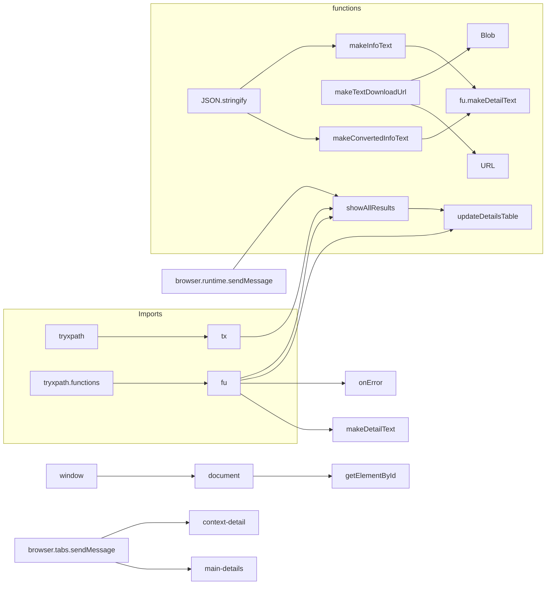

# Code Explanation: show_all_results.js

## <input code>

```javascript
/* This Source Code Form is subject to the terms of the Mozilla Public
 * License, v. 2.0. If a copy of the MPL was not distributed with this
 * file, You can obtain one at http://mozilla.org/MPL/2.0/. */

(function (window, undefined) {
    "use strict";

    // alias
    var tx = tryxpath;
    var fu = tryxpath.functions;

    var document = window.document;

    var detailKeys = ["type", "name", "value", "textContent"];
    var headerValues = ["Type", "Name", "Value", "textContent"];
    var relatedTabId;
    var relatedFrameId;
    var executionId;

    // ... (rest of the code)
```

## <algorithm>

**Workflow Diagram:**

```mermaid
graph TD
    A[Browser Load Event] --> B{Check results from runtime};
    B -- success --> C[showAllResults(results)];
    B -- failure --> D[Error Handling];
    C --> E[Update UI elements (context and main)];
    E --> F[Update context detail table];
    E --> G[Update main detail table];
    F -- success --> H[Download buttons handled];
    G -- success --> H[Download buttons handled];
    D --> H;
    H --> I[Event listeners set on context and main tables];
    I --> J[Event Handling (focusContextItem or focusItem)];
    J --> K[Send Message to content script];

    subgraph "Event Handling - context"
        J --> L[event: focusContextItem, executionId];
    end

    subgraph "Event Handling - main"
        J --> M[event: focusItem, executionId, index];
    end

    K --> N[Content script handles focus request];
```

**Example Data Flow:**

1. **Browser Load Event:**  A browser load event triggers the execution of the code block.
2. **Check results:** The code checks if a message was received from the browser runtime (`browser.runtime.sendMessage`) which contains `results` object.
3. **`showAllResults(results)`:** This function updates the UI elements, displaying message, title, URL, frame ID and other context/main information.
4. **Update UI Elements:** Specific elements in the HTML page are updated with data from `results`.
5. **Update Tables:** `updateDetailsTable` function is used to dynamically create and update tables in the page using the information present in the `results`.
6. **Event Listeners:** Event listeners are attached to the tables for handling user interactions (clicking buttons).

## <mermaid>



**Explanation of Dependencies:**

* `tryxpath`, `tryxpath.functions`: These likely reference other JavaScript modules or files within the same project (`src` package) that contain functions for working with XPath expressions, potentially for parsing, processing, and generating results for the UI. `tx` and `fu` are aliases used for concise code.
* `Blob`, `URL`: These are built-in JavaScript objects for creating Blob and URL objects. They are essential for creating downloadable files.

## <explanation>

**Imports:**

* The `tryxpath` and `tryxpath.functions` imports are crucial for interaction with a likely local library or code base containing XPath functionality. This functionality is necessary for processing the data fetched and transforming it for display.  Without the functionality within `tryxpath` and `tryxpath.functions`, the code wouldn't be able to parse and operate on XPath data.


**Classes:**

* There are no classes defined in this code.

**Functions:**

* **`showAllResults(results)`:** Takes a `results` object as input, assumed to contain data for populating the UI. Updates various HTML elements on the page with details from the `results` object.  It calls `updateDetailsTable` to generate and update display tables for detailed context and main information.
* **`makeTextDownloadUrl(text)`:** Creates a download URL for the given `text`. Uses the `Blob` and `URL.createObjectURL` to create a downloadable file containing the given text. The use of `Blob` ensures the content is correctly packaged as a file and download link.
* **`makeInfoText(results)`:** Formats a string that contains the result information for export. It uses string templating (`\n`), producing an exported string, and handles the formatting of the `results` object for clarity.
* **`makeConvertedInfoText(results)`:** Similar to `makeInfoText`, but converts relevant data to JSON format for the export before formatting. The main difference is that JSON string conversion is applied to specific fields before inclusion in the string.
* **`fu.updateDetailsTable(tbody, details, options)`:**  Likely a utility function from `tryxpath.functions` responsible for populating a given `tbody` (HTML table) with data from the `details` array, based on the given `detailKeys` and `headerValues`.


**Variables:**

* `detailKeys`, `headerValues`: Arrays defining the structure of the table data and its corresponding column headers.
* `relatedTabId`, `relatedFrameId`, `executionId`: Variables to store data relevant to the browser tab, frame, and execution context, allowing communication between the UI and content scripts.

**Potential Errors/Improvements:**

* **Error Handling:** While `catch(fu.onError)` is used in multiple places, the exact implementation of `fu.onError` is not shown. It's essential to have robust error handling to gracefully deal with potential issues (e.g., network problems, invalid data, missing elements).
* **`JSON.stringify` in `makeConvertedInfoText`:** This function modifies the UI update to add JSON output for specific fields. It's good practice to make sure that the JSON conversion won't introduce undesirable effects or break the code's logic in case of non-JSON or invalid data in those fields.
* **Data Validation:** It might be beneficial to validate the structure of the `results` object before using its properties to avoid unexpected errors.

**Relationship Chain:**

This code likely belongs to a browser extension (`hypotez`) focused on interactively inspecting and manipulating web content (XPath expressions).  `browser.runtime.sendMessage` and `browser.tabs.sendMessage` indicate communication with browser-extension runtime, suggesting dependency on extension APIs for cross-tab or cross-page interactions.  The handling of `relatedTabId`, `relatedFrameId`, and `executionId` strongly implies a communication protocol between the browser extension and the page content for passing information and requests.
```
Browser Extension (hypotez) -> show_all_results.js -> HTML UI -> Browser API (browser.runtime) -> Content Script
```