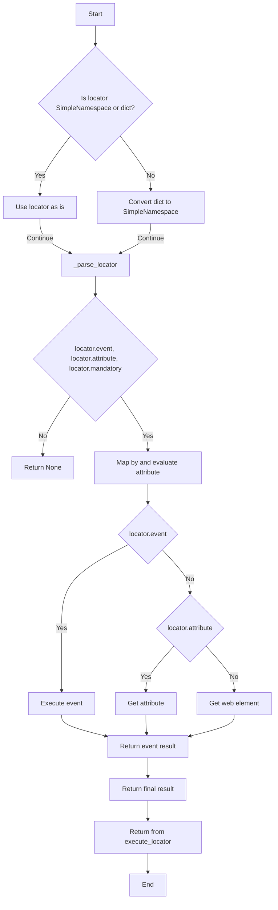
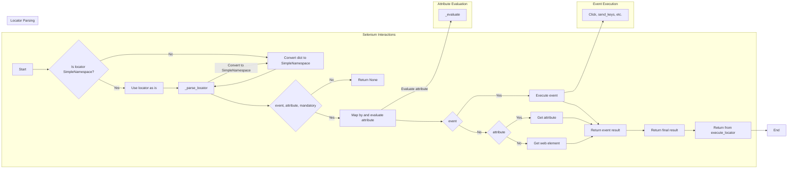

# Code Explanation for hypotez/src/webdriver/executor.py

```python
## File hypotez/src/webdriver/executor.py
# -*- coding: utf-8 -*-\n#! venv/Scripts/python.exe\n#! venv/bin/python/python3.12\n

"""
.. module: src.webdriver 
	:platform: Windows, Unix
	:synopsis: The purpose of the `executor` module is to perform actions on web elements based on provided configurations, 
known as "locators." These configurations (or "locators") are dictionaries containing information on how to locate and interact with elements on a web page. The module provides the following functionalities:

1. **Parsing and Handling Locators**: Converts dictionaries with configurations into `SimpleNamespace` objects, 
allowing for flexible manipulation of locator data.

2. **Interacting with Web Elements**: Depending on the provided data, the module can perform various actions such as clicks, 
sending messages, executing events, and retrieving attributes from web elements.

3. **Error Handling**: The module supports continuing execution in case of an error, allowing for the processing of web pages 
that might have unstable elements or require a special approach.

4. **Support for Multiple Locator Types**: Handles both single and multiple locators, enabling the identification and interaction 
with one or several web elements simultaneously.

This module provides flexibility and versatility in working with web elements, enabling the automation of complex web interaction scenarios.


"""
MODE = 'dev'

import asyncio
import re
import sys
import time
from dataclasses import dataclass, field
from enum import Enum
from pathlib import Path
from types import SimpleNamespace
from typing import BinaryIO, ByteString, Dict, List, Optional, Union

from selenium.common.exceptions import (
    ElementClickInterceptedException,
    JavascriptException,
    NoSuchElementException,
    StaleElementReferenceException,  # Этот импорт был добавлен
    TimeoutException,
)
from selenium.webdriver.common.action_chains import ActionChains
from selenium.webdriver.common.by import By
from selenium.webdriver.common.keys import Keys
from selenium.webdriver.remote.webelement import WebElement
from selenium.webdriver.support import expected_conditions as EC
from selenium.webdriver.support.ui import WebDriverWait

import header
from src import gs
from src.logger import logger
from src.logger.exceptions import (
    DefaultSettingsException,
    ExecuteLocatorException,
    WebDriverException,
)

from src.utils.jjson import j_dumps, j_loads, j_loads_ns
from src.utils.printer import pprint
from src.utils.image import save_png
```

## <algorithm>



## <mermaid>



**Dependencies Analysis:**

* **`selenium`**: Used for interacting with web browsers. Crucial for web automation tasks.
* **`asyncio`**: Enables asynchronous operations, preventing blocking in web interactions.
* **`re`**: Used for regular expressions. Likely for pattern matching and data extraction.
* **`time`**: Allows for time-related operations, including delays in automation scripts.
* **`dataclasses`**: Used to define the `ExecuteLocator` class, making it structured and maintainable.
* **`enum`**: Used potentially to define enumeration types for states or actions.
* **`pathlib`**: Helps in interacting with files and paths, likely needed for resource handling.
* **`types`**: For working with types in a flexible way, creating `SimpleNamespace` instances.
* **`typing`**: Enables typing hints and enhances code clarity and maintainability.
* **`header`**: Likely a custom module or file containing other parts of the project's initialization, imports, etc.
* **`src.gs`**: A module related to the general handling of project settings.
* **`src.logger`**: Provides logging capabilities. Imports related to exceptions for logging.
* **`src.logger.exceptions`**: Contains custom exceptions for logging, indicating specific errors in web driver interaction.
* **`src.utils.jjson`**: A module related to JSON handling. Likely for structured data management and interchange.
* **`src.utils.printer`**:  A custom module for formatting and printing output data.
* **`src.utils.image`**: For handling image operations (screenshots), often used to capture images in the course of testing.


## <explanation>

**Imports:**

- The `selenium` library is crucial for web automation.
- `asyncio` is critical to prevent blocking during web interactions.
- Other imports (`time`, `re`, `dataclasses`, etc.) provide necessary functionalities for data handling, logging, and exception management.
- `header` likely initializes the project and/or imports necessary modules from the src package.
- `gs`, `logger`, `jjson`, `printer`, and `image` are part of the project's internal libraries, possibly for handling general settings, logging, JSON parsing, output formatting, and image handling, respectively.  Custom exceptions from `src.logger.exceptions` are used for proper error handling.


**Classes:**

- **`ExecuteLocator`**:
    - Represents a handler for executing locators (actions on web elements).
    - `driver`: Selenium driver instance.
    - `actions`: Action chains (Selenium).
    - `by_mapping`: Dictionary mapping locator strings (XPATH, ID, etc.) to the corresponding Selenium `By` enum values.
    - `mode`: String; typically used for debugging output.
    - `__post_init__`: Initializes ActionChains based on the driver instance.
    - `execute_locator`: Main method to execute locator instructions based on the provided `locator` data. It handles error handling and different types of actions (clicks, sends messages, get attributes).  The use of `SimpleNamespace` allows flexibility in the input format, accepting either dictionaries or `SimpleNamespace` objects directly. This makes the code more versatile.
    - `evaluate_locator`: Processes the `locator.attribute` and resolves potential variables.
    - `get_attribute_by_locator`, `get_webelement_by_locator`, `get_webelement_as_screenshot`, `execute_event`, `send_message`, are methods for handling interactions, attribute retrieval, screenshots, and executing events on web elements.


**Functions:**

- `evaluate_locator`: Processes locator attributes, replacing placeholders with their actual values using regular expressions.
- `get_attribute_by_locator`: Retrieves attributes (values) from web elements based on the `locator.attribute`'s value. The implementation correctly handles single and multiple elements and different attribute formats.
- `get_webelement_by_locator`: Finds web elements using the specified locator and wait conditions. It handles various wait conditions using `WebDriverWait` and `expected_conditions`.
- `get_webelement_as_screenshot`: Captures screenshots of the located web element.
- `execute_event`: Executes actions on web elements based on `locator.event` with error handling. It deals with various events like `click`, `pause`, `upload_media`, `screenshot`, `clear`, `send_keys`, and `type`.  It parses event strings, handles potential errors, and supports asynchronous operations using `asyncio.to_thread`.
- `send_message`: Sends a message to a web element; using an asynchronous method to send a message character by character. This avoids blocking.


**Variables:**

- `MODE`: String; typically 'debug' or 'dev', influencing logging.

**Potential Errors/Improvements:**

- **Error Handling:** While error handling is present, more specific exception handling could improve error reporting and provide better context.

- **Code Clarity:** In `execute_event`, some logic for handling events could be separated into smaller, more manageable functions for improved readability.

- **Robustness:** The code assumes valid locator formats and correctly handles different input types. Error handling within the methods could be further strengthened.

- **`asyncio.to_thread`:** While this function is necessary for integrating blocking operations into an asynchronous environment, ensure that the operations within these threads won't introduce timing inconsistencies and that there's no deadlock risk.


**Relationships:**

- `Executor` depends on `selenium`, `asyncio`, and other `src` modules.
- `Executor` interacts with the `driver` object and performs actions on web elements.
- The `driver` object is likely an instance from the Selenium WebDriver, providing the connection to the browser.
- This module relies on other parts of the project (settings, logging, JSON, etc.) via the `src` package.

The code implements a robust system for interacting with web elements, employing asynchronous operations, and includes detailed error handling.  It's well-structured and adaptable to various automation tasks, but further analysis could potentially uncover further opportunities for performance improvements.