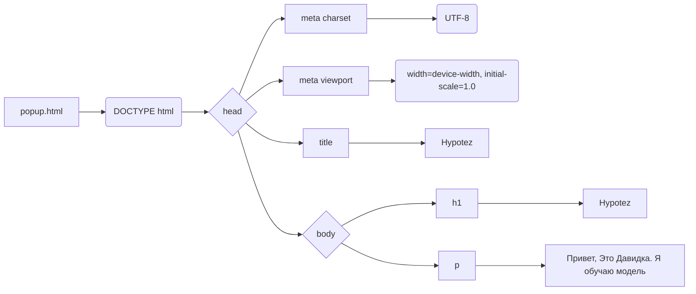

# Code Explanation for popup.html

## <input code>

```html
## \file hypotez/src/webdriver/firefox/extentions/test_extention - Copy/html/popup.html
# -*- coding: utf-8 -*-\
#! venv/Scripts/python.exe

""" module: src.webdriver.firefox.extentions.test_extention - Copy.html """
MODE = 'debug'
<!DOCTYPE html>
<html lang="en">
<head>
    <meta charset="UTF-8">
    <meta name="viewport" content="width=device-width, initial-scale=1.0">
    <title>Hypotez</title>
</head>
<body>
    <h1>Hypotez</h1>
    <p>Привет, Это Давидка. Я обучаю модель</p>
</body>
</html>
```

## <algorithm>

This code is an HTML file, not a Python script.  Therefore, there's no algorithm in the traditional sense of a series of steps.  The HTML defines the structure and content of a web page.

## <mermaid>



**Explanation of Dependencies (for a hypothetical Python-based extension):**

This HTML file, by itself, doesn't have dependencies in the traditional programming sense.  The dependency would be on the *JavaScript* code that might interact with it or any external style sheets. If this was part of a browser extension, the imports would be JavaScript or other extension-related files. The `mermaid` diagram, therefore, reflects the structure and content within the HTML document alone.

## <explanation>

* **Imports:**  There are no imports in the traditional sense.  This is pure HTML.  If this were part of a browser extension, imports would be JavaScript files, not Python files.
* **Classes:** No classes are defined.
* **Functions:** No functions are defined.
* **Variables:** `MODE = 'debug'` is a variable, and it's declared in the HTML file. This will likely be used by a JavaScript code that runs in a browser to either set a flag (debug mode) or display different output on the browser (if MODE = 'debug' or 'release').
* **Potential Errors/Improvements:**

    * **No JavaScript:** The HTML itself does not contain any JavaScript to interact with it.  Any interactivity would need to be added in a separate JavaScript file.
    * **Missing Style:**  The page lacks any styling.  External style sheets (`<link>` tags) would be needed for formatting.
    * **Limited Functionality:** The HTML just shows a heading and a paragraph.  More interactive or dynamic content would require JavaScript and potentially other technologies.


**Chain of Relationships (Hypothetical):**

This HTML file (`popup.html`) would likely be used by a browser extension.  The extension (a broader project) would contain JavaScript code that would interact with this HTML, handle user interactions (e.g., from buttons clicked), potentially make API calls, and manage the overall behavior of the extension.  The chain would be:

```
Browser Extension (Project) --> JavaScript (Interaction Logic) --> popup.html (UI Display)
```

This hypothetical relationship assumes a Firefox extension project, where `popup.html` is one component of the user interface of a broader extension project.  A Python script or other backend might be used for the logic behind the JavaScript that interact with the HTML.
```