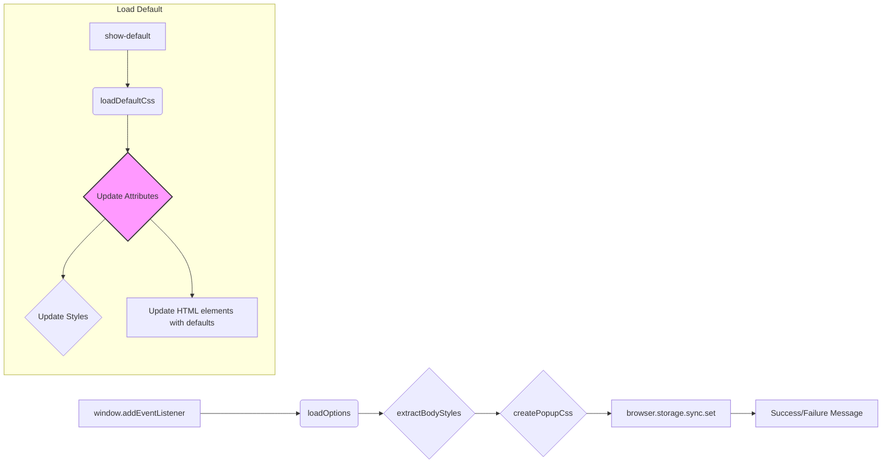

# Code Explanation: try_path_1.3.5/pages/options.js

## <input code>

```javascript
/* This Source Code Form is subject to the terms of the Mozilla Public
 * License, v. 2.0. If a copy of the MPL was not distributed with this
 * file, You can obtain one at http://mozilla.org/MPL/2.0/. */

(function (window, undefined) {
    "use strict";

    // alias
    var tx = tryxpath;
    var fu = tryxpath.functions;

    var document = window.document;

    const defaultAttributes = {
        "element": "data-tryxpath-element",
        "context": "data-tryxpath-context",
        "focused": "data-tryxpath-focused",
        "focusedAncestor": "data-tryxpath-focused-ancestor",
        "frame": "data-tryxpath-frame",
        "frameAncestor": "data-tryxpath-frame-ancestor"
    };

    const defaultPopupBodyStyles = {
        "width": "367px",
        "height": "auto"
    };

    var elementAttr, contextAttr, focusedAttr, ancestorAttr, frameAttr,
        frameAncestorAttr, style, popupBodyWidth, popupBodyHeight, message,
        testElement;

    function isValidAttrName(name) {
        try {
            testElement.setAttribute(name, "testValue");
        } catch (e) {
            return false;
        }
        return true;
    };

    function isValidAttrNames(names) {
        for (var p in names) {
            if (!isValidAttrName(names[p])) {
                return false;
            }
        }
        return true;
    };

    function isValidStyleLength(len) {
        return /^auto$|^[1-9]\d*px$/.test(len);
    };

    function loadDefaultCss() {
        return new Promise((resolve, reject) => {
            var req = new XMLHttpRequest();
            req.open("GET",
                     browser.runtime.getURL("/css/try_xpath_insert.css"));
            req.responseType = "text";
            req.onreadystatechange = function () {
                if (req.readyState === XMLHttpRequest.DONE) {
                    resolve(req.responseText);
                }
            };
            req.send();
        });
    };

    // ... (rest of the code)
```

## <algorithm>

**Step 1:** Initialize variables and aliases.

```
- tx = tryxpath;
- fu = tryxpath.functions;
- Get the browser's document.
- Initialize default attributes and styles.
- Initialize variables for HTML elements.
```

**Step 2:** Load options from browser storage.

```
- Send a message to the background script to request options.
- Update the HTML elements with the received options.
```

**Step 3:** Handle "Save" button click.

```
- Gather user input from HTML elements.
- Validate attributes and styles (check for invalid names or length).
- If validation fails, display an error message.
- Otherwise, update browser storage with the new options.
- Display success or failure message.
```

**Step 4:** Handle "Show Default" button click.

```
- Load default attributes and styles.
- Load default CSS.
- Update the HTML elements with the default values.
```

## <mermaid>



**Dependencies:**

*   `tryxpath`:  Used for aliases `tx` and `fu`. Implied dependency on a TryXpath module containing the `functions` object.
*   `browser`:  Used for `browser.runtime.sendMessage` and `browser.storage.sync.set`, indicating interaction with browser APIs.  Likely a browser extension context.
*   `XMLHttpRequest`: Standard browser API for making HTTP requests, used for loading the default CSS.


## <explanation>

**Imports:**

*   No explicit imports are shown; however, the use of `tryxpath`, `browser`, and `XMLHttpRequest` suggest dependencies on external libraries or browser APIs.

**Classes:**

*   No classes are defined in this code; only functions and variables.

**Functions:**

*   `isValidAttrName(name)`: Checks if an attribute name is valid by trying to set it on an element.
*   `isValidAttrNames(names)`: Validates multiple attribute names.
*   `isValidStyleLength(len)`: Checks if a CSS length value is valid.
*   `loadDefaultCss()`: Loads default CSS from a file (`/css/try_xpath_insert.css`) using `XMLHttpRequest`. Returns a Promise for asynchronous execution.
*   `extractBodyStyles(css)`: Extracts width and height styles from a CSS string.
*   `createPopupCss(bodyStyles)`: Creates a CSS string for the popup body based on provided styles.

**Variables:**

*   `defaultAttributes`, `defaultPopupBodyStyles`: Contain default values for attributes and popup body styles.
*   `elementAttr`, `contextAttr`, etc.: Hold references to HTML elements in the page, used for data retrieval and updating.
*   `message`: Used for displaying success or error messages.

**Potential Errors/Improvements:**

*   Error handling in `isValidAttrName` and `loadDefaultCss` is quite basic.  Consider more robust error handling to catch specific errors that might occur during attribute setting and request handling.
*   Lack of input sanitization when setting attribute values. If these values are coming from user input, then appropriate sanitization is crucial to prevent XSS vulnerabilities.
*   The `isValidStyleLength` regex might need further adjustment depending on more specific style values that are considered valid or invalid.

**Relationships:**

This code is part of a browser extension. It communicates with the background script to load options and save changes to browser storage.  It interacts with HTML elements to retrieve and display user input and the results of operations. The loadDefaultCSS functionality indicates the existence of a CSS file or resource used in the context of this extension.

**Overall:**

The code is well-structured for handling user input and interacting with browser APIs.  The use of Promises improves the asynchronous nature of the code.  Adding more robust error handling and input validation, particularly in regard to user input, would make the code more resilient.