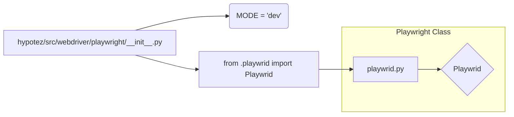

# Code Explanation for hypotez/src/webdriver/playwright/__init__.py

## <input code>

```python
## \file hypotez/src/webdriver/playwright/__init__.py
# -*- coding: utf-8 -*-\
#! venv/Scripts/python.exe
#! venv/bin/python/python3.12

"""
.. module: src.webdriver.playwright 
	:platform: Windows, Unix
	:synopsis:
https://chatgpt.com/share/67428d3f-6b18-800d-a585-eb414eef60e2
"""
MODE = 'dev'

from .playwrid import Playwrid
```

## <algorithm>

The code defines a module `hypotez/src/webdriver/playwright/__init__.py`.  It initializes a global variable `MODE` to 'dev'.  The critical part is the import statement. This import statement pulls in the `Playwrid` class definition from a module named `playwrid` within the same directory structure (`./playwrid`).

**Step-by-Step Workflow (Conceptual):**

1. **Initialization:** The module sets the global variable `MODE` to 'dev' (likely for development mode).

2. **Import:** The `from .playwrid import Playwrid` line imports the `Playwrid` class from the module `playwrid`.  This means that elsewhere in the project, if `Playwrid` is needed, it can be referenced without having to specify the full path to `hypotez/src/webdriver/playwright/playwrid.py`.


## <mermaid>



**Dependency Analysis:**

The mermaid diagram shows the primary dependency: `playwrid.py` is imported into `__init__.py`.  The `__init__.py` file acts as an entry point for the `playwrid` module's contents.

## <explanation>

**Imports:**

- `from .playwrid import Playwrid`: This line imports the `Playwrid` class from the module `playwrid`.  The `.` indicates that the module being imported is in the same directory as the current file.  This is a standard Python import pattern for organizing related modules within a package.


**Classes:**

- **Playwrid:** The `Playwrid` class is defined in `playwrid.py` (not shown in this file).  Its specific attributes and methods are not visible here, but this initialization indicates that `Playwrid` is likely a class for interacting with a web driver (e.g., using Playwright).

**Functions:**

- There are no functions defined directly within this `__init__.py` file.

**Variables:**

- `MODE = 'dev'`: A global variable that sets a mode (likely for the application).  Its value ('dev') suggests it's a development mode.

**Potential Errors or Improvements:**

- The docstrings are somewhat incomplete (the link provided in the synopsis is invalid). More detailed documentation about the `Playwrid` class would be beneficial for maintainability and understanding the intended purpose of this class/module.


**Relationships with Other Parts of the Project:**

- This `__init__.py` file acts as a crucial intermediary. Any part of the `hypotez` project that requires Playwright interaction will use the `Playwrid` class from `playwrid.py`, and access it via the `__init__.py` file, which is expected to exist at the `playwright` package level.  This suggests that `Playwrid` (and therefore the methods and attributes within) will need to be used to interact with Playwright functionality for controlling browser interactions.