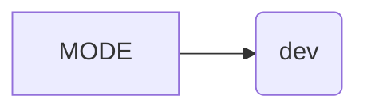

# <input code>

```python
## \file hypotez/src/webdriver/playwright/pw_executor.py
# -*- coding: utf-8 -*-\
#! venv/Scripts/python.exe
#! venv/bin/python/python3.12

"""
.. module: src.webdriver.playwright 
	:platform: Windows, Unix
	:synopsis:

"""
MODE = 'dev'
```

# <algorithm>

This file appears to be a Python module, likely part of a larger project related to web automation using Playwright.  The code itself is very minimal. It only defines a single variable, `MODE`, and sets its value to `'dev'`.


# <mermaid>



**Dependencies Analysis:**

The code imports no other modules. The `#!` lines are shebangs (interpreter directives) that specify which Python interpreter to use, and the `# -*- coding: utf-8 -*-` line specifies the encoding.  The docstring suggests this module is intended to be part of a larger framework or library related to webdrivers.


# <explanation>

* **Imports:** There are no imports. This file likely imports necessary modules from other Python files in the `hypotez` project.

* **Classes:** No classes are defined.

* **Functions:** No functions are defined.

* **Variables:**
    * `MODE`: This is a global string variable. Its value is set to `'dev'`, which suggests this variable might be used for configuring the mode of operation (e.g., development, testing, production).  The absence of any other usage suggests it's likely to be utilized later in the project by other modules that use `pw_executor.py`.


* **Potential Errors/Improvements:**
    * The file has a shebang and `coding` definition which is conventional, but the code is extremely basic and almost useless by itself.  A clear indication of how `MODE` is used is lacking. This file probably should be part of a larger context to have meaning and usage.
    * The docstring is somewhat uninformative; it needs a better description of how it interacts with other parts of the codebase.


**Relationships with other parts of the project:**

The `MODE` variable likely acts as a configuration parameter that influences the behaviour of other modules within the `hypotez` project, especially those related to web testing or Playwright automation. Without more code, the precise relationship and how `MODE` is utilized by other parts of the project are impossible to determine. This likely interacts directly with other parts of the `src.webdriver` package or potentially other packages within the `hypotez` project.