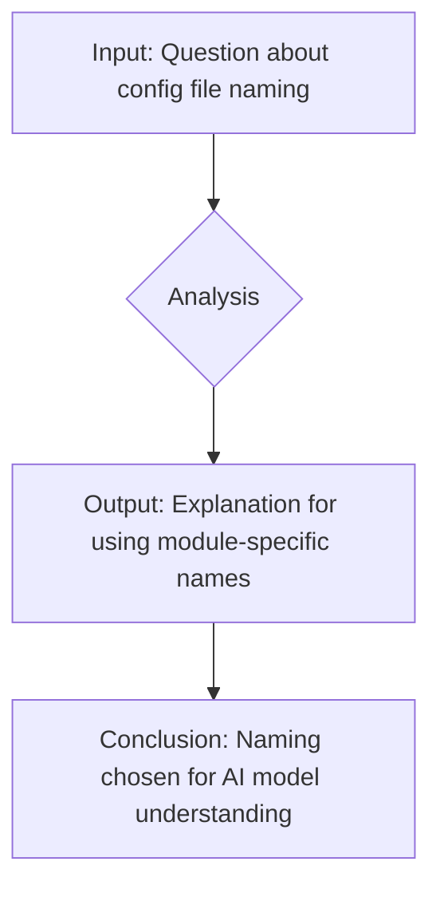

```
**ВОПРОС** Почему конфигурационные файлы называются по имени модуля (например: `suppliers.json`)?  
Не лучше ли было их именовать `config.json`?  
**ОТВЕТ** Имена файлов сделаны для удобства понимания моделями ИИ.
```

**<algorithm>**



No code is present for algorithm analysis. The provided text is a question-answer pair.

**<explanation>**

The provided text is a question-and-answer pair, not code.  It's a discussion about the naming convention for configuration files.

* **Imports:** There are no imports in this text.
* **Classes:** There are no classes.
* **Functions:** There are no functions.
* **Variables:** No variables are defined.
* **Potential Errors/Areas for Improvement:** There are no errors in the text itself; however, the question of whether using module-specific file names (`suppliers.json`) is better than a generic name (`config.json`) depends on the context of the larger project.  If the configuration settings are highly modularized and related to specific modules (like suppliers), naming them by module could improve code organization and readability for humans and potentially also facilitate automation and maintainability. However, a generic `config.json` might be simpler for simple projects or if the configuration isn't tightly coupled to modules.


**Relationships to Other Parts of the Project (if applicable):**

The relationship would depend on the larger project structure.  If there are modules for `suppliers`, `products`, etc., the `suppliers.json` file likely contains configuration settings specific to the `suppliers` module. The example provided does not offer enough context to establish clear relationships.


**Summary:**

The text is a natural language exchange, not code.  It discusses a design decision regarding file naming conventions, not actual implementation.  Further context from the surrounding project is needed for a more complete analysis.