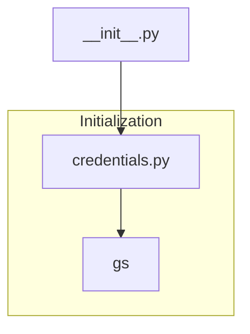

1. **<input code>**

```python
## \file hypotez/src/__init__.py
# -*- coding: utf-8 -*-
#! venv/Scripts/python.exe
#! venv/bin/python/python3.12

"""
.. module: src 
	:platform: Windows, Unix
	:synopsis:

"""
MODE = 'dev'

from .credentials import gs
```

2. **<algorithm>**



3. **<explanation>**

This Python file, `hypotez/src/__init__.py`, is an initialization file for a package named `src`.  It's part of a larger project likely structured using Python packages (like `hypotez`).

* **Imports:**
    * `from .credentials import gs`: This line imports a variable named `gs` from a module named `credentials.py`.  The `.` prefix indicates that `credentials.py` is located within the same package (`src`) as the current file. This strongly suggests that `credentials.py` likely contains configuration settings or access methods for Google Cloud Storage (or a similar service) and `gs` is a key value within these configurations, possibly a connection string or identifier.  The import is crucial for enabling access to the `credentials` module within the `src` package, linking the configuration to code in other modules in `src`.

* **Variables:**
    * `MODE = 'dev'`: This variable likely defines the current operational mode of the application (e.g., development, testing, production).  This is a simple global configuration setting.

* **File structure and organization:** The use of `hypotez/src/__init__.py` and `hypotez/src/credentials.py` indicates a modular and organized structure for the project.  The `credentials.py` file is separated to securely store and handle sensitive information, such as authentication keys.

* **Potential Errors and Improvements:**
    * **Security:** The use of `credentials.py` to hold sensitive data like Google Cloud Storage credentials is a good practice, preventing direct hardcoding into code.  However, if the project scales, consider encrypting the `gs` object (or the entire configuration) to prevent accidental leakage from Git or code repositories.

    * **Error Handling:** The code does not include error handling.  If there is an issue importing `gs`, the program would likely crash. It's essential to add a try-except block around the import to handle potential errors and log them appropriately:

```python
try:
    from .credentials import gs
except ImportError as e:
    print(f"Error importing gs: {e}")
    gs = None # Or another suitable default value
```

    * **Documentation:** Adding a more detailed docstring to `hypotez/src/__init__.py` describing the purpose of the `MODE` variable and potential values would improve readability and maintainability.

* **Relationships with Other Parts:**
    The `gs` variable imported from `credentials.py` will be used in other modules within the `src` package.  For example, other files might use `gs` to interact with the Google Cloud Storage service. This creates a dependency chain: `__init__.py` depends on `credentials.py`, which, in turn, likely depends on libraries for interacting with Google Cloud Storage.


**In summary:** This `__init__.py` file sets up essential imports and a global variable for the `src` package, particularly preparing for interaction with external services (likely Google Cloud Storage) using the imported `gs` value. The modular design is good, but adding error handling and security considerations for sensitive data would improve robustness.