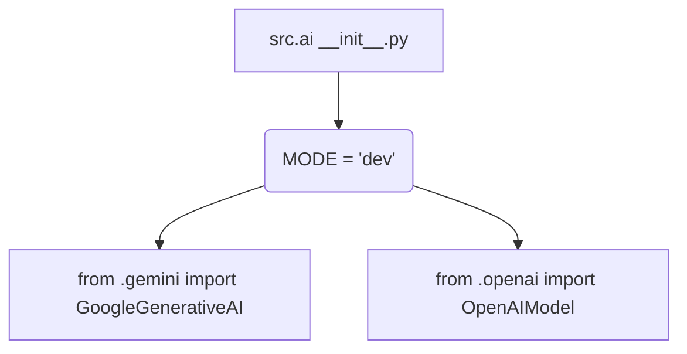

1. **<input code>**

```python
## \file /src/ai/__init__.py
# -*- coding: utf-8 -*-\
#! venv/Scripts/python.exe
#! venv/bin/python/python3.12

"""
module: src.ai
	:platform: Windows, Unix
	:synopsis: Модуль интерфейса моделей ИИ.
	"""
MODE = 'dev'

from .gemini import GoogleGenerativeAI
from .openai import OpenAIModel
```

2. **<algorithm>**



No complex algorithm exists here.  The file simply imports classes from submodules `gemini` and `openai` within the `src.ai` package.


3. **<explanation>**

* **Imports:**
    * `from .gemini import GoogleGenerativeAI`: Imports the `GoogleGenerativeAI` class from the `gemini.py` file, which is assumed to be located in the `src/ai/gemini` subdirectory. This is a relative import, referencing a module within the same package.  This likely represents a wrapper or interface for Google's Gemini large language model.  Crucially, this implies a dependency on Google's API (possibly via the `google-generative-ai` library).
    * `from .openai import OpenAIModel`: Imports the `OpenAIModel` class from the `openai.py` file.  Similar to the `gemini` import, this is a relative import. This likely represents an interface for using OpenAI's models.  This implies a dependency on OpenAI's API.
* **Classes:**
    * `GoogleGenerativeAI`: Represents an interface or wrapper for Google Gemini.  Details of its functionality (e.g. methods for generating text, prompting, etc.) would be found in `gemini.py`.
    * `OpenAIModel`: Represents an interface or wrapper for OpenAI models. Its structure would be defined in `openai.py` similar to `GoogleGenerativeAI`.

* **Functions:**
    * None. This file does not contain any functions, only imports.
* **Variables:**
    * `MODE = 'dev'`: A string variable.  This is a global constant likely used to set a development/production mode or control some aspect of application configuration.  It would be accessed throughout the code in the `src.ai` package.  The `dev` value suggests this is a development environment variable.  Consider using an environment variable for production to make the code more maintainable and prevent accidental configuration errors.

* **Potential Errors/Improvements:**

    * **Missing Error Handling:** The imports assume the existence of `gemini.py` and `openai.py`.  No error handling is present to gracefully manage cases where these files do not exist.  Adding a `try...except` block around the imports is crucial.
    * **Dependency Management (Implicit):** This code relies on the existence and proper installation of the external `google-generative-ai` and `openai` libraries.  Consider including a `requirements.txt` file for dependency management using tools like Pip.
    * **No Type Hints:**  Python type hints could be added to increase code clarity and maintainability in `GoogleGenerativeAI` and `OpenAIModel`.
    * **Docstrings:** Adding more detailed docstrings to classes (`GoogleGenerativeAI`, `OpenAIModel`) is beneficial for understanding their functionalities and usage.  This is particularly important because they are likely to be used in other parts of the project and documentation will help keep track of their purpose.
    * **`MODE` Variable:** While it's functional as is, it would be preferable to use an environment variable for `MODE`.  This would allow for more flexible configuration without hardcoding values.  Consider adding a config module for better organization.

* **Relationship Chain:** This module (`src/ai/__init__.py`) is a crucial part of a larger project.  It acts as an entry point for interacting with external AI models.  The code implies the existence of `gemini.py` and `openai.py` that would contain the actual implementation for interacting with each API.  Further down the line, functions within this project would interact with the `src.ai` methods to use the AI models for tasks.  A likely relationship would be between the `src.ai` and `src.data` or `src.utils` modules if these data or utility functions are needed to handle the AI responses or inputs.