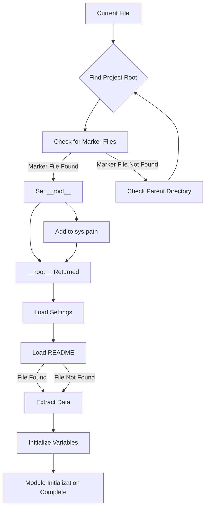

```python
## \file hypotez/src/ai/dialogflow/header.py
# -*- coding: utf-8 -*-
#! venv/Scripts/python.exe
#! venv/bin/python/python3.12

"""
.. module: src.ai.dialogflow 
	:platform: Windows, Unix
	:synopsis:

"""
MODE = 'dev'

"""
	:platform: Windows, Unix
	:synopsis:

"""


"""
	:platform: Windows, Unix
	:synopsis: Модуль определяющий корневой путь к проекту. Все импорты строятся относительно этого пути.
    :TODO: В дальнейшем перенести в системную переменную

"""

import sys
import json
from packaging.version import Version

from pathlib import Path
def set_project_root(marker_files=('pyproject.toml', 'requirements.txt', '.git')) -> Path:
    """
    Finds the root directory of the project starting from the current file's directory,
    searching upwards and stopping at the first directory containing any of the marker files.

    Args:
        marker_files (tuple): Filenames or directory names to identify the project root.
    
    Returns:
        Path: Path to the root directory if found, otherwise the directory where the script is located.
    """
    __root__:Path
    current_path:Path = Path(__file__).resolve().parent
    __root__ = current_path
    for parent in [current_path] + list(current_path.parents):
        if any((parent / marker).exists() for marker in marker_files):
            __root__ = parent
            break
    if __root__ not in sys.path:
        sys.path.insert(0, str(__root__))
    return __root__


# Get the root directory of the project
__root__ = set_project_root()
"""__root__ (Path): Path to the root directory of the project"""

from src import gs

settings:dict = None
try:
    with open(gs.path.root / 'src' /  'settings.json', 'r') as settings_file:
        settings = json.load(settings_file)
except (FileNotFoundError, json.JSONDecodeError):
    ...

doc_str:str = None
try:
    with open(gs.path.root / 'src' /  'README.MD', 'r') as settings_file:
        doc_str = settings_file.read()
except (FileNotFoundError, json.JSONDecodeError):
    ...


__project_name__ = settings.get("project_name", 'hypotez') if settings  else 'hypotez'
__version__: str = settings.get("version", '')  if settings  else ''
__doc__: str = doc_str if doc_str else ''
__details__: str = ''
__author__: str = settings.get("author", '')  if settings else ''
__copyright__: str = settings.get("copyrihgnt", '')  if settings else ''
__cofee__: str = settings.get("cofee", "Treat the developer to a cup of coffee for boosting enthusiasm in development: https://boosty.to/hypo69")  if settings else "Treat the developer to a cup of coffee for boosting enthusiasm in development: https://boosty.to/hypo69"
```

**<algorithm>**



**Example:**

If `__file__` is located at `hypotez/src/ai/dialogflow/header.py`, the script traverses up the directory tree (hypotez/src/ai/dialogflow, hypotez/src/ai, hypotez/src, hypotez). If `pyproject.toml` or `requirements.txt` or `.git` exists in `hypotez`, `__root__` will be set to that directory.

**<explanation>**

* **Imports:**
    * `sys`: Provides access to system-specific parameters and functions, including `sys.path`. Crucial for dynamically modifying the Python import path to find modules within the project directory.
    * `json`: Used for loading and parsing JSON data from `settings.json`.
    * `packaging.version`: Used for handling and comparing software versions (not used directly in this snippet).
    * `pathlib`: Used for working with file paths in a more object-oriented and platform-independent way.  Allows robust file path handling.
    * `gs`: Likely a custom module from the `src` package; it seems to contain a `path` object providing access to project root path, which is critical for finding the project configuration file.

* **`set_project_root` function:**
    * Takes a tuple of marker files as an argument.
    * Resolves the current file path using `Path(__file__).resolve()`.
    * Iterates through the current directory and its parents, checking if any of the marker files exist.
    * If a marker file is found, updates `__root__` and inserts the path into `sys.path`.  The `sys.path.insert` method is important because this module is probably going to import other parts of the project that are not directly located in the directory that `__file__` resides in.
    * Returns the absolute path to the project root.

* **Variables:**
    * `__root__`:  A critical variable containing the absolute path to the project root. This is used to find `settings.json` and `README.MD` file locations in the project.
    * `settings`: A dictionary containing project settings loaded from `settings.json`.
    * `doc_str`: The content of the `README.MD` file.
    * Other variables (`__project_name__`, `__version__`, etc.) store project metadata, populated from the `settings` dictionary if available.

* **`try...except` blocks:**
    * Used to handle potential `FileNotFoundError` and `json.JSONDecodeError` exceptions when reading `settings.json` and `README.MD`. This is crucial for robustness.  Without these, the program may crash if either configuration file is missing or corrupt.
    * `...` in the `except` blocks are placeholders for potential error handling.


* **Relationship with other parts of the project:**
    * The function relies on the existence of `settings.json` and `README.MD` in the project root (`gs.path.root`), implicitly requiring the `gs` module (from `src`) for accessing that path.


**Potential Errors/Improvements:**

* **Robust Error Handling:** The `try...except` blocks are good, but more specific exception handling (e.g., checking for malformed JSON) could be helpful.
* **Logging:**  Adding logging would allow tracking of the process, particularly the `sys.path` modification.
* **`gs` module details:** The analysis of the code relies on the `gs` module, and a detailed explanation of this module, its `path` object, and how it is integrated into the project would be invaluable to fully understand the system architecture. The code example in the provided context is incomplete, and more code from the `gs` module or a description of it is needed for a complete understanding of how `gs.path.root` is determined.
* **Type Hinting:** The use of type hints is good, but consistency is crucial. `marker_files` being a tuple instead of a `list` and the `Path` type hints may need to be addressed. This would improve code clarity for other developers.