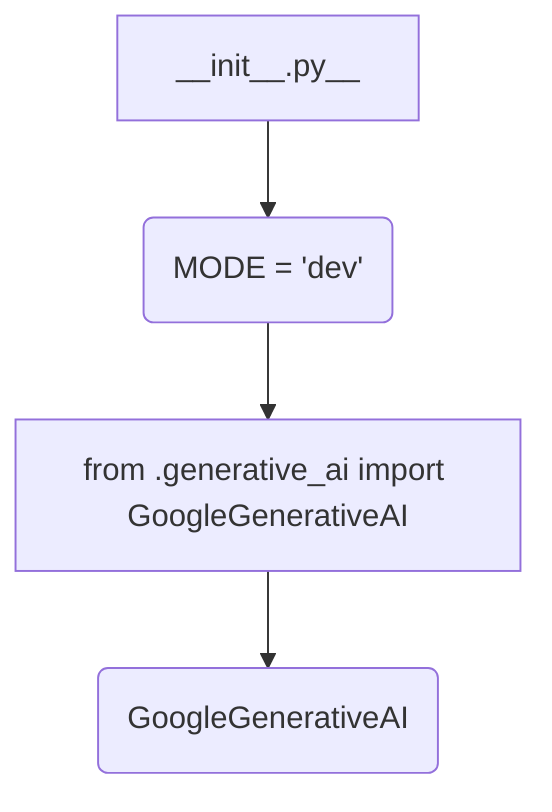

1. **<input code>**

```python
## \file hypotez/src/ai/gemini/__init__.py
# -*- coding: utf-8 -*-
#! venv/Scripts/python.exe
#! venv/bin/python/python3.12

"""
.. module: src.ai.gemini 
	:platform: Windows, Unix
	:synopsis: Модуль модели `gemini`

"""
MODE = 'dev'


from .generative_ai import GoogleGenerativeAI
```

2. **<algorithm>**



**Explanation of the Flow:**

The `__init__.py` file is a module initializer. It sets a variable `MODE` to 'dev'.  The main action is importing the `GoogleGenerativeAI` class from the `generative_ai` submodule within the same directory. This import makes the `GoogleGenerativeAI` class accessible within the `gemini` module.  No further processing or instantiation happens within this `__init__.py` file.

3. **<explanation>**

* **Imports:**
    - `from .generative_ai import GoogleGenerativeAI`: This line imports the `GoogleGenerativeAI` class from the `generative_ai.py` file located in the same directory as `__init__.py`. The `.` (relative import) indicates that the file is located within the `gemini` subdirectory of the `src.ai` package.  This is a standard Python import practice when modules are organized in hierarchical directories (packages).

* **Variables:**
    - `MODE = 'dev'`: This variable likely controls configuration options (development, testing, production).  Its value is set to 'dev'. It's important for the downstream use.  This configuration is stored in the `gemini` module.

* **Classes:**
    - `GoogleGenerativeAI`: This class is not defined in this file, but instead in `generative_ai.py` within the `gemini` package.  Knowing the content of `generative_ai.py` would help determine the class structure and possible dependency on external libraries like the Google AI APIs (or other generative AI providers).

* **Functions:**
    - There are no functions defined directly in this `__init__.py` file.


* **Potential Errors/Improvements:**
    - **Docstrings:** The docstrings are mostly in Russian, which might not be ideal for international collaboration.  Consider adding English docstrings, especially for the code intended for broader use.
    - **Unclear Purpose**: It's unclear what this module, `gemini`, is intended for, other than importing `GoogleGenerativeAI`. Context from the broader project structure would help understand the overall functionality of this module and the role of `GoogleGenerativeAI`.  If `GoogleGenerativeAI` isn't utilized immediately, the `__init__.py` might be improved by returning an instance or initializing the class, potentially to cache results or perform other preliminary operations.


**Chain of Relationships:**

This `__init__.py` file initializes the `gemini` module, enabling access to `GoogleGenerativeAI`.  The relationship with other modules in the project would be established through how this class (`GoogleGenerativeAI`) is used.  If it's part of a larger pipeline or framework (for example, for natural language processing or large language models), its use in other files would establish connections with potentially other parts of the project.


**Example Usage (Hypothetical):**

```python
from hypotez.src.ai.gemini import GoogleGenerativeAI

# ... other code ...

gemini_model = GoogleGenerativeAI()
result = gemini_model.generate_text("...")

# ... more code ...
```