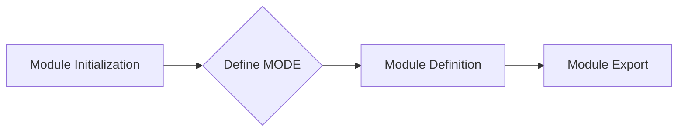

```
## <input code>
```python
## \file hypotez/src/ai/helicone/__init__.py
# -*- coding: utf-8 -*-\
#! venv/Scripts/python.exe
#! venv/bin/python/python3.12

"""
.. module: src.ai.helicone 
	:platform: Windows, Unix
	:synopsis:

"""
MODE = 'dev'
```

## <algorithm>



* **Module Initialization (A):** The module initializes.
* **Define MODE (B):**  A constant `MODE` is assigned the string value 'dev'. This likely signifies the environment, e.g., development, testing, production.
* **Module Definition (C):** The module is defined.  This step is not directly executable, but implicitly defines the module's scope and contents.
* **Module Export (D):** The module is prepared for import in other modules within the project.  This is the implicit result of the file structure.


## <explanation>

This Python file, `hypotez/src/ai/helicone/__init__.py`, is a module initialization file.  It's part of a larger project, likely a framework or application.

* **Imports**: There are no imports.  This file is likely not dependent on external modules for its core functionality.

* **Classes**: There are no classes defined.

* **Functions**: There are no functions defined.

* **Variables**:
    * `MODE`: A string variable.  Its value ('dev') is likely used to control behavior in the calling modules or by a configuration system. This suggests the project might have different settings based on the environment. For example, it could affect logging levels, API endpoints, or database connections.

* **Potential Errors or Areas for Improvement:**
    * **Lack of Functionality:** The file currently only sets a variable.  It lacks any meaningful logic or methods, which is typical for an initialization file that sets up environment variables or import paths for other modules in the package.
    * **Documentation Style:** While the docstrings use a Sphinx-style format, they lack example usages and comprehensive documentation. This makes it harder to understand how this module will be used without looking at other files.
    * **Missing Dependency Management:**  Python's `__init__.py` files can contain imports of other modules, particularly if this directory is intended to serve as an entry point for a collection of related modules.  There are no imports to other modules in `src.ai.helicone`, though this could be part of a larger system setup.

* **Relationships with Other Parts of the Project:**
   * This file likely exists within a project structure (`hypotez/src/ai/helicone`) indicating it's part of a subsystem for interacting with the Helicone API (or a similar service) and that other related files (e.g., `helicone.py`, `helicone_client.py`) are likely contained within the `hypotez/src/ai/helicone` directory. This directory structure hints that the initialization `MODE` variable sets the environment, making it possible to switch easily between development, testing, and production without modifying the code handling Helicone API interaction.

In summary, this `__init__.py` file serves as a module initializer for a part of the Hypotez project related to the Helicone API. Its current purpose is to define a `MODE` variable, implying different environments are supported, but further development is needed for this to be a functional module.