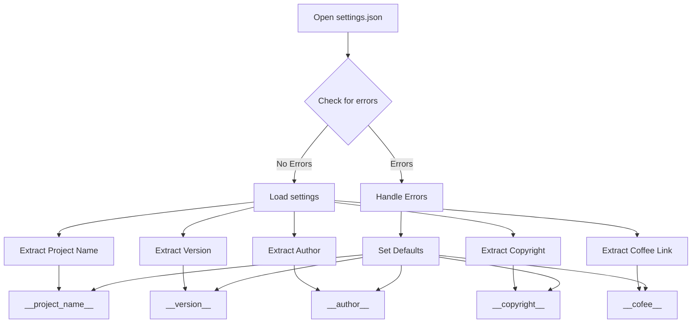

```
## <input code>
```python
## \file hypotez/src/ai/helicone/version.py
# -*- coding: utf-8 -*-\n#! venv/Scripts/python.exe
#! venv/bin/python/python3.12

"""
.. module: src.ai.helicone 
	:platform: Windows, Unix
	:synopsis:

"""
MODE = 'dev'

"""
	:platform: Windows, Unix
	:synopsis:

"""


"""
	:platform: Windows, Unix
	:synopsis:

"""


"""
  :platform: Windows, Unix

"""
"""
  :platform: Windows, Unix
  :platform: Windows, Unix
  :synopsis:
"""MODE = 'dev'
  
""" module: src.ai.helicone """


import json

settings:dict = None

try:
    with open(__root__ / 'src' /  'settings.json', 'r') as settings_file:
        settings = json.load(settings_file)
except (FileNotFoundError, json.JSONDecodeError):
    ...

__project_name__ = settings.get("project_name", 'hypotez') if settings  else 'hypotez'
__version__: str = settings.get("version", '')  if settings  else ''
__doc__: str = ''
__details__: str = ''
__author__: str = settings.get("author", '')  if settings  else ''
__copyright__: str = settings.get("copyrihgnt", '')  if settings  else ''
__cofee__: str = settings.get("cofee", "Treat the developer to a cup of coffee for boosting enthusiasm in development: https://boosty.to/hypo69")  if settings  else "Treat the developer to a cup of coffee for boosting enthusiasm in development: https://boosty.to/hypo69"
```

## <algorithm>



**Example Data Flow:**

If `settings.json` contains:

```json
{
  "project_name": "MyProject",
  "version": "1.0.0",
  "author": "John Doe"
}
```

The algorithm will extract the values, assigning them to the respective variables.  Otherwise, default values (e.g., `hypotez`) will be used.


## <explanation>

**Imports:**

- `import json`: Imports the `json` module, which is used for working with JSON data.  This is a standard Python library.

**Variables:**

- `settings: dict = None`: Declares a variable `settings` to store the loaded JSON data from `settings.json`. It's initialized to `None` to indicate that it hasn't been loaded yet.
- `__project_name__`:  Stores the project name.
- `__version__`: Stores the version string.
- `__doc__`, `__details__`, `__author__`, `__copyright__`, `__cofee__`: Store various metadata about the project.

**Classes:**

There are no classes defined in this code.

**Functions:**

There are no functions defined in this code.


**Code Details:**

- The code attempts to load data from `__root__ / 'src' / 'settings.json'`.  The use of `__root__` is likely a custom variable or import within the project, that represents the root directory of the project. This is critical for file paths.
- Error Handling (`try...except`):  Handles `FileNotFoundError` and `json.JSONDecodeError` in case the `settings.json` file doesn't exist or has invalid JSON. If errors occur, the `...` part is important as it indicates an intended way for the program to continue operation without crashing by continuing to use default values. This is common practice to prevent crashes on a variety of situations.
- `settings.get(...)`:  The `get()` method is used for safely accessing values from the `settings` dictionary.  If a key doesn't exist, it returns a default value. This is good practice for robustness because avoiding errors when reading configuration data is important.
-  Docstrings: The docstrings (the triple-quoted strings)  are used to document the code, as part of Python's standard module documentation tool. However, the format of those docstrings is unusual, with platform and synopsis markers.


**Relationships with other parts of the project:**

The code heavily relies on the existence of a `settings.json` file located in the `src/` directory.  This file is expected to contain configuration information that is used to set version information for the module.  `__root__` is also important here; it shows a crucial dependence on some sort of pre-defined, project-specific logic to define the path to the `settings.json` file.

**Potential Errors/Improvements:**

- **Error Handling**: While the `try...except` block is good for robustness, consider adding more specific error handling within the `except` block.  What is the planned course of action when `settings.json` isn't found or has invalid data?
- **`__root__`:**   It's essential to determine how the value of `__root__` is defined within your project. If it's not properly defined or accessible by code, your program may produce unexpected errors and not work as intended.
- **Strict Type Hinting:** The use of type hints is beneficial but could be improved; consider the specific data types that you expect the values in `settings.json` to be and using more specific type hints.


This analysis provides a comprehensive understanding of the code's functionality and its place within the larger project structure.