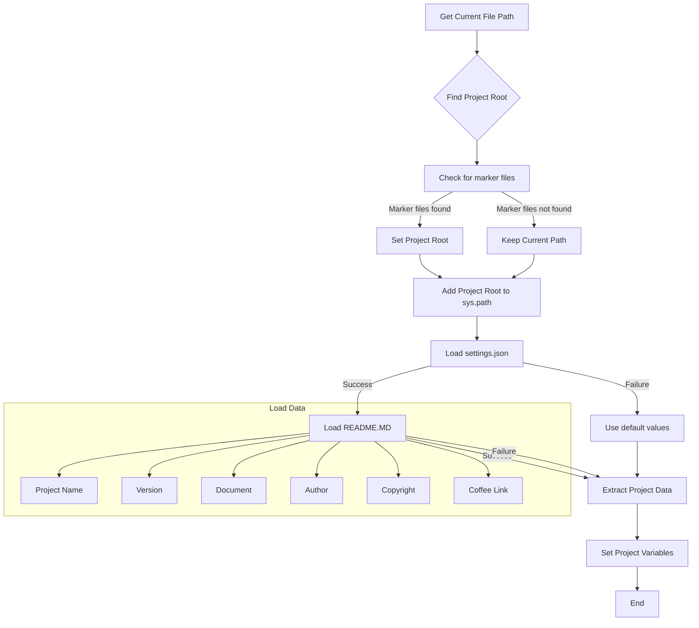

## <input code>
```python
## \file hypotez/src/ai/myai/header.py
# -*- coding: utf-8 -*-\
#! venv/Scripts/python.exe
#! venv/bin/python/python3.12

"""
.. module: src.ai.myai 
	:platform: Windows, Unix
	:synopsis:

"""
MODE = 'dev'

"""
	:platform: Windows, Unix
	:synopsis:

"""


"""
	:platform: Windows, Unix
	:synopsis:

"""


"""
  :platform: Windows, Unix

"""
"""
  :platform: Windows, Unix
  :platform: Windows, Unix
  :synopsis:
"""MODE = 'dev'
  
""" module: src.ai.myai """

import sys
import json
from packaging.version import Version

from pathlib import Path
def set_project_root(marker_files=('pyproject.toml', 'requirements.txt', '.git')) -> Path:
    """
    Finds the root directory of the project starting from the current file's directory,
    searching upwards and stopping at the first directory containing any of the marker files.

    Args:
        marker_files (tuple): Filenames or directory names to identify the project root.
    
    Returns:
        Path: Path to the root directory if found, otherwise the directory where the script is located.
    """
    __root__:Path
    current_path:Path = Path(__file__).resolve().parent
    __root__ = current_path
    for parent in [current_path] + list(current_path.parents):
        if any((parent / marker).exists() for marker in marker_files):
            __root__ = parent
            break
    if __root__ not in sys.path:
        sys.path.insert(0, str(__root__))
    return __root__


# Get the root directory of the project
__root__ = set_project_root()
"""__root__ (Path): Path to the root directory of the project"""

from src import gs

settings:dict = None
try:
    with open(gs.path.root / 'src' /  'settings.json', 'r') as settings_file:
        settings = json.load(settings_file)
except (FileNotFoundError, json.JSONDecodeError):
    ...

doc_str:str = None
try:
    with open(gs.path.root / 'src' /  'README.MD', 'r') as settings_file:
        doc_str = settings_file.read()
except (FileNotFoundError, json.JSONDecodeError):
    ...


__project_name__ = settings.get("project_name", 'hypotez') if settings  else 'hypotez'
__version__: str = settings.get("version", '')  if settings  else ''
__doc__: str = doc_str if doc_str else ''
__details__: str = ''
__author__: str = settings.get("author", '')  if settings  else ''
__copyright__: str = settings.get("copyrihgnt", '')  if settings  else ''
__cofee__: str = settings.get("cofee", "Treat the developer to a cup of coffee for boosting enthusiasm in development: https://boosty.to/hypo69")  if settings  else "Treat the developer to a cup of coffee for boosting enthusiasm in development: https://boosty.to/hypo69"
```

```
## <algorithm>



**Example Data Flow:**

If `pyproject.toml` is found in a parent directory, the `__root__` variable will be set to that parent path. This path will then be added to `sys.path`, allowing the import of modules from the project's src folder.


```
## <explanation>

**Imports:**

- `sys`: Provides access to system-specific parameters and functions, such as `sys.path` used for dynamically adding the project root to the Python module search path.
- `json`: Used for handling JSON data, specifically loading configuration data from `settings.json`.
- `packaging.version`: Used for potentially handling versioning logic or checks (though not directly used in this file).
- `pathlib`: Provides object-oriented representations of file paths, making path manipulation more readable and robust.
- `src import gs`: This line imports a module named `gs` from the `src` package.  This implies the existence of a `src` package and a module within it (likely containing path-related functions) with which the code interacts.  The `gs` module is critical in determining the project root directory.

**Classes:**

- No classes are defined in this file.

**Functions:**

- `set_project_root(marker_files)`: This function finds the root directory of the project.
    - **Args:** A tuple of filenames or directory names that act as markers to identify the project root.
    - **Return:** The path to the root directory as a `Path` object, or the current directory if the root can't be found.
    - **Example:** If `pyproject.toml` is in the parent directory, the function returns the path to the parent directory. If no such file is found, it returns the path where the current script is located.

**Variables:**

- `__root__`: Stores the path to the project root. It's a `Path` object.
- `settings`: A dictionary to hold the project configuration loaded from `settings.json`.
- `doc_str`: Holds the content of the README.md file. It's a string.
- `__project_name__`, `__version__`, `__doc__`, `__details__`, `__author__`, `__copyright__`, `__cofee__`: These variables hold data retrieved from the `settings.json` file or default values. They are all strings.
- `MODE`: A string variable likely for setting up development or production modes (e.g., 'dev', 'prod').

**Potential Errors/Improvements:**

- **Robustness:** The `try...except` blocks are a good practice to handle potential `FileNotFoundError` or `json.JSONDecodeError` when loading `settings.json` and `README.MD`. However, consider adding more specific error messages or logging within the `except` blocks for better debugging.
- **Configuration:**  The code depends on the existence of `settings.json` and `README.MD` in a specific location relative to the project root. Make sure those files are always present in the expected locations.
- **`gs` module:** The use of `gs` to determine the project root implies a significant dependency on that module.  Ensure the `gs` module is properly installed and available.


**Relationships with other project components:**

The code relies on the `gs` module (and possibly other modules within the `src` package), and loads configuration data from `settings.json`, and potentially other configuration files. This implies a project structure where data is organized in modules and files. The variable `__root__` is crucial for locating and importing necessary modules, directly influencing how the rest of the project operates. This strongly suggests a structure like `src/gs.py` and `src/settings.json`.