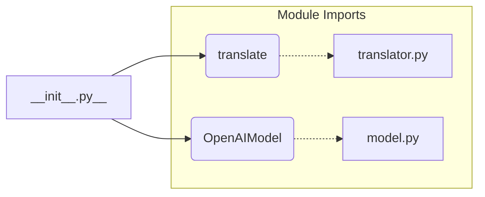

1. **<input code>**

```python
## \file hypotez/src/ai/openai/__init__.py
# -*- coding: utf-8 -*-
#! venv/Scripts/python.exe
#! venv/bin/python/python3.12

"""
.. module: src.ai.openai 
	:platform: Windows, Unix
	:synopsis: Модуль модели `openai`

"""
MODE = 'dev'

from .translator import translate
from .model import OpenAIModel
```

2. **<algorithm>**



This is a simple module initializer. It imports two modules (`translator` and `model`) from subdirectories within the same package (`src.ai.openai`).  There is no algorithmic workflow within this `__init__.py` file itself, as it primarily handles import statements.  The code merely provides a way for other parts of the project to access the `translate` function and `OpenAIModel` class.


3. **<explanation>**

* **Imports:**
    * `from .translator import translate`: Imports the `translate` function from the `translator.py` file within the `src.ai.openai` package.  This allows other modules to use the translation functionality.  The `.` indicates relative import, showing a dependency on `translator.py` within the same package directory.
    * `from .model import OpenAIModel`: Imports the `OpenAIModel` class from the `model.py` file within the `src.ai.openai` package. This is likely related to interacting with the OpenAI API.  Again, the `.` for relative imports.

* **Variables:**
    * `MODE = 'dev'`: This is a global variable likely used to define the operational mode (e.g., 'dev' for development, 'prod' for production).  This variable's value can be used to control different behaviors in the modules it's imported into (though not directly seen in this file).

* **Classes:**
    * `OpenAIModel`:  The `OpenAIModel` class, imported here, is presumably a wrapper around the OpenAI API, providing an interface to the model.  Details of its implementation are not shown in this file.  It's crucial to find `model.py` to understand its specific functionality, attributes, and methods.

* **Functions:**
    * `translate`: The `translate` function is imported from `translator.py`.  Details on its purpose, arguments, and return value are not available in this snippet; you need to look at `translator.py` for implementation specifics.

* **Potential Errors/Improvements:**
    * The use of `#! venv/Scripts/python.exe` and `#! venv/bin/python/python3.12` at the top of the file is unusual in a Python module. These likely indicate a specific execution environment (a virtual environment), but such directives are often placed in scripts, not modules, and may need review to prevent incorrect execution if imported elsewhere.
    * Docstrings are present but in Russian.  Consider including English docstrings for better maintainability and readability for a larger team.
    * The code is very basic. The core logic and data handling (API calls, response processing, etc.) is absent from this `__init__.py`.  Further analysis requires examining `translator.py` and `model.py`.


* **Relationship with Other Parts of the Project:**
    * The `translator.py` file likely interacts with other parts of the `src` package, for example, data loading, preprocessing or output formats. The nature of these interactions depends on the translation tasks this project performs.
    * `model.py` is crucial to determine what models are being used (OpenAI's specific models), how requests are handled (input/output format and type), and the expected results (e.g., response types).


This file's primary purpose is to provide a standardized way to access the `translator` and `OpenAIModel` module contents from other parts of the `hypotez` project. It's a crucial part of the package's import system, allowing modules in other parts of the `hypotez` project to use the `openai` functionality.