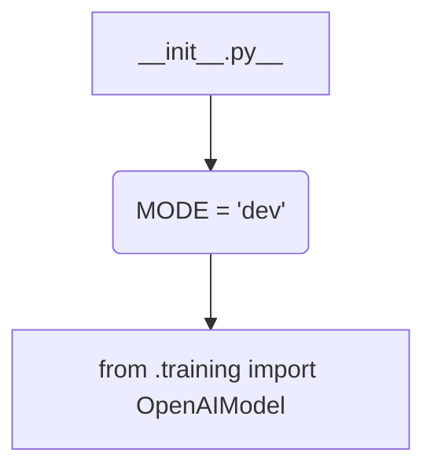

1. **<input code>**

```python
## \file hypotez/src/ai/openai/model/__init__.py
# -*- coding: utf-8 -*-\n#! venv/Scripts/python.exe\n#! venv/bin/python/python3.12\n\n"""
.. module: src.ai.openai.model 
	:platform: Windows, Unix
	:synopsis:

"""
MODE = 'dev'


from .training import OpenAIModel
```

2. **<algorithm>**



There's no significant algorithm in this file.  It's primarily a module initialization file.  The core functionality is in `OpenAIModel`, likely defined within the `training.py` file.  The workflow consists of simple import statements to make `OpenAIModel` accessible in other parts of the project.


3. **<explanation>**

* **Imports:**
    * `from .training import OpenAIModel`: This line imports the `OpenAIModel` class from the `training.py` file within the same directory (`src/ai/openai/model`).  The `.` refers to the current package, `model`.  This is crucial for modularity; it allows the `model` package to access the definitions of `OpenAIModel` without needing absolute path imports.  The file `training.py` is likely defining the model itself, including its structure, training procedures, and methods to interact with the OpenAI API (if needed).


* **Variables:**
    * `MODE = 'dev'`: This variable likely controls the mode of operation, possibly different configuration settings during development vs. production (`dev` vs. `prod`).  It's a simple global variable intended to influence other parts of the code (e.g. in `training.py`).


* **Classes (implied):**
    * `OpenAIModel`: This class is imported but not defined within `__init__.py`.  This strongly suggests it's defined in a separate file named `training.py` located in the `src/ai/openai/model/` folder.  Without seeing `training.py`, we can only infer its likely role:  implementing a custom or wrapped OpenAI model using specific settings (possibly model type, API keys, etc).  Its methods might handle training, prediction, or both.


* **Functions (implied):**
    * Any functions associated with the `OpenAIModel` class (like `train()`, `predict()`, etc.) will be found in `training.py`.


* **Potential Errors or Improvements:**
    * **Missing Documentation:** While the module docstring (`"""..."""`) is present, it could be more detailed, providing information about `OpenAIModel`'s functionality, expected parameters, etc.  Missing docstrings for the class and its methods inside `training.py` would be problematic.

    * **File Handling:** If `OpenAIModel` interacts with external files (e.g., saving training data or models), the code should include proper file handling (e.g. `with open(...)` blocks) to manage resources.

    * **Error Handling:** The code lacks error handling.  If `OpenAIModel` calls are not successful (API issues, invalid inputs), it's essential to include `try...except` blocks to manage and log these exceptions.

    * **External Dependencies:** The code imports `OpenAIModel`, indicating a dependency on the OpenAI library (or a wrapper/adapter around it).  This dependency should be listed in `requirements.txt` for reproducibility.

**Relationship to Other Parts of the Project:**

This `__init__.py` file serves as an entry point for the `src/ai/openai/model` package.  Other parts of the project (possibly in `app.py`, `main.py`, etc.) would import and utilize the `OpenAIModel` class defined in `training.py` to access OpenAI functionalities.  Thus, `__init__.py` creates a modular structure that allows other parts of the project to interact with the `OpenAI` model independently.