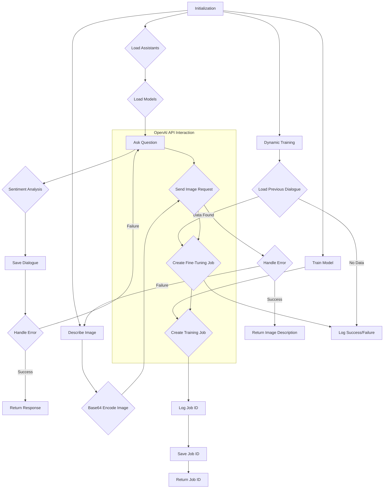

```python
## \file hypotez/src/ai/openai/model/training.py
# -*- coding: utf-8 -*-\
#! venv/Scripts/python.exe
#! venv/bin/python/python3.12

"""
.. module: src.ai.openai.model 
	:platform: Windows, Unix
	:synopsis: OpenAI Model Class for handling communication with the OpenAI API and training the model

"""
MODE = 'dev'

import time
from pathlib import Path
from types import SimpleNamespace
from typing import List, Dict, Optional
import pandas as pd
from openai import OpenAI
import requests
from PIL import Image
from io import BytesIO

from src import gs
from src.utils import j_loads, j_loads_ns, j_dumps
from src.utils.csv import save_csv_file  
from src.utils import pprint
from src.utils.convertors.base64 import base64encode
from src.utils.convertors.md2dict import md2dict
from src.logger import logger
```

```
<algorithm>
```

```
<explanation>
```

**1. Imports:**

The code imports various libraries for different functionalities:

*   `time`: Used for pausing execution or handling time-related tasks.
*   `pathlib`: For working with file paths in a more object-oriented way.
*   `types`: Used for `SimpleNamespace`.
*   `typing`: Provides type hints for better code readability and maintainability.
*   `pandas`: For potentially working with CSV data if needed.
*   `openai`: The OpenAI Python library for interacting with the OpenAI API.  Crucial for this module's purpose.
*   `requests`: Used for making HTTP requests (potentially for alternative or fallback OpenAI API interactions or other external API usage).
*   `PIL`:  Probably for image processing related tasks, handling images received or sent as a part of the OpenAI API interaction.
*   `io`:  For working with input/output streams, possibly for handling image data.
*   `src.gs`: This likely contains constants and helper functions related to file paths, credentials and Google Cloud Storage (gs).
*   `src.utils`: Package containing various utility functions, such as JSON loading/dumping (`j_loads`, `j_dumps`), CSV saving, and pretty printing.  It likely provides custom functions for handling data in a way specific to the application.
*   `src.utils.csv`: Specialized functions for interacting with CSV files.
*   `src.utils.convertors.base64`: Contains functions for encoding/decoding data in Base64 format. This is likely for converting images to/from Base64 strings suitable for API usage.
*   `src.utils.convertors.md2dict`: Functions for converting Markdown to dictionaries, potentially for formatting or parsing input data.
*   `src.logger`: Custom logging module, likely providing specialized logging configurations and formatting (e.g., levels, timestamps, output destinations).


**2. Classes:**

*   **`OpenAIModel`:** This class encapsulates interactions with the OpenAI API and manages the model's state.
    *   **Attributes:**
        *   `model`: The OpenAI model ID to use (defaults to `gpt-4o-mini`).
        *   `client`: An instance of the `OpenAI` class for API communication.
        *   `current_job_id`: Stores the ID of a current training job.
        *   `assistant_id`: ID of the assistant being used.
        *   `assistant`: The assistant object.
        *   `thread`:  OpenAI conversation thread.
        *   `system_instruction`:  System instructions for the model.
        *   `dialogue_log_path`: Path to save the dialogue log.
        *   `dialogue`: A list of conversation messages.
        *   `assistants`:  List of assistant objects loaded from the file.
        *   `models_list`: List of available model IDs loaded.
    *   **Methods:**
        *   `__init__`: Initializes the `OpenAIModel` with an API key, assistant ID, and optionally system instructions.  Loads assistants and a conversation thread.  Critically, it sets up communication with the OpenAI API.
        *   `list_models`: Fetches available models from the OpenAI API.  Handles potential errors and logs the loaded models.
        *   `list_assistants`: Loads a list of assistants from a JSON file (`assistants.json`).  Handles potential loading errors and logs.
        *   `set_assistant`: Sets the assistant to use based on the provided assistant ID.
        *   `_save_dialogue`: Saves the current dialogue to the specified JSON file.
        *   `determine_sentiment`: Analyzes the sentiment of a message by checking for positive, negative, or neutral keywords.
        *   `ask`: Sends a message to the OpenAI model, handles potential errors via retries, performs sentiment analysis on the reply, saves the dialogue, and returns the response.  The most crucial interaction with the OpenAI API.
        *   `describe_image`: Sends an image to the OpenAI model for description and returns a structured response (likely a dictionary).
        *   `describe_image_by_requests`: A potentially alternative or fallback implementation using the `requests` library for the image description.
        *   `dynamic_train`: Loads previous dialogue from a JSON file and creates a fine-tuning job using the current `assistant_id`.
        *   `train`: Creates a training job on the OpenAI platform using the provided data (CSV file or directory).
        *   `save_job_id`: Saves the training job ID and description to a JSON file.
*   **`main` function:** This function serves as the entry point, initializing the model, displaying available models/assistants, asking the model a question, performing dynamic training, training the model, and saving the job ID. It also provides examples of describing an image using the model.

**3. Functions:**


* **`main`:**  Manages the initialization, demonstrations, and calls to the OpenAI model methods for the user interaction flow.
* **Other functions are self-explanatory from the docstrings**  (e.g. `save_job_id`, `ask` etc.)

**4. Relationships:**

The code has strong dependencies on the `src` package, particularly the `gs`, `utils`, `utils.csv`, `utils.convertors`, and `logger` modules. The `OpenAIModel` relies on these modules for file paths, API interaction, and logging, indicating a modular design.


**Potential Errors and Improvements:**

* **Error Handling:** The error handling within the `ask` method and other functions is decent, including retries. But more specific error checking and logging could help pinpoint issues quickly.  Consider adding more context to the error messages in the logs.
* **Image Processing:**  The image handling could benefit from more robust image validation and handling of different image formats and sizes.
* **Data Validation:** Input data for `ask`, `describe_image`, `train` should be validated for correctness.
* **Training Data Format:** The code assumes a specific structure (e.g., in the training data format).  Adding assertions or checks for consistency in the format (e.g. that it is a dictionary) during data loading would improve robustness.
* **API Rate Limits:** The code doesn't explicitly handle API rate limits. Adding logic to pause or retry requests to avoid hitting the OpenAI API rate limits would be necessary.
* **Data Source Reliability:** The code assumes certain files, such as 'assistants.json' and 'dailogue.json' exist, and contains valid data.   Error handling for file unavailability or corrupted data should be added.
* **Configuration:**  Hardcoded API keys and assistant IDs should be replaced with configuration files or environment variables for better security and maintainability.


This detailed analysis provides a comprehensive understanding of the code's functionality and interdependencies within the project, highlighting potential areas for improvement.
```