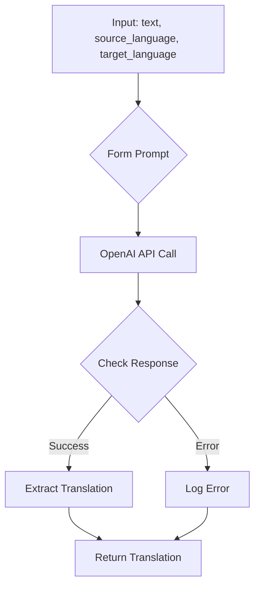

```
## File hypotez/src/ai/openai/translator.py
# -*- coding: utf-8 -*-\n#! venv/Scripts/python.exe\n#! venv/bin/python/python3.12\n\n"""\n.. module:: src.ai.openai\n    :platform: Windows, Unix\n    :synopsis: Модуль для перевода текста с использованием OpenAI API.\n"""\n\nMODE = \'dev\'\n\nimport openai\nfrom src import gs\nfrom src.logger import logger\n\nopenai.api_key = gs.credentials.openai\n\ndef translate(text, source_language, target_language):\n    """\n    Перевод текста с использованием OpenAI API.\n\n    Этот метод отправляет текст для перевода на указанный язык с помощью модели OpenAI и возвращает переведённый текст.\n\n    Аргументы:\n        text (str): Текст для перевода.\n        source_language (str): Язык исходного текста.\n        target_language (str): Язык для перевода.\n\n    Возвращает:\n        str: Переведённый текст.\n\n    Пример использования:\n        >>> source_text = "Привет, как дела?"\n        >>> source_language = "Russian"\n        >>> target_language = "English"\n        >>> translation = translate_text(source_text, source_language, target_language)\n        >>> print(f"Translated text: {translation}")\n    """\n    \n    # Формируем запрос к OpenAI API\n    prompt = (\n        f"Translate the following text from {source_language} to {target_language}:\\n\\n"\n        f"{text}\\n\\n"\n        f"Translation:"\n    )\n\n    try:\n        # Отправляем запрос к OpenAI API\n        response = openai.Completion.create(\n            engine="text-davinci-003",  # Укажите нужную модель\n            prompt=prompt,\n            max_tokens=1000,\n            n=1,\n            stop=None,\n            temperature=0.3\n        )\n\n        # Извлекаем перевод из ответа API\n        translation = response.choices[0].text.strip()\n        return translation\n    except Exception as ex:\n        # Логируем ошибку\n        logger.error("Error during translation", ex)\n        return\n```

2. **<algorithm>**



* **Input:**  The function receives the text to translate, the source language, and the target language as input parameters.
* **Form Prompt:** A prompt string is constructed using an f-string to format the input data for the OpenAI API call.  Example: `Translate the following text from Russian to English:\n\nПривет, как дела?\n\nTranslation:`
* **OpenAI API Call:** The `openai.Completion.create()` method is used to send the prompt to the OpenAI API. This utilizes the `text-davinci-003` model and has parameters for maximum tokens, number of responses, stop sequence, and temperature.
* **Check Response:**  The code checks for successful completion of the API call.
* **Extract Translation:** If successful, the translated text is extracted from the API response.
* **Return Translation:**  The extracted translated text is returned as the result of the function.
* **Log Error:** If an exception occurs (e.g., API error, network issue), the error message is logged to a specified logger (likely using a logging framework).
* **Return:** If there's an error, the function returns `None` to indicate failure.

3. **<explanation>**

* **Imports:**
    * `openai`: This is the crucial library for interacting with the OpenAI API.  It's a third-party package.
    * `src.gs`: This likely imports a module (`gs`) from the `src` package.  The file `gs.credentials.openai` likely holds the OpenAI API key. The `src` folder likely contains modules and functions related to general application utilities and configurations.
    * `src.logger`: Imports a logging module from the `src` package. This module is critical for handling errors during the translation process, providing diagnostic information for debugging.


* **Classes:** There are no classes in this code snippet.


* **Functions:**
    * `translate(text, source_language, target_language)`:
        * **Arguments:**
            * `text` (str): The text to translate.
            * `source_language` (str): The language code of the source text (e.g., "Russian").
            * `target_language` (str): The language code of the target language (e.g., "English").
        * **Return Value:**
            * `str`: The translated text (if successful), or `None` if an error occurs during the translation process.
        * **Purpose:** This function handles the entire translation process from constructing the prompt to communicating with the OpenAI API and returning the result.
        * **Example Usage:**
            ```python
            translation = translate("Hello, how are you?", "English", "Spanish")
            if translation:
                print(f"Translated text: {translation}")
            ```

* **Variables:**
    * `MODE`: A string variable, likely a configuration flag (`'dev'`).
    * `openai.api_key`: This variable assigns the OpenAI API key obtained from `gs.credentials.openai` to the `openai` library. This is a critical setup step.
    * `prompt`:  A string variable containing the formatted prompt sent to OpenAI.


* **Potential Errors/Improvements:**
    * **Error Handling:** The `try...except` block is good, but consider logging more specific error information (e.g., the exact exception type) for better debugging.
    * **Rate Limiting:**  OpenAI APIs have rate limits. The code doesn't handle these.  Add logic to retry if the API returns a rate limit error.
    * **Model Selection:** The code uses a specific model ("text-davinci-003"). Consider making this configurable for better adaptability.  More advanced models might improve quality but increase cost and latency.
    * **Input Validation:**  Adding input validation (e.g., checking if `text` is a string, source and target languages are valid) would prevent unexpected behavior.
    * **Context Management:**  OpenAI responses sometimes include too much text. Using a `max_tokens` limit prevents the response from being overly verbose or returning an error because of exceeding the character limit.


**Relationships:**

The code relies on the `gs` module (likely for configuration) and the `logger` module (for error handling and logging) within the `src` package. This suggests a modular structure, with separate modules handling various aspects of the application, including configuration (`gs`), logging (`logger`), and AI translations (`openai`).