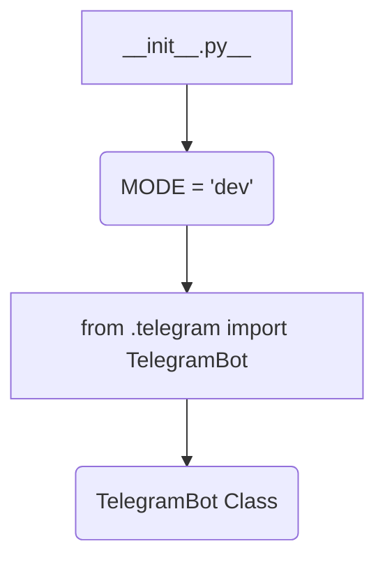

1. **<input code>**

```python
## \file hypotez/src/bots/__init__.py
# -*- coding: utf-8 -*-
#! venv/Scripts/python.exe
#! venv/bin/python/python3.12

"""
.. module: src.bots 
	:platform: Windows, Unix
	:synopsis:

"""
MODE = 'dev'


from .telegram import TelegramBot
```

2. **<algorithm>**



No complex algorithm exists.  The `__init__.py` file acts as a module initializer for the `bots` package. It defines a global variable `MODE` and imports a class `TelegramBot` from a submodule `telegram`.

**Data Flow:**

The code does not perform significant data flow operations.  The initialization of `MODE` is a simple assignment. The import statement populates the current namespace with the `TelegramBot` class from the `telegram` module.


3. **<explanation>**

* **Imports:**
    * `from .telegram import TelegramBot`: This imports the `TelegramBot` class from the `telegram.py` file located within the same directory (`./telegram`). This is a common Python practice for organizing modules.  The `.` refers to the current package/module, which is crucial for the module to locate the submodule.  This implies that `telegram.py` defines the `TelegramBot` class and that the `__init__.py` file is intended to make the contents of that file accessible by other modules/scripts within the `bots` package.


* **Classes:**
    * `TelegramBot`: The existence of this class is implied, but its actual definition is not shown here. It's likely a class for interacting with a Telegram bot API.  Its role is to handle Telegram-specific interactions, such as sending messages, receiving updates, etc. This class probably contains methods for these interactions, properties to store Telegram-related information (like bot token), and possibly error handling and logging mechanisms.  The code currently only imports the class; interactions with it will be in separate functions and scripts.


* **Functions:**
    * There are no functions defined directly in this file.  All logic and interactions with the imported `TelegramBot` are expected to be in other files (e.g., `telegram.py`, `main.py`).


* **Variables:**
    * `MODE = 'dev'`: This global variable likely controls the operational mode (e.g., 'dev', 'prod').  It allows for conditional behavior in the code (e.g., different API keys, or different logging strategies) depending on the mode.


* **Potential Errors or Areas for Improvement:**
    * **Missing `telegram.py`:** If `TelegramBot` isn't defined within `hypotez/src/bots/telegram.py`, the code won't function correctly. This suggests that the `telegram.py` file is necessary for this project and should be included in the analysis.
    * **Missing Usage:** The code does not demonstrate any usage of the `TelegramBot` class.


* **Relationships:**
    * **`hypotez/src/bots/telegram.py`:** This file is a prerequisite for the initialization of TelegramBot objects.  Importantly, `telegram.py` should define and implement the `TelegramBot` class itself.
    * **Other `hypotez/src` modules:** Other modules in the project, such as a main script, could import and use the `TelegramBot` class from this `__init__.py` file.  This might involve setting up a bot instance with specific Telegram credentials, triggering event listeners, or handling messages in the `main.py` file or other relevant modules.


This code snippet is a foundational piece that sets up a structure for working with Telegram bots within a larger project.  The `TelegramBot` object is likely to be instantiated and interacted with in a different part of the project.