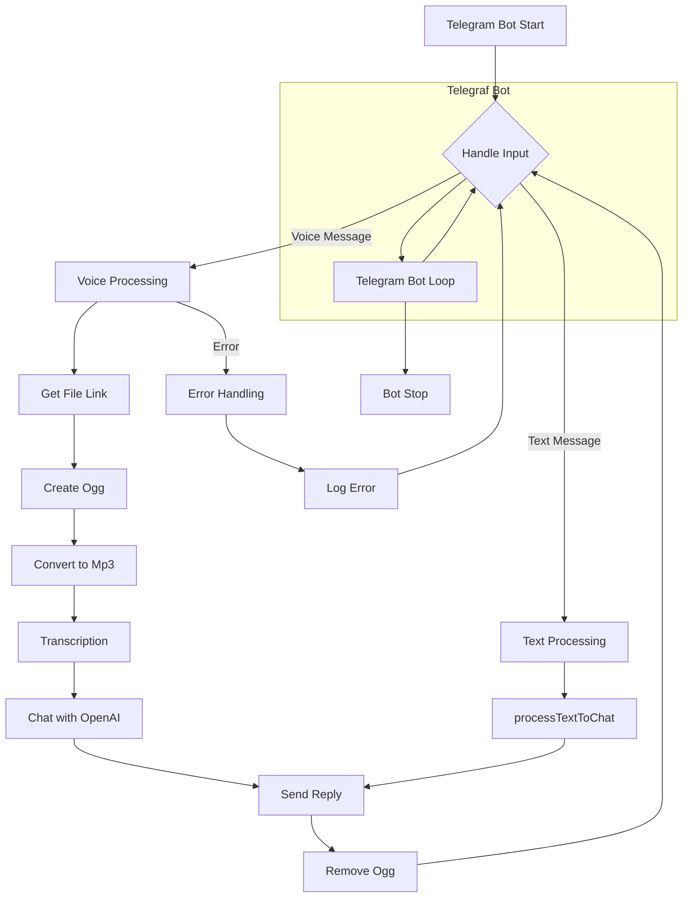

```
1. <input code>
```javascript
import { Telegraf } from 'telegraf'
import { message } from 'telegraf/filters'
import { code } from 'telegraf/format'
import config from 'config'
import { ogg } from './ogg.js'
import { openai } from './openai.js'
import { removeFile } from './utils.js'

const bot = new Telegraf(config.get('TELEGRAM_TOKEN'))
bot.command('start', async(ctx) => {
    await ctx.reply(JSON.stringify(ctx.message));
})

bot.on(message('voice'), async (ctx) => {
    try {
        await ctx.reply(code('Сообщение принял. Жду ответ от сервера...'))
        const link = await ctx.telegram.getFileLink(ctx.message.voice.file_id)
        const userId = String(ctx.message.from.id)
        const oggPath = await ogg.create(link.href, userId)
        const mp3Path = await ogg.toMp3(oggPath, userId)
        removeFile(oggPath)
        const text = await openai.transcription(mp3Path)
        await ctx.reply(code(`запрос: ${text}`))
        const messages = [{ role: openai.roles.USER, content: text }]
        const response = await openai.chat(messages)
        await ctx.reply(response.content)
    } catch (e) {
        console.error(`Error while proccessing voice message`, e.message)
    }
})

bot.on(message('text'), async (ctx) => {
    ctx.session ??= INITIAL_SESSION
    try {
        await ctx.reply(code('Сообщение принял. Жду ответ от сервера...'))
        await processTextToChat(ctx, ctx.message.text)
    } catch (e) {
        console.log(`Error while voice message`, e.message)
    }
})

bot.launch()
process.once('SIGINT', () => bot.stop('SIGINT'))
process.once('SIGTERM', () => bot.stop('SIGTERM'))
```

2. <algorithm>



**Examples:**

* **Voice Processing (C):** User sends a voice message.
* **Text Processing (D):** User sends a text message.
* **Get File Link (E):**  Retrieves download link for voice file from Telegram. Example: `https://api.telegram.org/file/xxx/yyy.ogg`
* **Create Ogg (F):** Downloads the voice file and saves it as OGG format. Example: Creates `./tmp/user12345.ogg`.
* **Convert to Mp3 (G):** Converts the downloaded OGG file to MP3. Example: Creates `./tmp/user12345.mp3`.
* **Transcription (H):** Sends the MP3 to OpenAI's speech-to-text API. Example: Sends `./tmp/user12345.mp3` and retrieves "Hello, world!".
* **Chat with OpenAI (I):** Sends the text to OpenAI's chat API. Example: Sends "Hello, world!" as user input.
* **Send Reply (J):** Sends the response from OpenAI back to the user. Example: Sends "Hi there!".


3. <explanation>

**Imports:**

* `Telegraf`:  The primary package for creating Telegram bots.
* `message`: Filter to handle voice and text messages.
* `code`: Formatter for displaying formatted text to Telegram.
* `config`: Loads configuration variables from a `config.js` file.
* `ogg`: Handles file conversion and manipulation for audio files.
* `openai`: Interacts with the OpenAI API for tasks like transcription and chat completion.
* `removeFile`:  Deletes files from the local system.
* `utils.js` likely contains functions for cleaning up resources and potentially other utility functions used in the bot.

**Classes:**

* No explicit classes defined in the code snippet.

**Functions:**

* `bot.command('start', ...)`:  Handles the '/start' command and responds with a stringified representation of the received message, used to show message structure.
* `bot.on(message('voice'), ...)`:  Handles incoming voice messages. It downloads, transcribes, sends to OpenAI, and handles the response.  Crucially, it handles the file management and error handling for the voice input.
* `bot.on(message('text'), ...)`:  Handles incoming text messages. It delegates to `processTextToChat` function.
* `processTextToChat`: This function is not defined within the provided code snippet.   The implementation of this function would determine how text messages are processed by the bot. It likely interacts with the OpenAI API in a similar manner to voice messages.

**Variables:**

* `bot`: An instance of the Telegraf bot.
* `INITIAL_SESSION`: Likely defined elsewhere; a variable to initialize the session data for the bot.  (Important: Using `ctx.session ??= INITIAL_SESSION` in the text message handler is vital to manage the session between messages).


**Potential Errors/Improvements:**

* **Error Handling:** The `try...catch` blocks are good, but consider more specific error handling within the `ogg`, `openai`, and `removeFile` functions.  Providing meaningful error messages to the user could enhance the user experience.
* **File Management:**  Ensure that `removeFile` handles potential errors (file not found, permission issues). Consider using a dedicated file system library for more robust and efficient file handling.
* **Rate Limiting:** OpenAI API calls have rate limits. Implement safeguards to avoid hitting these limits, potentially by using exponential backoff or queuing requests.
* **Logging:**  Improve logging to include timestamps, and debug information.
* **`processTextToChat` Implementation:**  Crucially, the `processTextToChat` function is undefined. This would need implementation elsewhere in the project and will dictate how the bot will process textual user input.

**Relationships:**

This code interacts with the `ogg`, `openai`, `utils`, `config` modules, all likely residing in other `src` folders/files.  Understanding the internal workings of `ogg` and `openai` is important to fully comprehend the code. `config` likely defines bot configuration settings, which might include API keys and other configuration variables, making it part of the external dependencies.