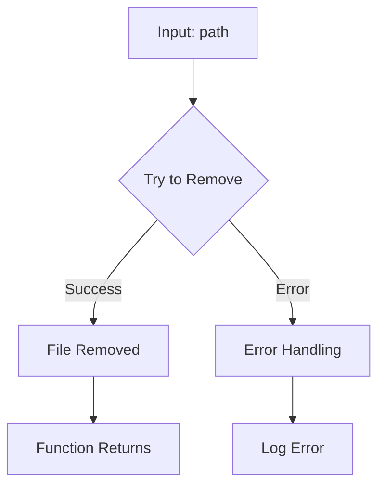

1. **<input code>**

```javascript
import { unlink } from 'fs/promises'
export async function removeFile(path) {
    try {
        await unlink(path)
    } catch (e) {
        console.log('Error while removing file', e.message)
    }
}
```

2. **<algorithm>**



**Example Data Flow:**

* **Input (path):** `/tmp/myFile.txt`
* **B (Try to Remove):** Calls the `unlink` function to remove the file at `/tmp/myFile.txt`.
* **C (File Removed):** If the file is successfully removed, the function continues to the next step.
* **D (Error Handling):** If any error occurs (e.g., file not found, permission issues), the code enters the `catch` block.
* **E (Log Error):** Logs an informative message to the console, containing the error message.  Example: "Error while removing file ENOENT: no such file or directory, /tmp/myFile.txt"
* **F (Function Returns):** The function returns (implicitly, as an async function).

3. **<explanation>**

* **Imports:**
    * `import { unlink } from 'fs/promises'`: This line imports the `unlink` function from the `fs/promises` module. This module provides asynchronous file system functionalities.  `fs/promises` is part of Node.js's built-in `fs` (file system) module and provides promises-based methods for file system operations, which are generally more efficient and easier to use in asynchronous contexts. The `unlink` function is used to delete a file.  It's a critical import for file removal operations in the script. This import is necessary for the `removeFile` function to work as intended and is a standard practice in Node.js applications that need to interact with the file system.

* **Functions:**
    * `async function removeFile(path)`: This function takes one argument:
        * `path (string)`: The path to the file that needs to be removed.
    * The function is asynchronous, indicated by `async`, meaning it can perform operations that might take time (like file system interactions) without blocking the main thread. The `try...catch` block handles potential errors during the `unlink` operation.
    * The function's purpose is to remove a file at a given path, logging errors if something goes wrong.  The function returns implicitly, with the asynchronous operation completing at a later point in time.


* **Variables:**
    * No variables are explicitly declared in the code snippet.


* **Potential Errors/Improvements:**
    * **Error Handling:** The error handling is quite good, logging the error message to the console.  A more robust solution might include logging the error to a centralized logging system or providing a more informative error message to the user.  More specific error handling (e.g., checking if the path is valid) is missing, which would increase the reliability of the function.
    * **Robustness:**  The code doesn't verify if the `path` is valid or if the file exists before attempting to delete it.  If the `path` is invalid or the file does not exist, `unlink` will throw an error.  Adding checks to verify these conditions could significantly improve the function's reliability.
    * **Input Validation:** It would be beneficial to add input validation to ensure that the `path` argument is a string and is not malicious.

* **Relationships with other parts of the project (Hypothetical):**

    This `removeFile` function likely exists in a larger project, potentially part of a bot or service that handles files.  It could be called by other scripts or classes within the project, like a message handling function in a Telegram bot (likely responsible for cleaning temporary files).


**Summary:** This code provides a basic, but not production-ready, asynchronous file removal function. It's well-structured and demonstrates proper error handling, but could benefit from more comprehensive input validation and error management to increase robustness and reliability.