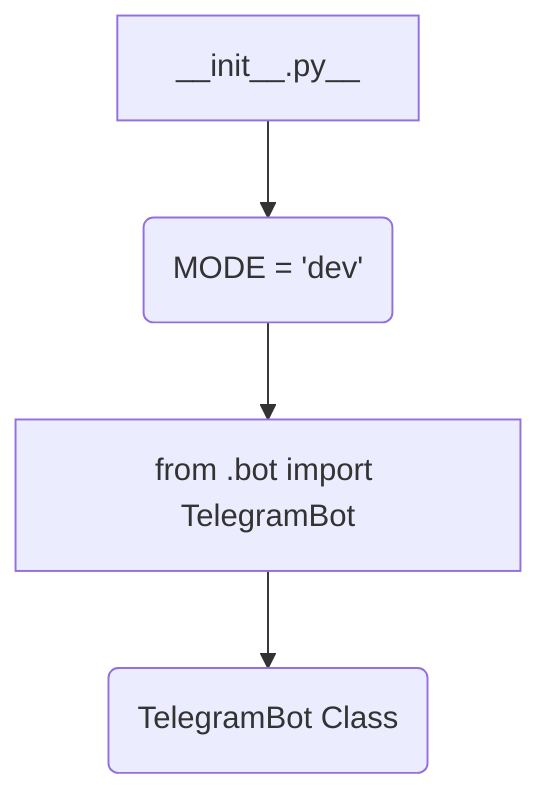

1. **<input code>**:

```python
## \file hypotez/src/bots/telegram/__init__.py
# -*- coding: utf-8 -*-
#! venv/Scripts/python.exe
#! venv/bin/python/python3.12

"""
.. module: src.bots.telegram 
	:platform: Windows, Unix
	:synopsis:

"""
MODE = 'dev'

from .bot import TelegramBot
```

2. **<algorithm>**:



**Example Data Flow:**

* `__init__.py` sets the `MODE` variable to 'dev'. This variable is likely used for configuration purposes, selecting different operational modes (e.g., development, production).
* `__init__.py` imports the `TelegramBot` class from the `bot.py` file within the same `telegram` subdirectory. This establishes a relationship between the `__init__.py` module and the `TelegramBot` class. The `TelegramBot` class defines the functionality for handling Telegram interactions.


3. **<explanation>**:

* **Imports**:
    * `from .bot import TelegramBot`: This line imports the `TelegramBot` class from the `bot.py` file located in the `hypotez/src/bots/telegram` directory.  The `.` indicates a relative import, crucial for structuring the project's modules. This import establishes a dependency between the `__init__.py` file and the `TelegramBot` class. This suggests the `bot.py` file contains the class definition for the Telegram bot, defining methods for interacting with the Telegram API.

* **Variables**:
    * `MODE = 'dev'`: This global variable likely defines the operational mode of the Telegram bot application. `dev` suggests a development mode.  This might control behavior, logging, or other settings.

* **Classes**:
    * `TelegramBot`: The `__init__.py` file does *not* define this class.  The comment suggests this class is in `bot.py` and is responsible for handling interactions with the Telegram API (creating a bot instance, handling updates, messages etc.). This will likely have methods for actions like sending messages, handling user interactions and potentially receiving messages. This is crucial for interacting with the Telegram Bot API.  Understanding the structure of `bot.py` is essential to understand the complete functionality.

* **Functions**:
    * There are no functions directly defined in `__init__.py`. The functionality comes from the `TelegramBot` class within `bot.py` which is imported and used by `__init__.py`.

* **Potential Errors/Improvements**:
    * The file contains only basic initialization.  A more comprehensive `__init__.py` would typically contain more configuration options, initialization code (e.g., creating the bot object), and potentially functions for managing the bot.
    * Docstrings are present in `__init__.py`, but the documentation should ideally be in a dedicated Sphinx documentation for the project.
    * It is crucial to understand the `bot.py` file to fully comprehend how the Telegram bot interacts with the Telegram API.
    * The `#!` lines at the beginning of the file appear to be shebangs for specifying the interpreter to run the file (probably Python 3.12).  These are not strictly necessary within the Python source code and might be historical/legacy for a different purpose.


* **Relationship with other parts of the project**:
    * The `TelegramBot` class relies on libraries for interacting with the Telegram API.  These are likely external packages that are imported in the `bot.py` file.
    * The project likely has other modules (e.g., `handlers.py`,  `utils.py`) within the `hypotez/src/bots/telegram` directory. For example, `handlers.py` could contain the code that handles different types of messages. `utils.py` could house utility functions used by the bot, such as message parsing or data formatting.


In summary, this `__init__.py` file acts as a module entry point for the `telegram` bot, importing and setting up the core component, `TelegramBot`, from another module.  Without `bot.py`, complete understanding is incomplete.