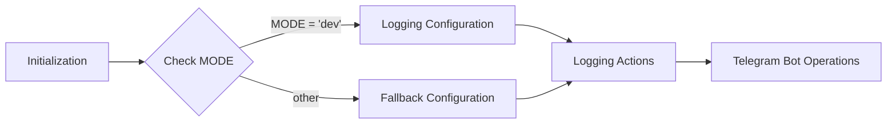

```
## File hypotez/src/bots/telegram/logger.py
# -*- coding: utf-8 -*-
#! venv/Scripts/python.exe
#! venv/bin/python/python3.12

"""
.. module: src.bots.telegram.logger
	:platform: Windows, Unix
	:synopsis: Модуль логгирования телеграм ботов

"""
MODE = 'dev'
```

**<algorithm>**



**Example Data Flow:**

* **Initialization:** The script begins execution.
* **Check MODE:**  The script examines the `MODE` variable (currently set to 'dev').
* **Logging Configuration (if MODE = 'dev'):**  Specific logging configurations for development mode are applied (e.g., logging level, handlers, output file).
* **Fallback Configuration (if MODE != 'dev'):**  Alternative logging configurations are applied if `MODE` is different from 'dev'. This could include production logging or another specific configuration.
* **Logging Actions:** Logging events related to Telegram bot operations (e.g., messages received, sent, errors) are logged based on the configured settings.
* **Telegram Bot Operations:** The Telegram bot interacts with users, and the logging infrastructure captures and records relevant events (e.g., user actions).


**<explanation>**

* **Imports:** There are no imports in this code snippet.  Import statements are missing, indicating that this likely serves as a configuration file or header for a Python module that will include imports within the functions and classes to use various logging libraries.

* **Classes:** No classes are defined.

* **Functions:** No functions are defined.

* **Variables:**
    * `MODE`: A string variable that is crucial for conditional configuration. It determines which logging configuration to use (in this case, 'dev').  The variable's value should be set to a specific string indicating the desired mode (e.g., "dev", "prod"). This is crucial for separating development and production logging and is an excellent practice.

* **Potential Errors or Areas for Improvement:**
    * **Missing Imports:** The code is incomplete.  The absence of import statements means that logging functionality cannot be used without explicitly importing the relevant libraries. This would typically be located within the functions and classes that will use the logging capabilities.
    * **Lack of Configuration Details:** The current code lacks the details of the logging configuration itself.  To be useful, it needs to define the logging handlers, level, formatters, and destinations (e.g., file, console).
    * **Undefined MODE Values:** The `MODE` variable is set to 'dev'. If other values were intended (e.g., 'prod'),  there should be an appropriate conditional block to handle them in case they're used.


**Relationship with Other Project Parts:**

This `logger.py` file will likely be imported and used by other modules or classes within the `hypotez` project, especially in the `bots/telegram` package.  These components will handle specific interactions with the Telegram bot API and will make calls to this logger to record events (e.g., sending messages, handling errors). The `MODE` variable will enable different configurations for development and production environments. This logger will need to interact with various API calls within the Telegram bot, making accurate logging of these interactions important for debugging and performance tracking.  Therefore, the complete implementation would also include import statements for appropriate Python libraries for logging and interaction with the Telegram Bot API.