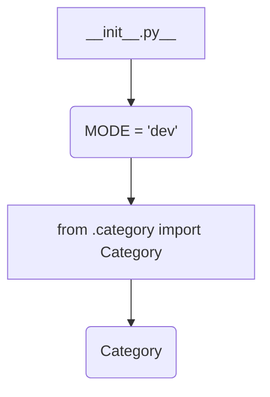

1. **<input code>**

```python
## \file hypotez/src/category/__init__.py
# -*- coding: utf-8 -*-
#! venv/Scripts/python.exe
#! venv/bin/python/python3.12

"""
.. module: src.category 
	:platform: Windows, Unix
	:synopsis:

"""
MODE = 'dev'

from .category import Category
```

2. **<algorithm>**



This is a simple `__init__.py` file.  It doesn't contain any complex algorithms or processing.  The data flow is straightforward.

* **Block A (init.py):** This is the entry point for the `category` module. It sets a global variable `MODE` to 'dev'.
* **Block B (MODE assignment):** The variable `MODE` is assigned the string value 'dev'.  This variable is likely used for configuration or conditional logic in other parts of the application. Example: if `MODE == 'prod'`, different database connections or logging configurations are used.
* **Block C (Import):** The `__init__.py` file imports the `Category` class from the `category` module.  This makes the `Category` class directly available to other modules using this package.
* **Block D (Category):** This represents the `Category` class, which is assumed to be defined in `hypotez/src/category/category.py`.  It's not shown in this snippet.

3. **<explanation>**

* **Imports:** The single import statement `from .category import Category` imports the `Category` class from a module named `category.py` located within the same directory (`hypotez/src/category/`). This is a standard Python practice for organizing modules. The `.` before `category` indicates that the module being imported is in the same package.
* **Classes:** The `Category` class is not defined within this `__init__.py` file but will likely be defined in a file named `category.py` within the `hypotez/src/category` directory.  Its role, attributes, and methods will define the structure and behavior related to a category.  For example, it might store the name, description, and associated items of a category. The absence of the `Category` class definition means no detailed attributes/methods can be described.
* **Functions:** There are no functions defined in this file.
* **Variables:** The `MODE` variable stores a string value ('dev').  This variable is likely used for configuring different environments, like development (`'dev'`), testing (`'test'`), or production (`'prod'`). This allows for conditional logic that modifies program behavior or data sources (e.g., databases) based on the environment.
* **Potential Errors/Improvements:**
    * **Missing Docstrings:** While the module docstring is present, individual class and function docstrings are missing, which would help other developers understand the purpose and usage of these components.
    * **Error Handling:** There's no error handling to catch cases where the imported `Category` class might not exist.  Adding a try/except block would make the code more robust.
    * **Type Hinting:** Adding type hints would improve code readability and maintainability and can help with static analysis tools.
* **Relationships:** This `__init__.py` file acts as an entry point for the `category` module. It establishes a dependency relationship between this module and any modules that import `Category`.  Other modules within the `hypotez` project, potentially in other packages (e.g., `analysis`, `utils`), might utilize the `Category` class to manage categories, suggesting a chain of relationships where `Category` is used for data modeling and potentially manipulated by other parts of the project.


In summary, this file acts as an import organizer, making the `Category` class accessible from other parts of the `hypotez` project by importing it.  The 'dev' mode variable will likely influence the application's configuration and behavior during different phases of development. More information about the `Category` class will be needed to gain a complete picture of the module's functionality.