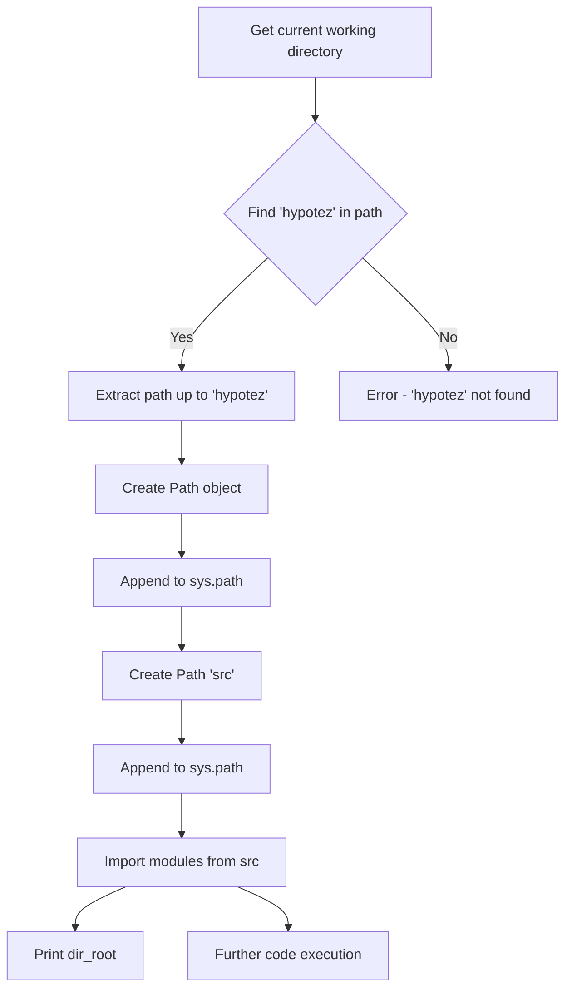

```
1. <input code>
```python
## \file hypotez/src/category/_examples/header.py
# -*- coding: utf-8 -*-\n#! venv/Scripts/python.exe
#! venv/bin/python/python3.12
"""
.. module: src.category._examples 
	:platform: Windows, Unix
	:synopsis:

"""
MODE = 'dev'

"""
	:platform: Windows, Unix
	:synopsis:

"""


"""
	:platform: Windows, Unix
	:synopsis:

"""


"""
  :platform: Windows, Unix

"""
"""
  :platform: Windows, Unix
  :platform: Windows, Unix
  :synopsis:
"""MODE = 'dev'
  
""" module: src.category._examples """


""" @namespace src.category._examples """
import sys
import os
from pathlib import Path

dir_root : Path = Path (os.getcwd()[:os.getcwd().rfind('hypotez')+11])
sys.path.append (str (dir_root) )  # Добавляю корневую папку в sys.path
dir_src = Path (dir_root, 'src')
sys.path.append (str (dir_root) ) 
...

print(dir_root)
# ----------------
from pathlib import Path
import json
import re
# ----------------

from src import gs
from src.suppliers import Supplier
from src.product import Product, ProductFields, ProductFieldsLocators
from src.category import Category
from src.utils import j_dumps, j_loads,   pprint, save_text_file
from src.logger import logger
from src.utils.string import StringFormatter, StringNormalizer, ProductFieldsValidator
...
```

2. <algorithm>



Example:

If `os.getcwd()` returns `/home/user/project/hypotez/some/path`, then `dir_root` will be `/home/user/project/hypotez/`.

3. <explanation>

* **Imports**:
    - `sys`, `os`, `pathlib`: Standard Python modules for system interactions (getting the current directory, path manipulation).  Crucial for finding and adding the project root to the Python path.
    - `json`, `re`: Standard Python libraries for JSON handling and regular expressions (likely used for data parsing and manipulation).
    - `gs`: Likely a module from the `src` package that handles Google Services or similar.
    - `Supplier`, `Product`, `ProductFields`, `ProductFieldsLocators`, `Category`: Custom classes from packages within the `src` directory. Define different types of entities in the application.  `ProductFieldsLocators` hints at potentially locating data in product fields.
    - `j_dumps`, `j_loads`, `pprint`, `save_text_file`: Custom functions from the `src.utils` module, potentially dealing with JSON encoding/decoding, formatted printing, and file saving.
    - `logger`: Likely a custom logging module from `src.logger` for structured output.
    - `StringFormatter`, `StringNormalizer`, `ProductFieldsValidator`: Functions from the `src.utils.string` module that handle string manipulation specifically related to product field validation.
    


* **Classes (and potential relationships):**
    - `Supplier`, `Product`, `Category`: These are likely domain models representing business entities and belonging to the `src` package. The `ProductFields` and `ProductFieldsLocators` classes likely define attributes and accessors for product data.
    - The code demonstrates how the application's `src` packages are referenced. The `src` folder potentially represents the core domain model packages.


* **Functions (example):**
    - `j_dumps`, `j_loads`:  These custom functions deal with JSON data. Likely crucial for handling structured data within the `src` package and other modules.  Crucial for data serialization and deserialization.
    - `pprint`: Provides pretty-printed output for debugging and displaying data (likely for easier visualization).

* **Variables**:
    - `dir_root`, `dir_src`:  `Path` objects to store the paths for the project root and the `src` directory.  Used for consistent path management.
    - `MODE`: A string variable likely indicating the execution mode (e.g., 'dev', 'prod').


* **Potential Errors/Improvements**:
    - The code appends the root directory twice to `sys.path`. This is likely an error. It should be appended only once.
    - The `...` indicates that the code continues beyond what's shown. This means potentially critical code may be hidden, which should be fully reviewed to determine the full functionality.
    - The `print(dir_root)` statement is useful for debugging, but should be removed from production code, as it will print the path multiple times if executed more than once.
    - The multitude of docstrings (`"""..."""`) without function/class definitions suggests these are either placeholder docstrings or incomplete implementation; they require implementation within the code.
    - The `...` suggests incomplete code. The `import ...` statements that include `...` require completion.
    - The use of Python `Path` objects is good practice; this avoids string manipulation vulnerabilities and enforces type safety in path handling.


* **Relationship Chain**:
The code clearly establishes a relationship between the root project folder (`hypotez`) and its `src` directory.  The `src` directory is likely the entry point for core project functionality (modules, classes, etc.), which in turn interact with `utils` to handle data serialization, manipulation, and other helper tasks. The use of import statements indicates dependency between different modules and packages.

**Overall:** The code snippet initializes the Python path by adding the project's `src` directory.  The remaining code is crucial for defining the core functionality of the project's `category` module, importing related modules and classes, and using utilities to facilitate data handling and interaction with external resources (e.g., Google services). The presence of the `...` suggests missing parts that will fully define the intended functionality.