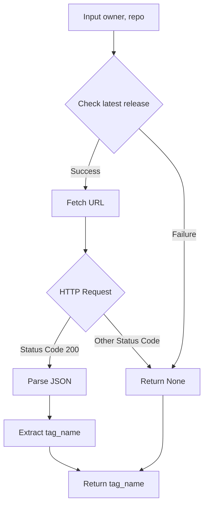

1. **<input code>**

```python
## \file hypotez/src/check_release.py
# -*- coding: utf-8 -*-
#! venv/Scripts/python.exe
#! venv/bin/python/python3.12

"""
.. module: src 
	:platform: Windows, Unix
	:synopsis:

"""
MODE = 'dev'


import requests
from src.logger import logger

def check_latest_release(owner: str, repo: str):
    """Check the latest release version of a GitHub repository.

    Args:
        owner (str): The owner of the repository.
        repo (str): The name of the repository.

    Returns:
        str: The latest release version if available, else None.
    """
    url = f'https://api.github.com/repos/{owner}/{repo}/releases/latest'
    response = requests.get(url)

    if response.status_code == 200:
        latest_release = response.json()
        return latest_release['tag_name']
    else:
        #logger.error(f"Error fetching data: {response.status_code}")
        #TODO: Код не проверен
        return 
```

2. **<algorithm>**



**Examples:**

* **Input:** `owner = "hypotez-org"`, `repo = "my-repo"`
* **Fetch URL:** `https://api.github.com/repos/hypotez-org/my-repo/releases/latest`
* **Success:** API returns a 200 OK response with JSON data like: `{ "tag_name": "v1.2.3" }`.
* **Return:** `v1.2.3`

* **Failure:** API returns a 404 or other error code.
* **Return:** `None`


3. **<explanation>**

* **Imports:**
    * `requests`: Used for making HTTP requests to the GitHub API.  Critically important for fetching release data.  This library is external to the project.  It's a standard Python library used for making HTTP requests.

    * `src.logger`: Imports a logger likely defined in a file within the `hypotez/src` directory.  This suggests a logging mechanism for the project, allowing for tracking and handling errors.  This is a custom import within the project, showcasing a modular structure.

* **Classes:**
   No classes are present.

* **Functions:**
    * `check_latest_release(owner: str, repo: str)`:
        * **Arguments:**
            * `owner` (str): The GitHub username or organization.
            * `repo` (str): The name of the repository.
        * **Return Value:**
            * `str`: The latest release version (tag name) if successful, `None` otherwise.
        * **Functionality:** Constructs the GitHub API URL, makes a GET request, checks the response status code. If 200, parses the JSON response, extracts the `tag_name`, and returns it.  If not 200, it returns `None`.  Note the crucial error handling, which currently doesn't log the error but simply returns `None`.

* **Variables:**
    * `MODE = 'dev'`: A global variable, likely used for configuration (e.g., different logging levels in different modes).
    * `url`:  String variable, dynamically created based on `owner` and `repo` arguments. This variable holds the URL to be used for the API request.
    * `response`: `requests.Response` object, containing the HTTP response from the API.

* **Potential Errors and Improvements:**
    * **Missing error handling:** The `else` block currently just returns `None` if the request fails.  This makes debugging difficult. It's crucial to log the error (using `logger`) with the `response.status_code` to understand why the request failed (e.g., network issue, invalid credentials, unauthorized). Example: `logger.error(f"Error fetching release for {owner}/{repo}: {response.status_code}")`.
    * **Missing Error Handling in Case of Invalid JSON:** The code assumes the JSON response is well-formed.  If the JSON is malformed, `response.json()` will raise an exception. The code should include a `try...except` block to handle potential `json.JSONDecodeError`.
    * **Incomplete Docstrings:** While the docstrings are good for basic understanding, more detailed explanations about the input validation checks and possible return values would improve readability and maintainability.
    * **Rate Limiting:** The code doesn't handle rate limiting by the GitHub API.  In production, the implementation should check the response headers for rate limits and implement appropriate delays to prevent being blocked.
    * **Type Hinting:** Type hinting is generally a good practice, however, checking the return value of a function is crucial. Using an assertion is a practical approach, as the return type is `str` or `None`, so one can assert the return value (`return_value is None or isinstance(return_value, str)`) within the `check_release` function to handle potential inconsistencies.

**Relationship to Other Project Parts:**

The `check_release` function relies on the `src.logger` module for logging, showing a clear dependency.  It interacts with the GitHub API, indicating an external dependency.  The function likely forms part of a larger system for managing releases and updates (e.g., for versioning and deployment).