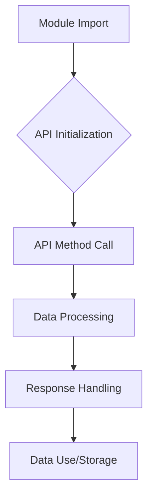

```
# Модуль `endpoints`

Модуль `endpoints` содержит различные реализации API-конечных точек для взаимодействия с внешними сервисами и модулями. Каждая поддиректория представляет отдельный модуль с реализацией API для определенного сервиса.

## Структура модуля

```
\src\endpoints
│
├── \prestashop       # API для интеграции с системой PrestaShop.
├── \advertisement    # API для работы с рекламными платформами.
├── \emil             # API для работы с сервисом Emil.
├── \hypo69           # API для взаимодействия с платформой Hypo69.
├── \kazarinov        # API для сервиса Kazarinov.
```

## Описание модулей

### 1. `prestashop`
Модуль предназначен для интеграции с системой электронной коммерции PrestaShop. Реализует функционал взаимодействия с заказами, товарами и клиентами.

- **Основные функции**:
  - Создание, редактирование и удаление товаров.
  - Управление заказами и пользователями.

### 2. `advertisement`
Модуль предоставляет API для управления рекламными платформами, включая создание кампаний и аналитические отчеты.

- **Основные функции**:
  - Управление рекламными кампаниями.
  - Сбор и обработка данных аналитики.

### 3. `emil`
Интерфейс для работы с сервисом Emil, предоставляющим API для обмена данными.

- **Основные функции**:
  - Обработка и отправка запросов в сервис.
  - Сбор данных из API Emil.

### 4. `hypo69`
API для взаимодействия с платформой Hypo69, предоставляющей специфические бизнес-решения.

- **Основные функции**:
  - Получение данных о клиентах.
  - Работа с пользовательскими отчетами.

### 5. `kazarinov`
Модуль для интеграции с сервисом Kazarinov. Поддерживает функционал аналитики и обмена данными.

- **Основные функции**:
  - Интеграция данных между системами.
  - Создание отчетов и аналитика.

## Установка и использование

### Установка
Для начала работы убедитесь, что установлены все зависимости проекта. Используйте команду:

```bash
pip install -r requirements.txt
```

### Использование
Импортируйте нужный модуль в своем коде:

```python
from src.endpoints.prestashop import PrestashopAPI
from src.endpoints.advertisement import AdvertisementAPI
```

Далее настройте и используйте методы в зависимости от вашего кейса.

## Вклад в разработку

Если вы хотите внести изменения в модуль, соблюдайте следующие правила:

1. Используйте [PEP 8](https://peps.python.org/pep-0008/) для стиля кода.
2. Добавляйте тесты для нового функционала.
3. Оставляйте подробные комментарии к изменениям.

Для вопросов и предложений обращайтесь к владельцу репозитория или оставляйте комментарии в [Issues](#).
```

**<algorithm>**



**Example:**

1. **Module Import (A):** `from src.endpoints.prestashop import PrestashopAPI` imports the `PrestashopAPI` class.
2. **API Initialization (B):**  `prestashop_api = PrestashopAPI(api_key="...")` creates an instance of the API class.
3. **API Method Call (C):** `products = prestashop_api.get_products()` calls the `get_products` method.
4. **Data Processing (D):** The method retrieves product data from PrestaShop API.  If this was a method returning an array of products, it might parse or filter the received data.
5. **Response Handling (E):** The received data is processed and parsed, handling potential errors or exceptions.
6. **Data Use/Storage (F):** The `products` data is stored in a database, used for display on a website, or further processed.


**<explanation>**

* **Imports:** The code shows import statements for specific API classes (`PrestashopAPI`, `AdvertisementAPI`).  These imports are crucial for using the functionality provided by the `endpoints` modules. The `src` prefix suggests a package structure where `endpoints` is a module within the larger `src` package.  The file `requirements.txt` likely defines the dependencies needed for the libraries those APIs might use.
* **Classes (e.g., PrestashopAPI):** The  `PrestashopAPI` class represents the interface for interacting with the PrestaShop API.  This class likely holds attributes like API keys, base URLs, and authentication tokens. It also likely defines methods (e.g., `get_products`, `create_product`, `update_order`) for different API calls.  Without the actual Python code, specifics about attributes and methods can't be fully described.
* **Functions:**  The documentation mentions various functions within each module (e.g., `get_products`, `create_product`). These functions likely handle specific tasks related to the corresponding external service. Function names are designed to be self-explanatory.
* **Variables:** Variables used are likely to be API keys, URLs, database connection strings, and returned data (e.g. `products`).  Their types are dependent on the implementation, but will be strings, integers, lists, dictionaries, or instances of custom data classes (e.g. `Product`).
* **Potential Errors/Improvements:** The documentation lacks crucial detail. Errors like incorrect API keys or rate limits from external APIs are not covered.  Code examples for using these APIs would greatly improve understanding and guidance for developers using these modules. Thorough error handling and logging would significantly benefit robustness.


**Relationships:**

The `endpoints` module clearly interacts with external services (PrestaShop, Emil, etc.). This means it relies on those services being operational. The module's functionality is dependent on correctly configured interactions with the external APIs. The `requirements.txt` file likely specifies the packages necessary for interaction with the external services.  Without access to the implementation of these APIs, or sample code demonstrating these interactions, we can't identify any direct connections within the `src` package hierarchy.  However, we can infer that there's a dependency on a package handling the communication with the external APIs. This is crucial, as it affects how the APIs will be used and error handling.  Data from these external services is presumably used within other modules in `src` (e.g., for order processing, inventory management).