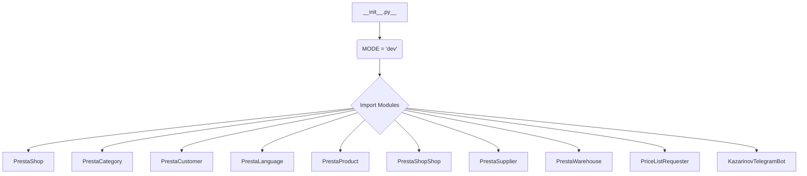

1. **<input code>**

```python
## \file hypotez/src/endpoints/__init__.py
# -*- coding: utf-8 -*-
#! venv/Scripts/python.exe
#! venv/bin/python/python3.12

"""
.. module: src.endpoints 
	:platform: Windows, Unix
	:synopsis:

"""
MODE = 'dev'


from .prestashop import PrestaShop, PrestaCategory, PrestaCustomer, PrestaLanguage, PrestaProduct, PrestaShopShop, PrestaSupplier, PrestaWarehouse, PriceListRequester 
from .kazarinov import KazarinovTelegramBot
```

2. **<algorithm>**



This is a simplified diagram. The actual algorithm is the importing of modules, setting a `MODE` variable, and referencing classes and objects defined in the respective modules (e.g. `.prestashop`).


3. **<explanation>**

* **Imports**:
    - `from .prestashop import ...`: Imports various classes from the `prestashop` submodule within the `endpoints` package.  This suggests a modular design where `prestashop` handles interactions with the PrestaShop e-commerce platform.  This is likely a core part of the project's functionality and will likely include interactions with PrestaShop APIs to extract data.  The `endpoints` package acts as an entry point for interacting with various data sources (e.g., PrestaShop, Kazarinov). The specific types imported (e.g., `PrestaShop`, `PrestaProduct`) indicate classes likely representing entities or data structures from the PrestaShop API.
    - `from .kazarinov import KazarinovTelegramBot`: Imports the `KazarinovTelegramBot` class, which suggests this part of the project involves communication with a Telegram bot (likely a business partner, an internal tool, etc.) for Kazarinov.


* **Classes**:
    - The presence of classes like `PrestaShop`, `PrestaCategory`, etc. strongly suggests an object-oriented approach to dealing with the different elements of PrestaShop and other sources.  Each likely represents an entity or data model within the PrestaShop platform or from the Kazarinov system.  Each will likely have methods for accessing and manipulating data related to that specific entity.  These classes are defined in the `.prestashop` and `.kazarinov` modules respectively, which are assumed to contain the complete implementation of these classes.


* **Functions**:
    - No functions are defined in this file.  The purpose is simply to organize the access to the classes (objects) defined in the other module files.


* **Variables**:
    - `MODE = 'dev'`: This is a configuration variable, likely used to switch between different operational modes (e.g., development, testing, production). It's a simple string variable.  This is a common practice for separating configurations during development and deployment.

* **Potential Errors/Improvements**:
    - **Missing Documentation**:  While the docstrings provide a basic overview, more detailed docstrings within the imported modules for each class, function and variables would significantly improve readability and maintainability.
    - **Error Handling**: No error handling mechanisms are visible.  Adding `try...except` blocks around API calls to PrestaShop and Telegram would make the code more robust.
    - **Dependency Management**:  Explicitly mentioning dependencies (e.g., `requests` for API calls or specific PrestaShop API libraries).

* **Relationships**:
    - The `endpoints` package is likely to be a core part of the project's architecture.  It's the middleman for interacting with the various data sources (PrestaShop, KazarinovTelegramBot). The `.prestashop` and `.kazarinov` submodules are the actual implementation modules that handle communications and data retrieval from these sources. The `hypotez` package is assumed to be the main project module and contains the other parts of the system (e.g., services).  In the absence of further code, it's unclear what these other parts are.


This analysis assumes a standard Python project structure. If there are custom packages, the exact structure will change.  The next step in analysis would be to examine the code within `.prestashop` and `.kazarinov` to understand how these external systems are accessed.