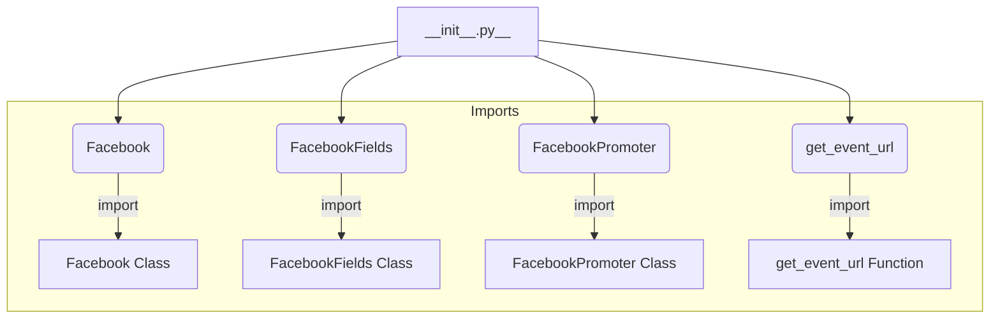

1. **<input code>**:

```python
## \file hypotez/src/endpoints/advertisement/facebook/__init__.py
# -*- coding: utf-8 -*-\
#! venv/Scripts/python.exe
#! venv/bin/python/python3.12

"""
.. module: src.endpoints.advertisement.facebook 
	:platform: Windows, Unix
	:synopsis:

"""
MODE = 'dev'

from .facebook import Facebook
from .facebook_fields import FacebookFields
from .promoter import FacebookPromoter, get_event_url
```

2. **<algorithm>**:



**Example Data Flow:**

The `__init__.py` file acts as a module entry point. When other parts of the project need to interact with Facebook-related functionality, they will import classes/functions defined in submodules within this folder.

3. **<explanation>**:

* **Imports**:
    * `from .facebook import Facebook`: Imports the `Facebook` class from the `facebook.py` module within the same directory.  This likely represents a class for interacting with Facebook APIs.
    * `from .facebook_fields import FacebookFields`: Imports the `FacebookFields` class from `facebook_fields.py`.  This likely defines constants or enums related to Facebook fields or data structures.
    * `from .promoter import FacebookPromoter, get_event_url`: Imports the `FacebookPromoter` class and the `get_event_url` function from `promoter.py`. This likely handles Facebook ad promotion and event URL retrieval respectively. The `promoter.py` module might contain the logic for interacting with the Facebook Ads API or similar.

    Relationship with other packages: This module is part of a larger project structure organized by packages (src). The `.facebook`, `.facebook_fields`, and `.promoter` submodules are likely further implementing various aspects of Facebook integration.  The specific relationships with other packages would depend on how the imports are used in other modules within the `src` packages.


* **Variables**:
    * `MODE = 'dev'`: This variable likely sets a mode for the module, either for development (dev) or production (prod).  It can be used to control settings or behaviors depending on the current environment.


* **Classes**:

    *  No specific class instantiation or use is present here.   The code simply exposes these classes and functions for use by other parts of the project.


* **Functions**:

    * `get_event_url()`:  This function is imported but not defined here.  It's likely responsible for generating a URL for a Facebook event, potentially based on some input data.  It's expected to have arguments (e.g., event ID, or other event-related data) to generate the appropriate URL for that specific event.  A possible call pattern would be `event_url = get_event_url(event_id=123)`.


* **Potential Errors or Areas for Improvement**:

    * **Missing Docstrings**: The code lacks detailed docstrings explaining the purpose of `Facebook`, `FacebookFields`, `FacebookPromoter` and `get_event_url`. This makes it difficult for others to use these elements without examining their internal implementations.
    * **Missing Error Handling**: The code doesn't demonstrate how it handles potential errors (e.g., network issues, API errors) during Facebook interactions.  Adding try...except blocks would significantly enhance robustness.
    * **Implicit Imports**:  While this is a `__init__.py` for a package, making explicit imports in the `__init__.py` file is sometimes better.   This is a matter of preference and style though.
    * **Missing External Library Imports:** If this code uses libraries like `facebook-ads`, these imports should be present.


**Chain of Relationships**:

The `__init__.py` acts as a module entry point for this Facebook-related functionality.  `Facebook`, `FacebookFields`, and `FacebookPromoter` are likely used in other parts of the project (e.g., within controllers, services, or views) to interact with Facebook's API or perform other tasks.  The `get_event_url` likely serves a specific use case, for example,  it may be used in a controller to get a Facebook event link. The `MODE` variable allows those other parts of the project to conditionally use different settings for different environments.