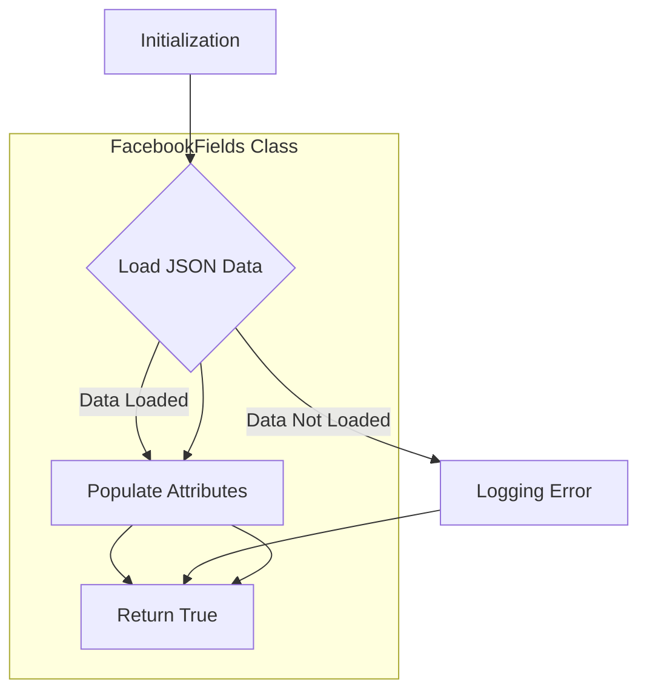

```
## <input code>

```python
## \file hypotez/src/endpoints/advertisement/facebook/facebook_fields.py
# -*- coding: utf-8 -*-
#! venv/Scripts/python.exe
#! venv/bin/python/python3.12

"""
.. module: src.endpoints.advertisement.facebook 
	:platform: Windows, Unix
	:synopsis:

"""
MODE = 'dev'


from pathlib import Path
from src import gs
from src.utils.jjson import j_loads, j_loads_ns
from src.logger import logger

class FacebookFields:
    """Поля для `объявлний` и `эвентов` """

    def __init__(self):
        """"""
        ...
        self._payload()

    def _payload(self):
        """"""
        ...
        data = j_loads (Path (gs.path.src, 'advertisement', 'facebok', 'facebook_feilds.json'))
        if not data:
            logger.debug(f"Ошибка загрузки полей из файла {gs.path.src}/advertisement/facebok/facebook_feilds.json")
            return 
        for name, value in data.items():
            setattr(self, f'{name}', value)
        return True
```

## <algorithm>



**Example Data Flow:**

1. **Initialization (A):** `FacebookFields` object is created.
2. **Load JSON Data (B):** The `_payload` method is called. It attempts to load data from `facebook_feilds.json` using `j_loads` which is likely a custom JSON loading function.
   * **Example:** `facebook_feilds.json` might contain:
     ```json
     {
       "ad_targeting": "interests",
       "event_location": "USA"
     }
     ```

3. **Populate Attributes (C):** If the JSON data is valid, the code iterates through the loaded data and sets attributes for the `FacebookFields` object.
   * **Example:** For each `name`-`value` pair, `setattr(self, f'{name}', value)` sets an attribute named "ad_targeting" with value "interests" for `self`.
4. **Return True (E):** The method returns `True` to signal successful loading or `None` if the JSON file is empty or an error occurred.

5. **Logging Error (D):**  If the JSON data cannot be loaded (e.g., file not found, invalid JSON format), a debug message is logged using `logger`.


## <explanation>

**Imports:**

* `from pathlib import Path`: Used for working with file paths, which is crucial for file handling. This is a standard Python import.
* `from src import gs`: Imports the `gs` module from the `src` package. This likely contains global settings or configuration variables, such as the path to the project root. The `gs` module is crucial for the file loading operation (`gs.path.src`).
* `from src.utils.jjson import j_loads, j_loads_ns`: Imports functions likely for loading JSON data (in the `utils` module) from files in a specific or more sophisticated way than built-in `json` module. This suggests `j_loads` and `j_loads_ns` might handle more complex JSON structures.
* `from src.logger import logger`: Imports a logger object (likely from a logging library such as `logging`) to log messages. This is important for debugging and monitoring the application's execution.


**Classes:**

* `FacebookFields`: This class is designed to encapsulate data related to Facebook advertisements and events. The `__init__` method initializes the object and calls `_payload` to load and set Facebook fields.
    * `_payload()`:  This private method is responsible for loading Facebook field data from a JSON file. It's intended to handle loading JSON data and setting object attributes.

**Functions:**

* `_payload(self)`: 
    * **Arguments:**  Takes `self` (the instance of `FacebookFields` being operated on) as input.
    * **Return value:** Returns `True` on success or `None` on failure (likely implicit failure).
    * **Purpose:** This method attempts to load data from a JSON file (`facebook_feilds.json`) located relative to the project's `src` directory (using `gs.path.src`). If the loading is successful, the fields are populated in the object.

**Variables:**

* `MODE`:  A string constant likely defining the current application mode ('dev' in this case).  It's important for conditional logic (e.g., different configurations for dev vs. production).
* `data`: A variable containing the loaded JSON data.


**Potential Errors and Improvements:**

* **Error Handling:** The code only logs a debug message if the JSON file loading fails. Consider adding more robust error handling (e.g., `try-except` block) to catch potential exceptions (like `FileNotFoundError` or `JSONDecodeError`) and handle them appropriately (e.g., logging a more informative error message or returning a specific error code).
* **Input Validation:** It's essential to validate the structure of the loaded JSON data to prevent unexpected behavior or crashes if the file format is incorrect.
* **Clarity and Comments:** Adding more comments to explain the purpose of the code and any non-obvious logic or design choices would enhance maintainability. The existing docstrings aren't comprehensive.
* **`gs.path.src`:**  This variable needs documentation or context about where it's defined and how `gs` is implemented to understand its significance.

**Relationship with Other Parts of the Project:**

* The `gs` module likely defines the path structure of the project, allowing modules in different directories to find each other. This demonstrates a structured project organization.
* The use of `src.logger` indicates a logging framework, crucial for monitoring applications.
* The use of `src.utils.jjson` suggests a utility module that contains other functions for working with JSON data, which might provide better error handling or more specific JSON formatting support.  It's important to examine the `j_loads` and `j_loads_ns` functions for more details about their specific functionality and limitations.

The code seems to be part of a larger project responsible for advertising and event management.  The Facebook fields are being loaded from a JSON file for configuration.