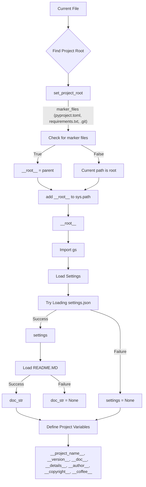

## hypotez/src/endpoints/advertisement/facebook/header.py
# -*- coding: utf-8 -*-\n#! venv/Scripts/python.exe\n#! venv/bin/python/python3.12\n\n"""\n.. module: src.endpoints.advertisement.facebook \n\t:platform: Windows, Unix\n\t:synopsis:\n\n"""\nMODE = \'dev\'\n\nimport sys\nimport json\nfrom packaging.version import Version\n\nfrom pathlib import Path\ndef set_project_root(marker_files=(\'pyproject.toml\', \'requirements.txt\', \'.git\')) -> Path:\n    """\n    Finds the root directory of the project starting from the current file\'s directory,\n    searching upwards and stopping at the first directory containing any of the marker files.\n\n    Args:\n        marker_files (tuple): Filenames or directory names to identify the project root.\n    \n    Returns:\n        Path: Path to the root directory if found, otherwise the directory where the script is located.\n    """\n    __root__:Path\n    current_path:Path = Path(__file__).resolve().parent\n    __root__ = current_path\n    for parent in [current_path] + list(current_path.parents):\n        if any((parent / marker).exists() for marker in marker_files):\n            __root__ = parent\n            break\n    if __root__ not in sys.path:\n        sys.path.insert(0, str(__root__))\n    return __root__\n\n\n# Get the root directory of the project\n__root__ = set_project_root()\n"""__root__ (Path): Path to the root directory of the project"""\n\nfrom src import gs\n\nsettings:dict = None\ntry:\n    with open(gs.path.root / \'src\' /  \'settings.json\', \'r\') as settings_file:\n        settings = json.load(settings_file)\nexcept (FileNotFoundError, json.JSONDecodeError):\n    ...\n\n\ndoc_str:str = None\ntry:\n    with open(gs.path.root / \'src\' /  \'README.MD\', \'r\') as settings_file:\n        doc_str = settings_file.read()\nexcept (FileNotFoundError, json.JSONDecodeError):\n    ...\n\n \n\n__project_name__ = settings.get("project_name", \'hypotez\') if settings  else \'hypotez\'\n__version__: str = settings.get("version", \'\')  if settings  else \'\'\n__doc__: str = doc_str if doc_str else \'\'\n__details__: str = \'\'\n__author__: str = settings.get("author", \'\')  if settings  else \'\'\n__copyright__: str = settings.get("copyrihgnt", \'\')  if settings  else \'\'\n__cofee__: str = settings.get("cofee", "Treat the developer to a cup of coffee for boosting enthusiasm in development: https://boosty.to/hypo69")  if settings  else "Treat the developer to a cup of coffee for boosting enthusiasm in development: https://boosty.to/hypo69"\n```

```
<algorithm>

**Example Data Flow:**

If `pyproject.toml` exists in the parent directory of the current file, `set_project_root` will return the parent directory, which will then be added to `sys.path` if not already present.  If no marker file is found, `__root__` will default to the current file's parent directory. The variable `settings` will be populated with the loaded JSON content from `settings.json`, if available.  `__doc__` will receive the content of `README.MD`, and project variables will be assigned values.

```
<explanation>

**Imports:**

- `sys`: Used for manipulating the Python path. Crucial for finding and importing modules from other project folders.
- `json`: For handling JSON data, particularly in loading the project settings.
- `packaging.version`: Likely for handling version numbers (not directly used in this code snippet).
- `pathlib`: For working with file paths in an object-oriented manner, providing a more robust way to handle file paths. This is better than using string concatenation.
- `src.gs`: A custom module (likely in the `src` directory) that provides paths related to the project.

**Classes:**

No classes are defined in the provided code.

**Functions:**

- `set_project_root(marker_files=...) -> Path`: This function is crucial for locating the project root directory. It iterates through parent directories starting from the file where this code resides. It searches for specific files (like `pyproject.toml`, `requirements.txt`, or `.git`) to identify the project's root. The returned path is essential as it modifies `sys.path` to allow imports of modules from other parts of the project.

**Variables:**

- `MODE`: A string, likely for setting a development mode.
- `__root__`: A `Path` object that stores the path to the root directory of the project.  Critical for accessing modules/files relative to the project root.
- `settings`: A dictionary storing the project settings, loaded from `settings.json`.
- `doc_str`: A string that stores the content of the `README.MD` file.
- `__project_name__`, `__version__`, etc.: Strings that represent project metadata.
- `marker_files`: Tuple that determines how `set_project_root` finds project roots.


**Potential Errors/Improvements:**

- **Error Handling:** The code uses `try...except` blocks to handle `FileNotFoundError` and `json.JSONDecodeError`. This is good practice to prevent crashes if the necessary files aren't found or have invalid JSON structure.  It would be better to log these errors (using `logging`) instead of using `...`.  It would be helpful to have a descriptive error message.
- **File Existence:**  The code should validate that the project root directory is actually found before attempting to load `settings.json` or `README.MD`.
- **Logging:** Instead of `...`, use a logging library (like `logging`) to record these errors and provide informative messages for debugging purposes.


**Relationships:**

This `header.py` file relies on `src.gs` for obtaining the project root path. It loads project settings (`settings.json`) and documentation (`README.MD`). These settings (like `project_name`, `version`) are used to populate the project metadata variables.   The code implicitly depends on the existence of `settings.json` and `README.MD` in the `src` directory relative to the project root.  The existence of `pyproject.toml`, `requirements.txt` or `.git` is used to accurately establish the project root.
```