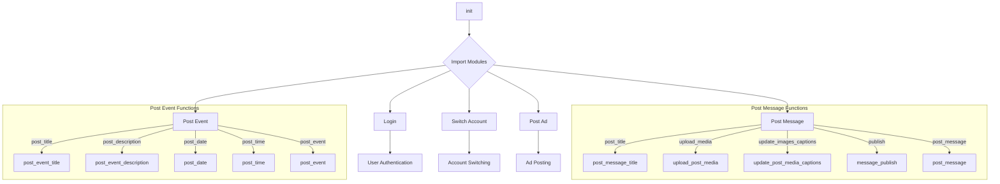

1. **<input code>**:

```python
## \file hypotez/src/endpoints/advertisement/facebook/scenarios/__init__.py
# -*- coding: utf-8 -*-\
#! venv/Scripts/python.exe
#! venv/bin/python/python3.12

"""
.. module: src.endpoints.advertisement.facebook.scenarios 
	:platform: Windows, Unix
	:synopsis:

"""
MODE = 'dev'

from .login import login
from .post_message  import *
from .switch_account import switch_account
from .post_message import (post_title as post_message_title,   # <- заголовок
                           upload_media as upload_post_media, # <- изображения 
                           update_images_captions as update_post_media_captions, # <- подписи к изображениям 
                           publish as message_publish,
                           post_message,
                           )

from .post_event import (post_title as post_event_title,
                         post_description as post_event_description,
                         post_date,
                         post_time,
                         #send,
                         post_event
                         )

from .post_ad import post_ad
```

2. **<algorithm>**:



**Example:**

* **`Login` (C):** The user provides credentials (username, password, or tokens). The `login` function handles the authentication process. 
* **`Post Message` (D):** The code prepares a message (text and media) for posting to the Facebook page.
* **`Post Event` (F):** Creates a Facebook event, including the title, description, date, and time.
* **`Switch Account` (E):** Handles the process of switching between different Facebook accounts.
* **`Post Ad` (G):**  Handles creating and posting advertisements on Facebook.

3. **<explanation>**:

* **Imports:** The file imports functions and possibly classes from submodules within the `hypotez/src/endpoints/advertisement/facebook/scenarios` directory. This structure suggests a modular design for Facebook advertisement scenarios. The `from .post_message import *` imports all available functions from the `post_message` module.  Using `as` for aliases (e.g., `post_title as post_message_title`) makes the code more readable by clarifying the origin of the function.

* **Classes:** The code doesn't directly define classes. Instead, it imports functions for various tasks.

* **Functions:**

    * `login`: This likely authenticates the user with the Facebook API. It takes credentials as input (e.g., username, password) and returns the authenticated session object, or a success/failure status.
    * `switch_account`: Handles the user transition to a different Facebook account if needed.
    * `post_message`:  Handles posting various types of messages (text, media, events).
    * `post_title`, `upload_media`, etc.: All these functions likely form a group for posting messages.
    * `post_event`, `post_event_title`, `post_event_description`, `post_date`, `post_time`: Functions for creating and posting events.
    * `post_ad`: Function for creating and posting advertisements.

* **Variables:**

    * `MODE = 'dev'`: This variable likely defines the execution mode (e.g., development, production).  Knowing the mode can affect configurations used during execution.

* **Potential Errors/Improvements:**

    * The use of `from .post_message import *` imports all functions in one go. This can increase the difficulty in maintaining the code. Consider importing specific functions or classes instead, for better clarity and modularity.  Import only the necessary functions in the `__init__.py` file.

    * Missing error handling: The code likely lacks error handling (e.g., API errors, invalid input). This is crucial for robust code.  Wrap function calls with `try...except` blocks to catch potential exceptions.

    * Docstrings: While docstrings are present, the examples may be too simplified and not very informative. Detailed docstrings are necessary to understand the expected behavior.


* **Relationships:**

    * This file interacts with other modules/packages in the Hypotez project that likely handle Facebook API connections (possibly in a `facebook` module).
    * The file heavily relies on functionality exposed by a likely a Facebook API library or wrapper for interactions.
    * The functions in the file act as entry points for different Facebook scenario operations.


The `__init__.py` file acts as a central entry point for the Facebook advertisement functionality, allowing external users to access all these functions and methods. It shows a modular approach with submodules (`login`, `post_message`, etc.) to handle the individual stages.  Adding more detailed docstrings and robust error handling will greatly improve the code's maintainability and usability.