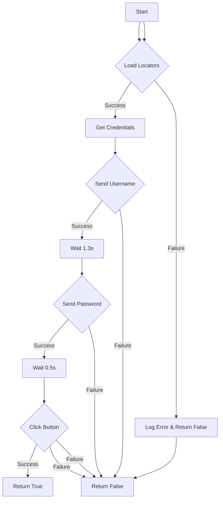

```
## File hypotez/src/endpoints/advertisement/facebook/scenarios/login.py
# -*- coding: utf-8 -*-\n#! venv/Scripts/python.exe\n#! venv/bin/python/python3.12\n\n"""\n.. module: src.endpoints.advertisement.facebook.scenarios \n\t:platform: Windows, Unix\n\t:synopsis: Facebook login scenario\n\n"""\nMODE = \'dev\'\n\nfrom pathlib import Path\nfrom typing import Dict\nfrom src import gs\nfrom src.webdriver import Driver\nfrom src.utils import j_loads, j_loads_ns, j_dumps\nfrom src.logger import logger\n\n# Загрузка локаторов для авторизации Facebook\nlocators = j_loads_ns(\n            Path(gs.path.src / \'endpoints\' / \'advertisement\' / \'facebook\' / \'locators\' / \'login.json\'))\nif not locators:\n    logger.debug(f"Ошибка в файле локаторов")\n    ...\n\ndef login(d: Driver) -> bool:\n    """ Выполняет вход на Facebook.\n\n    Функция использует переданный `Driver` для выполнения авторизации на Facebook, заполняя\n    логин и пароль, а затем нажимает кнопку входа.\n\n    Args:\n        d (Driver): Экземпляр драйвера для взаимодействия с веб-элементами.\n\n    Returns:\n        bool: `True`, если авторизация прошла успешно, иначе `False`.\n\n    Raises:\n        Exception: Если возникает ошибка при вводе логина, пароля или нажатии кнопки.\n    """\n    credentials = gs.facebook_credentials[0]\n    try:\n        # Ввод логина\n        d.send_key_to_webelement(locators.email, credentials.username)\n    except Exception as ex:\n        logger.error("Invalid login", ex)\n        return False\n\n    d.wait(1.3)\n    try:\n        # Ввод пароля\n        d.send_key_to_webelement(locators[\'password\'], credentials[\'password\'])\n    except Exception as ex:\n        logger.error("Invalid login", ex)\n        return False\n\n    d.wait(0.5)\n    try:\n        # Нажатие кнопки входа\n        d.execute_locator(locators[\'button\'])\n    except Exception as ex:\n        logger.error("Invalid login", ex)\n        return False\n\n    return True\n```

2. <algorithm>



* **Example:**  If `locators` is loaded successfully, `credentials` is retrieved from `gs.facebook_credentials`, and all actions (username, password, click) are executed without errors, the function returns `True`.  If, for example, there's an error when sending the password, the function returns `False` and logs an error.


3. <explanation>

* **Imports:**
    * `pathlib.Path`: Used to create and manipulate file paths, crucial for working with the `gs.path.src` directory and accessing the `login.json` file.
    * `typing.Dict`: Implied use for data structures holding key-value pairs, though not directly used in this snippet.
    * `src.gs`:  Likely a global settings or configuration module providing access to paths (`gs.path.src`), Facebook credentials (`gs.facebook_credentials`), and potentially other project-wide data. This relationship is critical for the script's operation, as it relies on external configurations.  A high degree of dependency on `gs` module exists.
    * `src.webdriver.Driver`: A custom class or module related to web driver interaction (e.g., Selenium), likely handling browser control and element manipulation. This is central to the function's functionality.
    * `src.utils.j_loads`, `src.utils.j_loads_ns`, `src.utils.j_dumps`:  Functions to load and potentially un-serialize JSON data. `j_loads_ns` likely handles loading from JSON files that might include namespaces or external references.
    * `src.logger.logger`: A logger object for recording events (including errors) during Facebook login, providing essential debugging and monitoring capabilities. This is an important component for logging exceptions and debugging.

* **Classes:**
    * `Driver`: This is a crucial class from the `src.webdriver` module.  It's not fully defined in this code, but it represents a driver for interacting with web elements.  Its `send_key_to_webelement`, `wait`, and `execute_locator` methods are vital for automating the login process.

* **Functions:**
    * `login(d: Driver) -> bool`:
        * Takes a `Driver` object (`d`) as input, which is crucial to interact with the web elements.
        * Aims to authenticate a user on the Facebook website.
        * Retrieves login credentials (`credentials`) from `gs.facebook_credentials`.
        * Uses a `try...except` block to handle potential exceptions during each step (username, password input, button click).  Error handling is crucial.
        * Returns `True` if the login is successful and `False` otherwise.
        * Uses `d.wait` for delays, which are common to avoid issues with web element responsiveness.


* **Variables:**
    * `MODE`:  A string likely defining the environment (e.g., 'dev', 'prod').
    * `locators`: Holds the locators retrieved from `login.json`, essential for targeting elements on the Facebook login page.
    * `credentials`: A variable accessing the Facebook credentials.
    * `logger`: This object will log errors or information about login failures or success.

* **Potential Errors and Improvements:**
    * **Error Handling:** The `try...except` blocks are good but could benefit from more specific exception handling to improve debugging.
    * **Robustness:**  The `if not locators` check is good, but adding a fallback mechanism (e.g., loading default locators or raising an exception) would make the script more robust if the `login.json` file is not found or malformed.
    * **Logging:** Using descriptive log messages would be beneficial (e.g., "Failed to input username").
    * **Data Validation:** Consider adding validation to the credentials received from `gs.facebook_credentials` to prevent potential issues.
    * **Wait Time:** The wait times (`1.3`, `0.5`) are hardcoded and might need adjustment depending on the website's responsiveness or the specific browser instance.  More dynamic/configurable wait times are recommended.

* **Chain of Relationships:**
    * `login.py` depends on `gs` (global settings) for credentials and paths.
    * `login.py` depends on `src.webdriver.Driver` for interaction with the browser.
    * `login.py` depends on `src.utils` for handling JSON data.
    * `login.py` depends on `src.logger` for logging.
    * The script is part of the `src.endpoints.advertisement.facebook` module, implying a larger system for advertising-related operations using Facebook.  `locators/login.json` is expected to contain the specific selector information for the Facebook login page, which is crucial for the automation process to work properly.