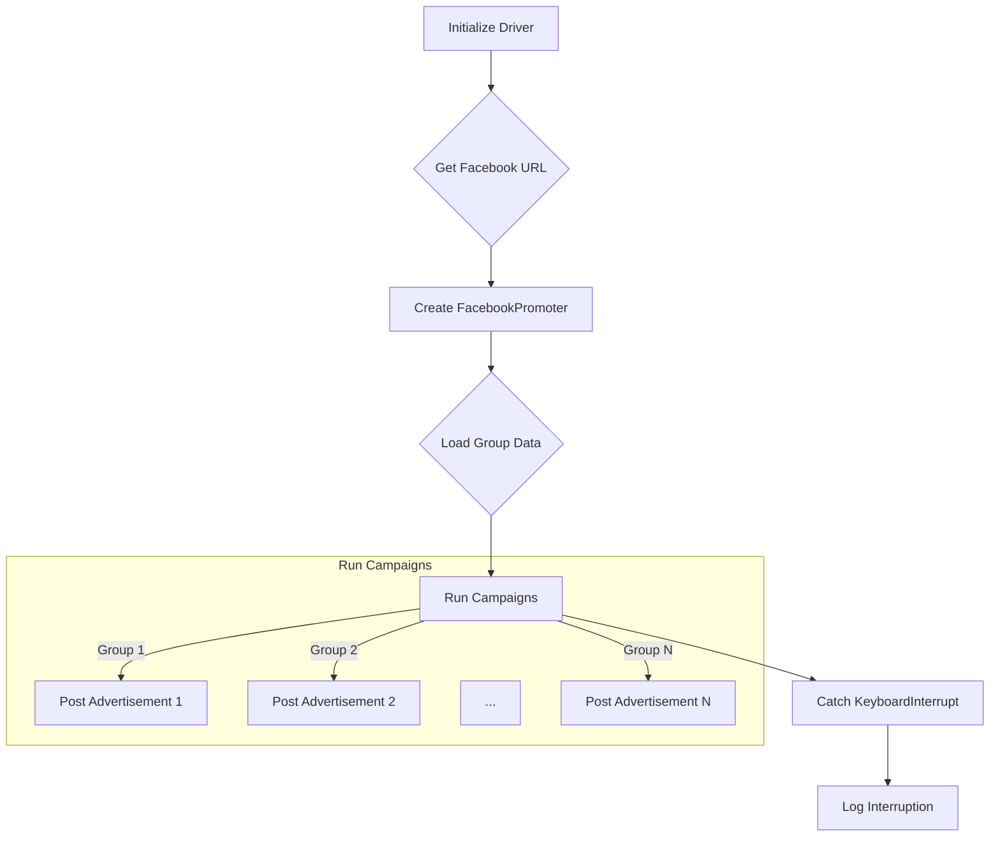

```
## <input code>

```python
## \file hypotez/src/endpoints/advertisement/facebook/start_posting_katia.py
# -*- coding: utf-8 -*-
#! venv/Scripts/python.exe
#! venv/bin/python/python3.12

"""
.. module: src.endpoints.advertisement.facebook 
	:platform: Windows, Unix
	:synopsis: Отправка рекламных объявлений в группы фейсбук (Katia?)

"""
MODE = 'dev'


import header 
from src.webdriver import Driver, Chrome
from src.endpoints.advertisement.facebook.promoter import FacebookPromoter
from src.logger import logger

d = Driver(Chrome)
d.get_url(r"https://facebook.com")

filenames:list = ['katia_homepage.json',]
campaigns:list = [ 'sport_and_activity',
                  'bags_backpacks_suitcases',
                    'pain',
                    'brands',
                    'mom_and_baby',
                    'house',
                ]
promoter = FacebookPromoter(d, group_file_paths = filenames, no_video = False)

try:
    promoter.run_campaigns(campaigns)
except KeyboardInterrupt:
    logger.info("Campaign promotion interrupted.")
```

## <algorithm>



**Explanation:**

1. **Initialize Driver:**  Creates a web driver instance (likely using Selenium) to interact with the Facebook website.
2. **Get Facebook URL:** Navigates to the Facebook homepage.
3. **Create FacebookPromoter:** Initializes the `FacebookPromoter` class, passing the driver and group file paths.  This object likely handles the actual posting of ads.  Examples could be the configuration of a campaign to target particular Facebook groups.
4. **Load Group Data:** Loads data (likely JSON) from the specified group files (`filenames`) to determine the target groups for the advertisement.
5. **Run Campaigns:** The core of the script. The `run_campaigns` method likely iterates through the `campaigns` list. For each campaign: It identifies the corresponding Facebook groups using the `group_file_paths`. Then executes the advertisement posting process within each targeted Facebook group (steps H, I, and J).
6. **Catch KeyboardInterrupt:** Handles Ctrl+C interruption to gracefully log the interruption.
7. **Log Interruption:** Logs an informative message to indicate that the campaign promotion was interrupted.


## <explanation>

**Imports:**

- `header`:  Purpose unknown without seeing the `header` module.  Likely contains helper functions or constants used throughout the project. The `#!` lines at the top of the script probably indicate which Python interpreter to use (venv), but that's not directly reflected in the functionality of the code.
- `src.webdriver`: Likely contains classes and functions for interacting with web browsers (like Chrome) for automation, consistent with the rest of the project's architecture.
- `src.endpoints.advertisement.facebook.promoter`: Defines the `FacebookPromoter` class to handle campaign management and advertisement posting.  This demonstrates a clear modular design.
- `src.logger`: Provides logging functionality, crucial for tracking program execution and debugging.

**Classes:**

- `Driver`: This class (from `src.webdriver`) likely manages the web driver interaction.  Its attributes and methods are not directly visible but would allow control over browser interactions, like `d.get_url`.
- `Chrome`: Likely a subclass of `Driver` that specifies the use of a Chrome browser.  This is part of the modular implementation of the web driver component, and may include methods like setting up the Chrome driver.
- `FacebookPromoter`: This class is at the core of campaign management. It likely has methods for loading group data, configuring advertisements, and posting advertisements to the targeted groups.


**Functions:**

- `d.get_url(r"https://facebook.com")`:  Navigates the web driver `d` to the Facebook homepage.  It's a common function when using web automation libraries.  The `r` before the string indicates a raw string literal.

- `run_campaigns`:  The method of `FacebookPromoter` responsible for handling the campaign advertisement posting for a particular Facebook Group.


**Variables:**

- `MODE`:  A string variable set to 'dev'. This variable likely defines the program's mode (e.g., development or production).
- `filenames`: A list of filenames containing data for Facebook groups.
- `campaigns`: A list of campaign names (strings).
- `d`: An instance of the `Driver` class, initialized to control the browser interaction.

**Potential Errors/Improvements:**

- **Error Handling:**  While a `KeyboardInterrupt` exception is handled, other potential issues (like network problems, Facebook API rate limits, or invalid group data) are not. Robust error handling (using `try...except` blocks) would be important to ensure the program's stability. Logging specific errors with details is also highly recommended.
- **Data Validation:** The code doesn't explicitly validate the `filenames` or the structure of the campaign data.  Validation should be added to ensure that expected data exists and has the correct format.
- **Robustness:** The code assumes a consistent Facebook API and the correct structure for the input files. A way to handle potential inconsistencies is necessary.


**Relationships:**

The code demonstrates a clear modular structure.  `start_posting_katia.py` relies on classes and functions in `src.webdriver` and `src.endpoints.advertisement.facebook.promoter`, implying a dependency hierarchy. The `src.logger` provides a necessary integration point for reporting progress and errors throughout the program's execution, ensuring accountability of the whole program.