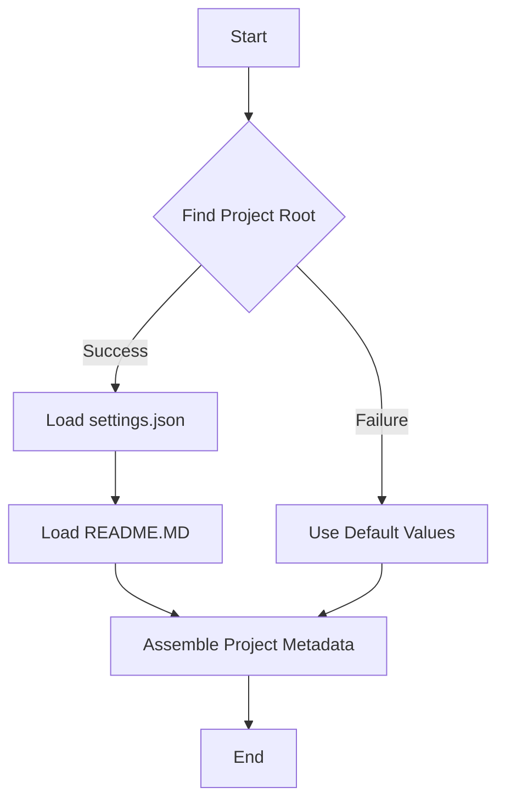

```python
## \file hypotez/src/endpoints/advertisement/header.py
# -*- coding: utf-8 -*-\
#! venv/Scripts/python.exe
#! venv/bin/python/python3.12

"""
.. module: src.endpoints.advertisement 
	:platform: Windows, Unix
	:synopsis:

"""
MODE = 'dev'


import sys
import json
from packaging.version import Version

from pathlib import Path
def set_project_root(marker_files=('pyproject.toml', 'requirements.txt', '.git')) -> Path:
    """
    Finds the root directory of the project starting from the current file's directory,
    searching upwards and stopping at the first directory containing any of the marker files.

    Args:
        marker_files (tuple): Filenames or directory names to identify the project root.
    
    Returns:
        Path: Path to the root directory if found, otherwise the directory where the script is located.
    """
    __root__:Path
    current_path:Path = Path(__file__).resolve().parent
    __root__ = current_path
    for parent in [current_path] + list(current_path.parents):
        if any((parent / marker).exists() for marker in marker_files):
            __root__ = parent
            break
    if __root__ not in sys.path:
        sys.path.insert(0, str(__root__))
    return __root__


# Get the root directory of the project
__root__ = set_project_root()
"""__root__ (Path): Path to the root directory of the project"""

from src import gs

settings:dict = None
try:
    with open(gs.path.root / 'src' / 'settings.json', 'r') as settings_file:
        settings = json.load(settings_file)
except (FileNotFoundError, json.JSONDecodeError):
    ...

doc_str:str = None
try:
    with open(gs.path.root / 'src' / 'README.MD', 'r') as settings_file:
        doc_str = settings_file.read()
except (FileNotFoundError, json.JSONDecodeError):
    ...


__project_name__ = settings.get("project_name", 'hypotez') if settings  else 'hypotez'
__version__: str = settings.get("version", '')  if settings  else ''
__doc__: str = doc_str if doc_str else ''
__details__: str = ''
__author__: str = settings.get("author", '')  if settings  else ''
__copyright__: str = settings.get("copyrihgnt", '')  if settings  else ''
__cofee__: str = settings.get("cofee", "Treat the developer to a cup of coffee for boosting enthusiasm in development: https://boosty.to/hypo69")  if settings  else "Treat the developer to a cup of coffee for boosting enthusiasm in development: https://boosty.to/hypo69"
```

**<algorithm>**



**Example Data Flow:**

1. **Find Project Root (B):**
   - Input: `__file__` (current script).
   - Output: `__root__` (Path object to the project root). 
   - Example: If `__file__` is `hypotez/src/endpoints/advertisement/header.py`, the output `__root__` might be `/home/user/hypotez`.
2. **Load settings.json (C):**
   - Input: `gs.path.root / 'src' / 'settings.json'`.
   - Output: `settings` (dictionary containing project settings) or `None` if the file doesn't exist or is invalid.
   - Example: Output `settings = {'project_name': 'My Project', 'version': '1.0.0'}`.
3. **Load README.MD (E):**
   - Input: `gs.path.root / 'src' / 'README.MD'`.
   - Output: `doc_str` (string containing the README content) or `None` if the file doesn't exist.
   - Example: Output `doc_str = "This is the README file."`.
4. **Assemble Project Metadata (F):**
   - Input: `settings`, `doc_str`.
   - Output: Project metadata variables (`__project_name__`, `__version__`, etc.).
   - Example: `__project_name__` will be set to `"My Project"`.

**<explanation>**

* **Imports:**
    - `sys`: Provides access to system-specific parameters and functions, including the `sys.path` used to add the project root directory to the search path.
    - `json`: Used for working with JSON data (loading `settings.json`).
    - `packaging.version`: Used for handling version numbers (although not used directly in this code).
    - `pathlib`: Enables working with file paths in a more object-oriented and platform-independent manner.


* **Classes:**
   - No classes are defined in this file.

* **Functions:**
    - `set_project_root(marker_files)`: 
        - Arguments: `marker_files` (a tuple of file/directory names).
        - Return value: `Path` object representing the project root directory.
        - Functionality: Iterates up the directory tree from the current file until it finds a directory containing any of the specified marker files (e.g., `pyproject.toml`, `requirements.txt`). If no marker is found the script's location is returned.  This is crucial for ensuring that the code can be run from anywhere within the project.
        - Example: Calling `set_project_root(('pyproject.toml',))` would find the directory containing `pyproject.toml` starting from the current script's location.

* **Variables:**
    - `MODE`: String constant. The variable's meaning and impact aren't directly apparent from this code alone.  It's crucial to have more context from surrounding code and external documentation for a complete understanding.
    - `__root__`:  A Path object representing the root directory of the project. Initialized by the `set_project_root()` function. Critical for relative path resolution within the project.
    - `settings`, `doc_str`: Dictionaries containing project metadata (from `settings.json` and `README.MD` respectively). These are loaded from files and are crucial for determining project-specific values. `None` if the file can't be read.
    - `__project_name__`, `__version__`, etc.: Variables holding information about the project's name, version, author, etc.  Derived from the `settings` dict.

* **Potential Errors/Improvements:**
    - **Error Handling:** The `try...except` blocks for loading `settings.json` and `README.MD` are good practice. However, consider logging the error (using a `logging` module) instead of using `...` to prevent silent failures.
    - **File Existence Check:**  While the `try...except` blocks are good, you should consider checking if the `gs.path.root` object is valid before using it.
    - **`gs` Module:** The `from src import gs` line strongly suggests a missing or incomplete explanation for this module.  The `gs` module likely provides utilities for working with the project's file system.  This is vital to determine what `gs.path.root` is doing. Its exact implementation and intended usage need to be understood.

**Relationships:**

The code is heavily reliant on the `src` package, particularly the `gs` module, which manages paths relative to the project root. This indicates a structured project layout and a well-defined strategy for handling project-wide resources.  A diagram clarifying the relationship between this file and the `src` and `gs` packages is necessary for a full understanding. Understanding the `gs` module is vital to understanding the code's behavior.