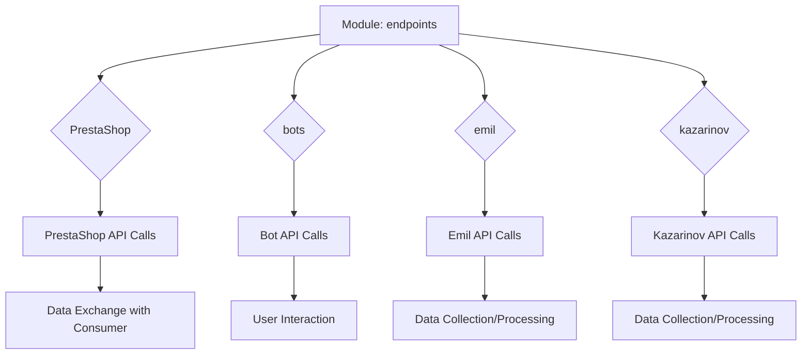

```
### **endpoints Module**: Final Consumer Endpoints

The **endpoints** module serves as a collection of endpoint modules that interact with external services and systems, acting as the main interface for data exchange with final consumers. It includes the following submodules:

1. **PrestaShop**  
   Provides integration with the PrestaShop e-commerce platform, supporting functions such as product and order management, allowing seamless data exchange between the application and the PrestaShop system.

2. **bots**  
   Manages bot integrations, including support for platforms like Telegram and Discord, enabling user interaction, command processing, and messaging functionalities.

3. **emil**  
   A submodule designed for integration with the data supplier Emil, facilitating data collection, processing, and synchronization.

4. **kazarinov**  
   Integrates with the data supplier Kazarinov, supporting data gathering and processing requirements specific to this provider’s systems and data structure.
```

**<algorithm>**



* **endpoints module**:  This module acts as a central hub, coordinating interactions with various external systems.
* **PrestaShop**:  Handles communication with the PrestaShop API, potentially including requests for product details, order information, etc.  Data from the API would be exchanged with the consumers.
* **bots**:  Enables interaction with messaging platforms like Telegram and Discord. This involves sending/receiving messages and processing commands.
* **emil**:  Manages data collection and processing related to the Emil data supplier.  This involves calls to the Emil API and processing of received data.
* **kazarinov**:  Handles Kazarinov API interactions for retrieving and processing data specific to Kazarinov's platform.


**<explanation>**

* **Imports**:  There are no imports shown in the code snippet.  The code describes modules and their functionalities, but the actual code for these modules is missing, so no import analysis is possible.

* **Classes**:  No classes are defined in the provided text.

* **Functions**:  No functions are defined in the provided text.

* **Variables**:  No variables are defined in the provided text.

* **Potential Errors/Improvements**:  The text provides a high-level description of the modules.  To evaluate potential errors or improvements, the actual implementation of these modules would need to be examined.  Key aspects to check would be error handling (e.g., handling API errors, network issues), data validation, security considerations (e.g., API keys, authentication), and logging to track API interactions.

* **Chain of Relationships**: The `endpoints` module sits as a layer of abstraction between the external services (PrestaShop, bots, Emil, Kazarinov) and the consumers of the data.  The `endpoints` module is likely part of a larger application that consumes the data from these systems to perform further actions.  To understand the full relationship, the code that uses these endpoints would need to be examined.


**Summary**: The provided text describes a module structure for interacting with several external services.  The description outlines the intended functionality and interaction patterns but lacks the implementation details necessary for in-depth analysis.  A detailed implementation would be necessary for identifying potential issues or offering specific recommendations.