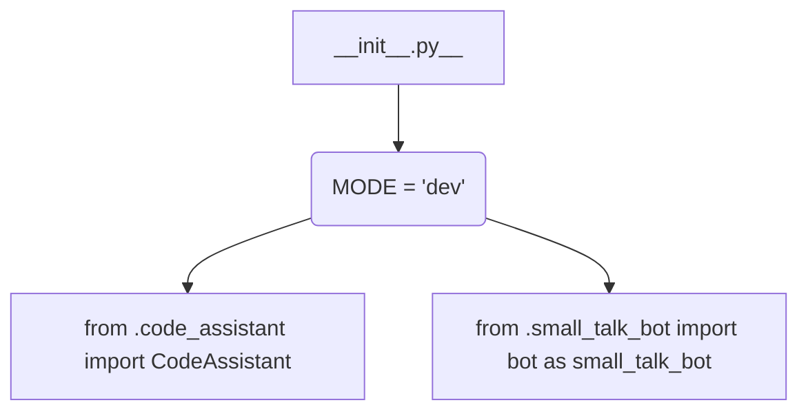

1. **<input code>**:

```python
## \file hypotez/src/endpoints/hypo69/__init__.py
# -*- coding: utf-8 -*-\
#! venv/Scripts/python.exe
#! venv/bin/python/python3.12

"""
.. module: src.endpoints.hypo69 
	:platform: Windows, Unix
	:synopsis:

"""
MODE = 'dev'


from .code_assistant import CodeAssistant
from .small_talk_bot import bot as small_talk_bot
```

2. **<algorithm>**:



* **Step 1**: Initialization: The Python file initializes a variable `MODE` to the string 'dev'.  This likely controls runtime behavior for development vs. production.

* **Step 2**: Import Statements: This file imports classes from the `code_assistant` and `small_talk_bot` modules within the same package (`endpoints/hypo69`). This establishes relationships between the modules.


3. **<explanation>**:

* **Imports:**
    * `from .code_assistant import CodeAssistant`: This line imports the `CodeAssistant` class from the `code_assistant.py` file within the `hypotez/src/endpoints/hypo69` directory. This implies that `code_assistant.py` contains the implementation details of the `CodeAssistant` class.  The `.` prefix indicates that the module being imported is within the current package (`endpoints/hypo69`). This import is crucial for using the `CodeAssistant` class within this module.
    * `from .small_talk_bot import bot as small_talk_bot`: This line imports the `bot` object from the `small_talk_bot.py` file, also within `hypotez/src/endpoints/hypo69`. The `as small_talk_bot` creates an alias for the imported object, which is good practice for clarity.

* **Variables:**
    * `MODE = 'dev'`: This global variable defines the execution mode. It's likely used to configure different behaviors in the code (e.g., logging, data sources, etc.) for development and production. A more detailed analysis of its usage would require inspecting the `code_assistant` and `small_talk_bot` modules.


* **Classes:**
    * `CodeAssistant`: The code snippet itself doesn't define the `CodeAssistant` class, it simply imports it.  The actual implementation of the `CodeAssistant` class would likely reside in `hypotez/src/endpoints/hypo69/code_assistant.py`, holding methods and attributes for code-assist functionality.


* **Functions:**
    * None are explicitly defined in this file.


* **Potential Errors/Improvements:**
    * The docstring is present, but it's a bit minimal.  A more detailed description of the functionality of this module, `code_assistant` and `small_talk_bot` would be helpful for understanding its overall purpose.

* **Relationships with other parts of the project:**
    * This module (`hypotez/src/endpoints/hypo69/__init__.py`) relies heavily on the `code_assistant.py` and `small_talk_bot.py` modules. These modules likely implement specific functionalities that this `__init__.py` file intends to use together.  The exact relationships would depend on the internal structures of those modules, which are not shown here.  This suggests this code is part of a larger application and the `endpoints` directory likely has other files or modules that interact with this one.


**In summary:** This Python file acts as an entry point for accessing code assistance and a small talk bot functionalities. It provides a way to use these features by importing the respective classes and/or functions without needing to know the specifics of how they are implemented.  The `MODE` variable hints at a potentially more complex configuration.