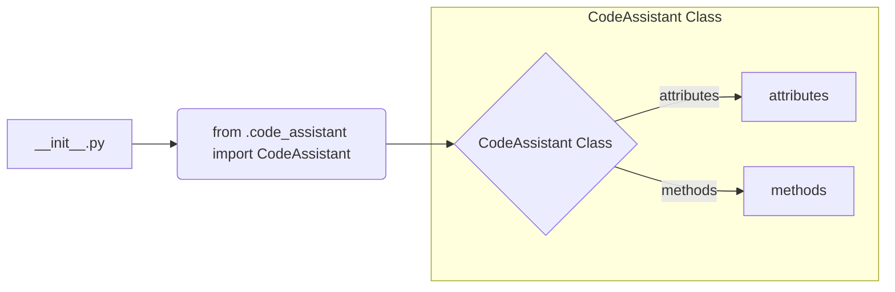

**<input code>**

```python
## \file hypotez/src/endpoints/hypo69/code_assistant/__init__.py
# -*- coding: utf-8 -*-
#! venv/Scripts/python.exe
#! venv/bin/python/python3.12

"""
.. module: src.endpoints.hypo69.code_assistant 
	:platform: Windows, Unix
	:synopsis:

"""
MODE = 'dev'

from .code_assistant import CodeAssistant
```

**<algorithm>**



No specific algorithm can be described. This Python file is an initialization file for a package. It primarily imports a module/class called `CodeAssistant`.  It does not define any functions or perform any major calculations.


**<explanation>**

* **Imports**:
    * `from .code_assistant import CodeAssistant`: This line imports the `CodeAssistant` class from the `code_assistant.py` module located in the same directory (`./code_assistant`). This is a standard Python import to make the `CodeAssistant` class available in this `__init__.py` file. The `.` refers to the current directory, which is the `endpoints/hypo69/code_assistant` directory.  This is crucial for module structure and allows other parts of the codebase to use the `CodeAssistant` class.


* **Variables**:
    * `MODE = 'dev'`: This variable likely defines the operational mode of the application, such as 'dev' (development), 'test' or 'prod'.  It is likely used as a global configuration setting accessible throughout the application.

* **Classes (Indirectly referenced):**
    * `CodeAssistant`: The actual functionality resides in `code_assistant.py`.  The `__init__.py` file merely provides access to the `CodeAssistant` class, which probably handles the core logic for the code assistant.  Without the contents of `code_assistant.py`, we cannot provide detailed descriptions of its attributes or methods.


* **Functions (Indirectly referenced):**
   No functions are directly defined in this file. Any functions used by `CodeAssistant` reside in `code_assistant.py`.


* **Potential Errors/Improvements:**

    * **Missing Documentation:** While the module docstring is present, it is very basic.  Providing docstrings for the `CodeAssistant` class and its methods would significantly improve maintainability and understanding.
    * **Missing context:** Without the file `code_assistant.py`, it's impossible to explain the purpose of the `CodeAssistant` class, its methods, attributes, usage, dataflow or relationship with other parts of the system.


* **Relationship to other parts of the project:**

   The `CodeAssistant` class likely interacts with other parts of the `hypotez` project.  The way this interaction happens depends heavily on the contents of `code_assistant.py`. Without that file, we cannot determine specific interactions. For example, it might interact with data storage, input/output mechanisms, or other components within the larger application. This initialization file acts as a crucial link to the functionality of the `CodeAssistant` class, establishing a path for the rest of the project to access it.  Further investigation of `code_assistant.py` is required to fully describe the interactions.