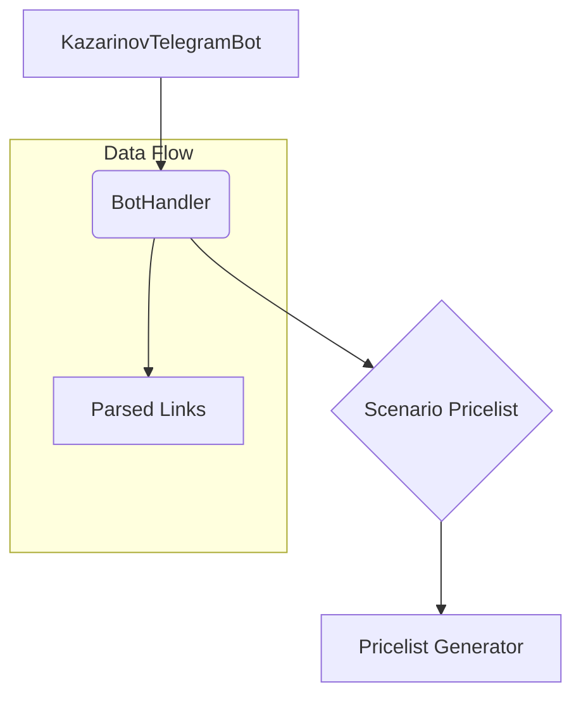

```
1. <input code>

```KazarinovTelegramBot`
- https://one-tab.co.il
- https://morlevi.co.il
- https://grandavance.co.il
- https://ivory.co.il
- https://ksp.co.il 
-------- 
`BotHandler` 
- парсит линки

bot -> handler -> scenario_pricelist -> pricelist_generator
```
2. <algorithm>



**Example Data Flow:**

* **KazarinovTelegramBot:** Receives messages (likely containing URLs) from a Telegram user.  Example: `/getprice https://one-tab.co.il`.
* **BotHandler:** Parses the incoming message to extract the URL.  Example: Extracts `https://one-tab.co.il` from the message.  
* **BotHandler:**  Passes the extracted URL (Parsed Links) to `Scenario Pricelist` for processing.
* **Scenario Pricelist:**  Processes the URL to determine the appropriate pricelist generation scenario. This is likely a lookup or decision process based on the parsed URL. Example: It might recognize `one-tab.co.il` and route to a specific scenario for generating a pricelist for One-Tab products.
* **Pricelist Generator:** Generates a pricelist based on the scenario from `Scenario Pricelist`. The output would be a list of prices and products associated with the given URL.

3. <explanation>

* **Imports:**  No imports are shown in the code snippet.  This is a high-level description, likely representing the overall structure and flow of functions and classes within a larger Python project.  Further code would reveal dependencies and import statements for specific modules within `src`.
* **Classes:**
    * **KazarinovTelegramBot:** A likely class representing a Telegram bot instance.  This class would handle incoming messages, interact with the `BotHandler`, and manage other bot-related tasks.
    * **BotHandler:** This class likely handles the parsing of URLs and their interaction with a pricelist processing system.  Without code, it's difficult to know the specific attributes and methods; however, it likely has a `parse_url()` method.
    * **Scenario Pricelist:** This likely represents a class with methods to handle the routing and selection of the appropriate pricelist generation method given the context (URL). This is a crucial part of controlling the process's specificity.
    * **Pricelist Generator:**  Handles the actual generation of the pricelist based on the scenario defined by `Scenario Pricelist`. This class would likely have methods to retrieve pricing data.

* **Functions:**  Specific function definitions are missing, preventing a detailed explanation.  However, functions related to parsing, URL processing, data retrieval, and pricelist formatting are implied. For example, a function might be responsible for converting the scraped data into a structured format.


* **Variables:**  No specific variables are shown.  Variables within each class would store data, like URLs, parsed data, and generated pricelists.


* **Potential Errors/Improvements:**

    * **Error Handling:**  The pseudocode lacks error handling (e.g., what if the URL is invalid? What if the pricelist generator encounters an error?). Robust error handling is crucial for a production-ready system to avoid crashes and provide informative error messages.
    * **Data Validation:** How does the code validate the input URLs to ensure they are in the expected format or come from the expected providers?
    * **Scalability:** The code's ability to handle a large number of requests, especially from a large user base on Telegram, should be considered.
    * **Maintainability:**  The code should adhere to clean coding principles, with clear variable names, comments, and structured code.

* **Relationships with Other Project Parts:** The diagram implies a broader system:

    * **`src.endpoints`:** The `/kazarinov/` directory suggests that the Kazarinov bot is a specific endpoint of a larger Telegram bot system.
    * **`src.data_sources`:**  The pricelist generation component likely depends on external data sources (possibly APIs, databases, or scraped data), which would be managed in separate modules within the `src.data_sources` package.
    * **`src.utils`:** Likely contains reusable functions or classes for URL parsing, data formatting, etc., which could be used by the components.


The provided description is a high-level overview of a workflow. A full understanding of the functionality requires looking at the source code for the specific classes and functions mentioned.