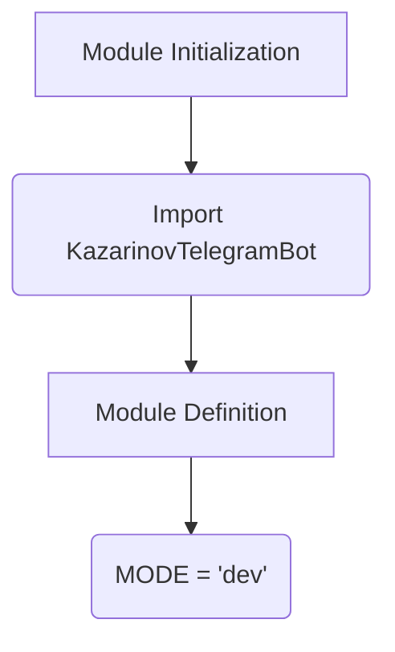

1. **<input code>**

```python
## \file hypotez/src/endpoints/kazarinov/__init__.py
# -*- coding: utf-8 -*-\
#! venv/Scripts/python.exe
#! venv/bin/python/python3.12

"""
.. module: src.endpoints.kazarinov 
	:platform: Windows, Unix
	:synopsis:

"""
MODE = 'dev'

from .kazarinov_bot import KazarinovTelegramBot
```

2. **<algorithm>**



* **Example for A (Module Initialization):** The script starts by initializing the module.

* **Example for B (Import KazarinovTelegramBot):** This step imports the `KazarinovTelegramBot` class from the `kazarinov_bot.py` file within the same `endpoints/kazarinov` directory.

* **Example for C (Module Definition):**  The module is defined by the file itself.

* **Example for D (MODE = 'dev'):** A variable named `MODE` is assigned the string value 'dev', likely for configuration purposes. This data is stored in the module's namespace.


3. **<explanation>**

* **Imports:**
    * `from .kazarinov_bot import KazarinovTelegramBot`: This line imports the `KazarinovTelegramBot` class from the `kazarinov_bot.py` module within the same directory. The `.` indicates a relative import, making it clear that the imported module is part of the `endpoints/kazarinov` package.  This is a standard Python import.  This import is crucial for using the bot functionalities defined in `kazarinov_bot.py`.

* **Variables:**
    * `MODE = 'dev'`: This variable likely represents the operational mode (e.g., development, production).  Its value ('dev') suggests it's being used to control conditional logic in other parts of the project, such as selecting configuration files or enabling certain features.  Its type is a string.

* **Classes (implied):**
    * `KazarinovTelegramBot`: This class is imported but not directly used or defined in this file.  Its definition must be in the `kazarinov_bot.py` file.  This class likely handles the interaction with the Kazarinov Telegram bot, including methods for sending messages, receiving updates, and other Telegram-specific tasks.  This implies a relationship with the Telegram Bot API library (likely imported within `kazarinov_bot.py`).

* **Functions (implied):**
    * Functions are not explicitly defined in this file. However, the `KazarinovTelegramBot` class will likely contain methods for initializing the bot, handling incoming messages, and responding to users.

* **Potential Errors/Improvements:**

    * **Missing Documentation:** While the docstring provides general context, more detailed explanations about the `MODE` variable's intended usage and the `KazarinovTelegramBot` class's methods would be beneficial.


* **Relationship with Other Project Components:**

   This file acts as an entry point for utilizing Kazarinov Telegram bot functionality.  The `kazarinov_bot.py` module is responsible for defining the bot's logic.  There's likely a connection to a project that uses Telegram bots, including handling user interactions and data flow between bot and application layers.


**In summary:** This Python file initializes the Kazarinov Telegram bot endpoint by importing the necessary class, defining a mode variable, and setting the stage for interaction with a Telegram bot. The functionality of the Kazarinov bot is in another file (`kazarinov_bot.py`) which is implicitly linked by this import. More context is needed to understand the exact implementation details and data flow, particularly the methods and attributes within the `KazarinovTelegramBot` class.