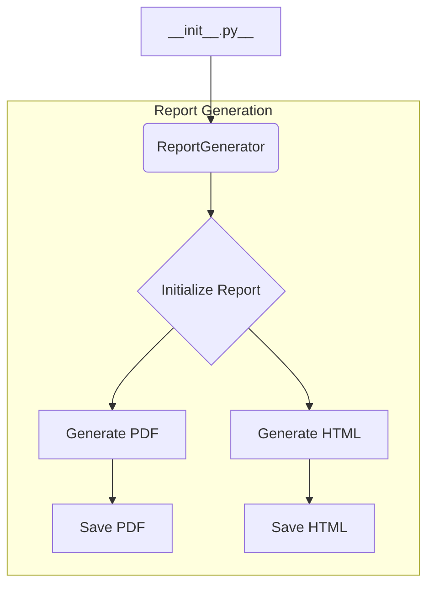

1. **<input code>**

```python
## \file hypotez/src/endpoints/kazarinov/react/__init__.py
# -*- coding: utf-8 -*-
#! venv/Scripts/python.exe
#! venv/bin/python/python3.12

"""
.. module: src.endpoints.kazarinov.react 
	:platform: Windows, Unix
	:synopsis: Генератор прайслистов в формате `pdf`, `html`

"""
MODE = 'dev'

from .pricelist_generator import ReportGenerator
```

2. **<algorithm>**



* **__init__.py**: This file likely serves as a module initializer for the `kazarinov.react` package within the `endpoints` directory.
* **Report Generation**: This subgraph represents the process of report generation which is likely implemented in the `ReportGenerator` class.

3. **<explanation>**

* **Imports**:
    * `from .pricelist_generator import ReportGenerator`: This line imports the `ReportGenerator` class from the `pricelist_generator.py` file within the same directory (`./`). This indicates that `pricelist_generator.py` contains the implementation details for generating price lists. `src` likely represents a source directory for the project.  `.` is crucial as it shows the file is in the same directory.


* **Classes (implied):**
    * `ReportGenerator`: This class, defined in `pricelist_generator.py`, is responsible for generating price lists in PDF and HTML formats.  The `__init__.py` file doesn't define any classes of its own; it's primarily a module/package initializer. Further details of `ReportGenerator` (methods, attributes, and data it uses) are not available from this fragment of code alone.

* **Functions (implied):**
    * Methods of `ReportGenerator`:  Methods like `generate_pdf()`, `generate_html()`, `save_pdf()`, and `save_html()` would likely be present within the `ReportGenerator` class. These methods would handle the details of report generation and saving.


* **Variables:**
    * `MODE = 'dev'`:  This global variable likely controls the mode of operation (e.g., development, production). It's used for conditional logic or configuration settings.  The value 'dev' suggests a development environment.


* **Potential errors or areas for improvement:**
    * **Missing documentation:** The code lacks detailed docstrings within the class (in `pricelist_generator.py`) and potentially in the methods. Adding detailed docstrings to these functions and classes will be very helpful to maintainers in understanding the functionality.
    * **Dependency on external libraries:** Without seeing `pricelist_generator.py`, it's not clear what external libraries (`pandas`, `ReportLab`, `docx` or similar) may be required for generating the documents.  Missing dependencies would create errors at runtime.
    * **Error handling:** No error handling is apparent. The `ReportGenerator` should include error handling in case of invalid input or issues during file generation, such as issues saving to file, or problems parsing input data.


* **Relationship with other parts of the project:** The `ReportGenerator` class likely interacts with other components of the `hypotez` project. It might take data from a database, or receive parameters from a REST API.  It likely interacts with files for saving the generated documents. More context is needed to determine the nature of those dependencies and the data flow. Without seeing `pricelist_generator.py`, this analysis is incomplete.


**In Summary:** This `__init__.py` file acts as an import declaration for the `ReportGenerator` class, likely used to create price lists in PDF and HTML format. The core functionality lies in the `pricelist_generator.py` file and more information is needed to understand the details.