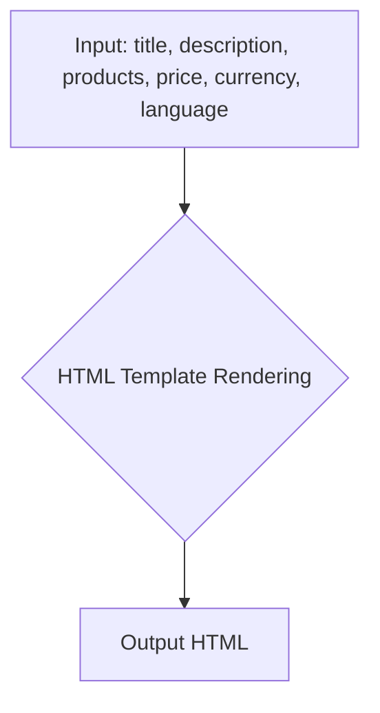

```
## <input code>
```python
## \file hypotez/src/endpoints/kazarinov/react/templates/template_1.html
# -*- coding: utf-8 -*-\
#! venv/Scripts/python.exe

""" module: src.endpoints.kazarinov.react.templates """
MODE = 'debug'
<!DOCTYPE html>
<html lang="{{ language }}">

<head>
    <meta charset="UTF-8">
    <meta name="viewport" content="width=device-width, initial-scale=1.0">
    <title>{{ title }}</title>
    <link rel="stylesheet" href="https://cdn.jsdelivr.net/npm/bootstrap@5.3.0/dist/css/bootstrap.min.css">
    <style>
        body {
            background-color: #0d1117;
            color: #c9d1d9;
            font-family: 'Segoe UI', Tahoma, Geneva, Verdana, sans-serif;
        }
        .product-card {
            background-color: #161b22;
            border: 1px solid #30363d;
            border-radius: 8px;
            padding: 15px;
            margin: 15px 0;
        }
        .product-card img {
            max-width: 100%;
            height: auto;
            border-radius: 5px;
        }
        .price-tag {
            background-color: #238636;
            color: white;
            padding: 5px 10px;
            border-radius: 5px;
        }
        .footer {
            text-align: center;
            margin-top: 30px;
            padding: 15px;
            border-top: 1px solid #30363d;
        }
    </style>
</head>

<body>
    <div class="container">
        <h1 class="text-center my-5">{{ title }}</h1>
        <p class="lead">{{ description }}</p>

        <div class="row">
            
            <div class="col-md-6 product-card">
                <h3>{{ product.product_title }}</h3>
                
                <p>{{ product.product_description }}</p>
            </div>
            
        </div>

        <div class="footer">
            <p>Общая стоимость:
                <span class="price-tag">{{ price }} {{ currency }}</span>
            </p>
        </div>
    </div>
</body>

</html>
```

```
## <algorithm>
```


* **Input:**  The code receives data variables: `title`, `description`, `products` (a list of products), `price`, `currency`, and `language` from a backend process, presumably a Python application in the `src` project.
* **HTML Template Rendering:**  The code renders a pre-defined HTML structure using Jinja2 templating language.  The input data is inserted into placeholders (`{{ ... }}`). The `` block iterates through the list of product data.
* **Output HTML:** The final HTML containing the dynamically populated data is generated. This HTML is then sent as a response by the backend to the client.

```
## <explanation>
```

**Imports:**

There are no imports in the standard Python sense. This is an HTML template file, not a Python script. It uses Jinja2 templating syntax, which is implicitly handled by the Python backend.


**Classes:**

There are no classes defined in this file. It's a template file, not a class definition.


**Functions:**

There are no functions in the standard Python sense. This is an HTML template file, not a Python script. The functionality is driven by Jinja2 templating.


**Variables:**

* `MODE`: This is a variable declared in Python that controls the mode of the application (presumably for debugging or production).  Its value is 'debug'. This is not used in the template, but is likely part of the related Python backend.
*  `language`, `title`, `description`, `products`, `price`, `currency`:  These are variables that are passed to the template from the backend via Jinja2 templating.  They represent data about the web page to be generated. They contain dynamic content from a data source.


**Potential Errors/Improvements:**

* **Security:** The template uses `{{ }}` to insert data into the HTML.  The code needs validation to prevent cross-site scripting (XSS) vulnerabilities. Data should be properly sanitized before being included in HTML.
* **Error Handling:**  The template doesn't handle any potential errors during data insertion. Error handling should be added to the backend to handle missing or invalid data.
* **Dynamic Styles:** Using external stylesheets like Bootstrap is a good practice.
* **CSS Structure:** The CSS is okay, but could be improved by using more descriptive class names for better maintenance.

**Relationships:**

This HTML template file (`template_1.html`) is strongly tied to a backend Python application in the `src` project.  The backend application receives data, and using Jinja2 templating, generates the HTML output of the template.  The data values needed for the template will be passed as variables from the backend.  Likely, the `products` list represents database records, or information loaded from a file in the backend. `price` and `currency` likely represent related data. The Python code interacts with the template, dynamically populating the placeholders and generating the correct output HTML.