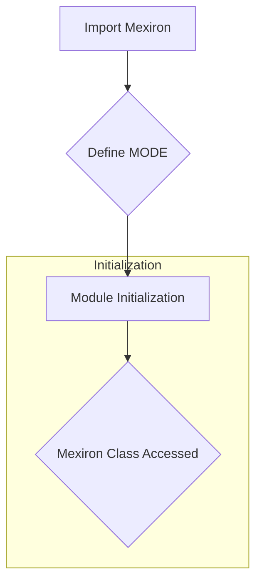

```## File hypotez/src/endpoints/kazarinov/scenarios/__init__.py
# -*- coding: utf-8 -*-
#! venv/Scripts/python.exe
#! venv/bin/python/python3.12

"""
.. module: src.endpoints.kazarinov.scenarios
	:platform: Windows, Unix
	:synopsis:

"""
MODE = 'dev'


from .scenario_pricelist import Mexiron
```

**<algorithm>**



**Example Data Flow:**

1.  The `__init__.py` file imports the `Mexiron` class from the `scenario_pricelist` module.
2.  A variable named `MODE` is assigned the string value 'dev'.  This is likely a configuration setting for the module, potentially determining behavior during development.
3. The `Mexiron` class and any methods within are now accessible within this module (`hypotez/src/endpoints/kazarinov/scenarios`).


**<explanation>**

* **Imports:**
    * `from .scenario_pricelist import Mexiron`: This line imports the `Mexiron` class from the `scenario_pricelist.py` file, which is located in the same directory (`./scenario_pricelist.py`).  The `.` indicates a relative import.  This is a standard Python practice for organizing modules within a project.  This import establishes a dependency between `__init__.py` and `scenario_pricelist.py`.  `scenario_pricelist.py` likely contains the implementation details of the `Mexiron` class.

* **Variables:**
    * `MODE = 'dev'`: This variable likely controls the execution mode of the code. Different modes (`'dev'`, `'prod'`, etc.) could trigger different configurations or behaviors in other parts of the project. The value `'dev'` suggests that this is intended for development.

* **Classes (indirectly):**
    * `Mexiron`: The `Mexiron` class is defined in `scenario_pricelist.py`.  This code imports the class itself, not its contents or initialization; but makes it usable in this module.  Without seeing `scenario_pricelist.py`, the specific purpose and methods of `Mexiron` remain unclear, but it's likely to be related to pricing scenarios relevant to the project.


* **Functions (indirectly):**
    * There are no directly defined functions in `__init__.py`.  Any functions will be found within the `Mexiron` class and the other files and modules it imports.


* **Potential Errors or Areas for Improvement:**
    * **Missing docstrings:**  While there is a docstring in the module, it would benefit from docstrings for the `MODE` variable and the import statement, potentially describing the intended purpose and how it interacts with other parts of the system.

* **Relationship with other project parts:**
    * This module (`hypotez/src/endpoints/kazarinov/scenarios`) is likely part of a larger project with a modular architecture. The `Mexiron` class, defined elsewhere, likely contains methods and attributes that interact with data or other modules.  It's a part of an API or application structure. For example,  the `scenario_pricelist` module might use data retrieved from a database or external services to populate data structures for different scenarios, so understanding the specifics of that functionality is crucial for a thorough analysis.


**In summary:** This `__init__.py` file acts as an entry point for accessing functionalities related to pricing scenarios.  The import statements make the contents of `scenario_pricelist.py` available, which is where the actual implementation of the `Mexiron` class (and its functionality) resides. Without the source code for `scenario_pricelist.py`, a more detailed analysis cannot be performed.