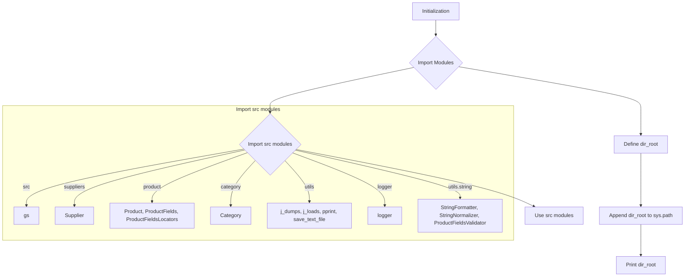

```
## <input code>

```python
## \file hypotez/src/endpoints/prestashop/_examples/header.py
# -*- coding: utf-8 -*-\n#! venv/Scripts/python.exe
#! venv/bin/python/python3.12

"""
.. module: src.endpoints.prestashop._examples 
	:platform: Windows, Unix
	:synopsis:

"""
MODE = 'dev'

"""
	:platform: Windows, Unix
	:synopsis:

"""


"""
	:platform: Windows, Unix
	:synopsis:

"""


"""
  :platform: Windows, Unix

"""
"""
  :platform: Windows, Unix
  :platform: Windows, Unix
  :synopsis:
"""MODE = 'dev'
  
""" module: src.endpoints.prestashop._examples """


import sys
import os
from pathlib import Path

dir_root : Path = Path (os.getcwd()[:os.getcwd().rfind('hypotez')+11])
sys.path.append (str (dir_root) )  # Добавляю корневую папку в sys.path
dir_src = Path (dir_root, 'src')
sys.path.append (str (dir_root) ) 
...

print(dir_root)
# ----------------
from pathlib import Path
import json
import re
# ----------------

from src import gs
from src.suppliers import Supplier
from src.product import Product, ProductFields, ProductFieldsLocators
from src.category import Category
from src.utils import j_dumps, j_loads,   pprint, save_text_file
from src.logger import logger
from src.utils.string import StringFormatter, StringNormalizer, ProductFieldsValidator
...
```

## <algorithm>



**Example:**

Initialization sets up the environment by importing necessary libraries.  `Import src modules` imports various components from the `src` package, likely related to data handling, logging, and potentially business logic.  `Define dir_root` gets the project root directory. `Append dir_root to sys.path` makes the project's `src` directory accessible by the Python interpreter.  `Print dir_root` verifies the directory path. The algorithm then proceeds to use the imported modules.

## <explanation>

**Imports:**

- `sys`, `os`, `pathlib`: Standard Python modules for system interaction, file operations, and path manipulation. Crucial for locating and accessing project resources.
- `json`, `re`: Used for handling JSON data and regular expressions; likely related to data processing and validation.
- `gs`, `Supplier`, `Product`, `ProductFields`, `ProductFieldsLocators`, `Category`, `j_dumps`, `j_loads`, `pprint`, `save_text_file`, `logger`, `StringFormatter`, `StringNormalizer`, `ProductFieldsValidator`: These imports suggest the code interacts with a system for managing products, suppliers, and categories (`src` package). This is probably part of a larger application. The functions and classes associated with these modules are likely to perform tasks like data serialization, processing, saving, and validation. The relationships between these modules are likely to indicate the program's data model and structure.  


**Classes (potential):**

- `Supplier`, `Product`, `Category`,  `ProductFields`, `ProductFieldsLocators`, `StringFormatter`, `StringNormalizer`, `ProductFieldsValidator`: These likely represent classes defined within the `src` package. Each class likely has attributes and methods for handling data related to a particular entity (supplier, product, category) and string manipulation. `ProductFields` and `ProductFieldsLocators` suggest fields and locators relevant to product data, potentially for searching or extracting information.

**Functions (potential):**

- `j_dumps`, `j_loads`, `pprint`, `save_text_file`: Likely utility functions for handling JSON data (serialization/deserialization), printing formatted output, and saving text files.
- Methods associated with classes like `Supplier`, `Product`, `Category`.

**Variables:**

- `dir_root`, `dir_src`: These variables store file paths, crucial for finding and accessing the `src` directory containing the application's modules.
- `MODE`: A string variable indicating the application mode, probably `'dev'` or `'prod'`. This is a configuration variable.

**Potential Errors/Improvements:**

- The `...` indicates missing code.  The code needs more context to properly understand the algorithm and potential issues.
- The repeated `sys.path.append(str(dir_root))` is unusual and potentially unnecessary or indicative of a design flaw (e.g., the application might not handle correctly the import of modules in nested structures).
- The `print(dir_root)` statement is helpful for debugging but should be removed in production code unless there's a specific need for output.
-  Missing docstrings within the script. While the code has docstrings at the top level, the specific functions within the missing sections should have more descriptive docstrings.


**Relationships to other parts of the project:**

The code strongly suggests a project structure with a `src` folder where custom modules are defined. It relies on modules in other `src` subfolders to handle data processing and validation related to products, suppliers, and categories. This means the `src` package is at the heart of the project's functionality. The presence of `gs` suggests that this project may leverage a Google Services or similar external service, likely for data storage or access.  More context is needed for a complete understanding of the dependency structure.