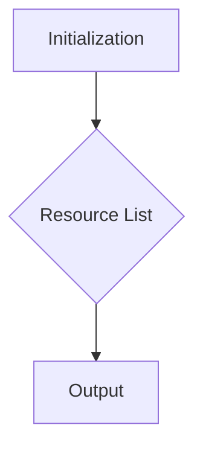

```
## File: hypotez/src/endpoints/prestashop/api_schemas/api_resourses_list.py
# -*- coding: utf-8 -*-\
#! venv/Scripts/python.exe
#! venv/bin/python/python3.12

"""
.. module: src.endpoints.prestashop.api_schemas 
	:platform: Windows, Unix
	:synopsis: Список всех доступных ресурсов для API вызовов

"""
MODE = 'dev'

resource:list = [
    'products', 
    'categories', 
    'attachments', 
    'addresses',  
    'carriers', 
    'cart_rules', 
    'carts',
    'countries',
    'content_management_system',
    'currencies', 
    'customer_messages', 
    'customer_threads',
    'customers',
    'customizations',
    'deliveries',
    'employees', 
    'groups', 
    'guests',
    'image_types',
    'customizations',
    'images',
    'languages', 
    'manufacturers', 
    'messages',
    'order_carriers',
    'order_cart_rules',
    'order_details',
    'order_histories', 
    'order_invoices', 
    'order_payments',
    'order_slip',
    'order_states',
    'orders',
    'price_ranges',
    'product_customization_fields',
    'product_feature_values',
    'product_features', 
    'product_option_values', 
    'product_options',
    'product_suppliers',
    'products',
    'search',
    'shop_groups',
    'shop_urls',
    'shops', 
    'specific_price_rules', 
    'specific_prices',
    'states',
    'stock_availables',
    'stock_movement_reasons',
    'stock_movements',
    'stocks',
    'stores',
    'suppliers', 
    'supply_order_details', 
    'supply_order_receipt_histories',
    'supply_order_states',
    'supply_orders',
    'tags',
    'tax_rule_groups',
    'tax_rules',
    'taxes',
    'translated_configurations',
    'warehouse_product_locations', 
    'warehouses', 
    'weight_ranges',
    'zones',
    ]
```

**<algorithm>**



* **Initialization (A):**  The script initializes a global variable `MODE` to 'dev'.  This likely controls some settings for development versus production.

* **Resource List (B):**  A list named `resource` is created containing strings, which represent available API resources (endpoints).

* **Output (C):** The script simply defines and populates the `resource` list. This list is likely used elsewhere in the application (e.g., API route definitions, documentation generation) to know which endpoints are available.


**<explanation>**

* **Imports:** There are no imports. This script defines a list of strings representing available API resources for a PrestaShop API.

* **Classes:** There are no classes defined.

* **Functions:** There are no functions.

* **Variables:**
    * `MODE`: A string variable, likely a global setting to control configuration.  This variable is probably used for conditional behavior, toggling different sets of actions depending on the `MODE` being 'dev' or another string (not shown).
    * `resource`: A list variable containing strings representing API resource names.


* **Potential Errors/Improvements:**

    * **Incompleteness:** The list might not be exhaustive.  Additional API resources are missing.

    * **Type Hinting:**  While Python 3.12 allows for type hints like `resource:list`, the script lacks checks for input validity. For example, the list should not contain anything but strings for the purpose it is serving.

    * **Documentation:**  More extensive comments could describe the purpose of each resource string, any required parameters, etc. This code might not fit into a larger code base and would be lacking in that context.

* **Relationship with other parts of the project:**

    * **PrestaShop Integration:** This list defines the structure of API calls from `hypotez`.
    * **API Routing:** The resource names would be likely used by a routing or dispatch mechanism in the codebase, mapping the requests to specific processing functions or classes in `endpoints/prestashop/`.
    * **Documentation Generation:** This file might feed into documentation tools to automatically generate API references.

    The structure implies that a main API server likely exists within the project handling the incoming requests to `endpoints/prestashop`.  This file prepares the data structures.