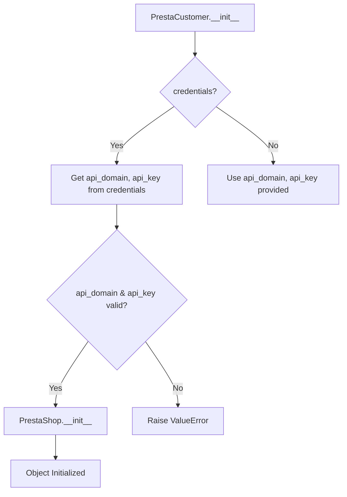

```python
## \file hypotez/src/endpoints/prestashop/customer.py
# -*- coding: utf-8 -*-\
#! venv/Scripts/python.exe
#! venv/bin/python/python3.12

"""
.. module: src.endpoints.prestashop 
	:platform: Windows, Unix
	:synopsis:

"""
MODE = 'dev'


import sys
import os
from attr import attr, attrs
from pathlib import Path
from typing import Union, Optional
from types import SimpleNamespace

import header
from src import gs
from src.logger import logger
from src.utils.jjson import j_loads as j_loads
from .api import PrestaShop
from src.logger import logger
from src.logger.exceptions import PrestaShopException

class PrestaCustomer(PrestaShop):
    """    
    Класс для работы с клиентами в PrestaShop.

    Пример использования класса:

    .. code-block:: python

        prestacustomer = PrestaCustomer(API_DOMAIN=API_DOMAIN, API_KEY=API_KEY)
        prestacustomer.add_customer_PrestaShop('John Doe', 'johndoe@example.com')
        prestacustomer.delete_customer_PrestaShop(3)
        prestacustomer.update_customer_PrestaShop(4, 'Updated Customer Name')
        print(prestacustomer.get_customer_details_PrestaShop(5))
    """
    
    def __init__(self, 
                 credentials: Optional[dict | SimpleNamespace] = None, 
                 api_domain: Optional[str] = None, 
                 api_key: Optional[str] = None, 
                 *args, **kwards):
        """Инициализация клиента PrestaShop.

        Args:
            credentials (Optional[dict | SimpleNamespace], optional): Словарь или объект SimpleNamespace с параметрами `api_domain` и `api_key`. Defaults to None.
            api_domain (Optional[str], optional): Домен API. Defaults to None.
            api_key (Optional[str], optional): Ключ API. Defaults to None.
        """
        
        if credentials is not None:
            api_domain = credentials.get('api_domain', api_domain)
            api_key = credentials.get('api_key', api_key)
        
        if not api_domain or not api_key:
            raise ValueError('Необходимы оба параметра: api_domain и api_key.')
        
        super().__init__(api_domain, api_key, *args, **kwards)
```

**<algorithm>**



**Example Data Flow:**

1.  `PrestaCustomer` object is created.
2.  `credentials` might be provided as a dictionary or `SimpleNamespace`
3.  `api_domain` and `api_key` are extracted from credentials or using directly provided values.
4.  If `api_domain` and `api_key` are valid, the `PrestaShop.__init__` is called.
5.  PrestaShop object initializes with the supplied API information.
6.  Otherwise, a ValueError is raised.


**<explanation>**

* **Imports:**
    * `sys`, `os`: Standard Python libraries for system interactions.
    * `attr`, `attrs`:  For potentially defining attributes of the class in a more structured way.  (Not used directly in this example, however a good practice for organization)
    * `pathlib`: For working with file paths.
    * `Union`, `Optional`, `SimpleNamespace`, `typing`: Type hinting, important for code clarity and maintainability, indicating types of variables.
    * `header`:  Likely a custom module for global header information, not used directly in this example.
    * `gs`: Possibly a custom module for global settings, not directly used in this example.
    * `logger`, `PrestaShopException`: Custom modules for logging and exception handling, showing the use of a structured error handling framework. These import statements reference specific modules under the `src` package.
    * `j_loads`:Likely a custom function for parsing JSON strings under the `src.utils` package.
    * `PrestaShop`: The base class for interacting with the PrestaShop API.  This import shows a clear inheritance relationship, this class is presumably located within the same `prestashop` folder as the current file.
    
* **Classes:**
    * `PrestaCustomer`: Inherits from `PrestaShop`.  It's a specialized class for interacting with PrestaShop customers, handling customer-related API calls. 
        * `__init__`: Initializes the `PrestaCustomer` object.  Takes `credentials` (dictionary or SimpleNamespace), `api_domain` and `api_key` as arguments, allowing for flexible initialization.  Importantly it validates that both `api_domain` and `api_key` are provided. If not it raises a `ValueError`. The use of `credentials` parameter suggests that there's an alternative way of supplying configuration which is more sophisticated (e.g. for reading from a config file or database). The code also calls the `PrestaShop` constructor with the required arguments, which would provide the core API functionality.
* **Functions:**
    * No functions are defined directly in this snippet, but `PrestaShop.__init__` is called.


* **Variables:**
    * `MODE`: A global variable defining the execution mode ('dev').
    * `credentials`: Optional argument for passing API credentials.
    * `api_domain`, `api_key`:  Required parameters for connecting to the PrestaShop API.
    * `args`, `kwargs`:  Standard Python arguments to allow for extending the functionality of the init.

* **Potential Errors/Improvements:**
    * The code is missing the `PrestaShop` class definition which is used in `PrestaCustomer`.  This implies either it's not displayed in the snippet, or an incomplete file.
    * Error handling in `__init__` is crucial, but the code only handles the lack of `api_domain` and `api_key`. More specific validation within `PrestaShop` is likely needed (e.g. ensuring `api_domain` is a valid URL format).
    * The docstrings are comprehensive and well-formatted, but additional comments explaining the inheritance relation between `PrestaCustomer` and `PrestaShop` would increase readability.

* **Relationship Chain:**
    * `PrestaCustomer` inherits from `PrestaShop`.
    * `PrestaShop` likely uses other modules from `src` for logging, error handling, and potentially communication with the PrestaShop API.  This implies a layered structure with a central `src` directory that holds common utilities and components. 

This analysis provides a thorough understanding of the code's functionality, its potential errors and areas for improvement, and its relation to other parts of the project.  Further investigation into the `PrestaShop` class would be necessary to complete the analysis.