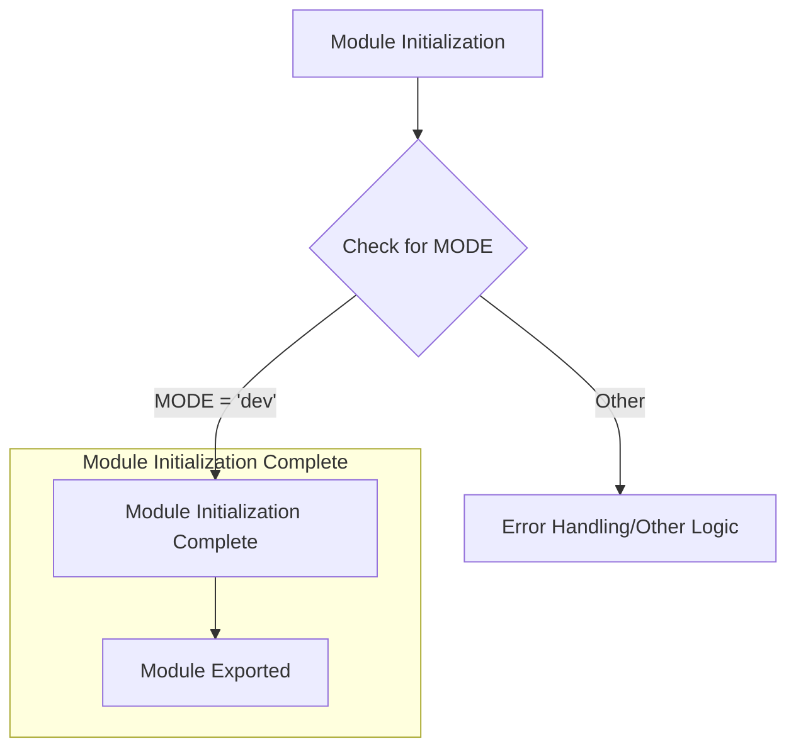

```
## <input code>
```python
## \file hypotez/src/endpoints/prestashop/domains/__init__.py
# -*- coding: utf-8 -*-\
#! venv/Scripts/python.exe
#! venv/bin/python/python3.12

"""
.. module: src.endpoints.prestashop.domains 
	:platform: Windows, Unix
	:synopsis:

"""
MODE = 'dev'

"""
	:platform: Windows, Unix
	:synopsis:

"""


"""
	:platform: Windows, Unix
	:synopsis:

"""


"""
  :platform: Windows, Unix

"""
"""
  :platform: Windows, Unix
  :platform: Windows, Unix
  :synopsis:
"""MODE = 'dev'
  
""" module: src.endpoints.prestashop.domains """

```
## <algorithm>



**Example:**

The `MODE = 'dev'` assignment is a simple initialization step.  If a particular conditional or other logic is dependent on a specific value of `MODE`, that would be elaborated in the `Error Handling/Other Logic` block (D).  If a specific logic related to `MODE` is not found, the execution proceeds as shown in the diagram to "Module Initialization Complete" section.


## <explanation>

**Imports:**

There are no imports in this file.  This is an empty initialization file for the `prestashop/domains` sub-package within the `endpoints` package.


**Classes:**

No classes are defined.


**Functions:**

No functions are defined.


**Variables:**

- `MODE = 'dev'`: This is a global variable. It's likely a configuration variable defining the operation mode (e.g., development, production).  The repeated docstrings and variable definitions are redundant and should be consolidated for maintainability.


**Potential Errors/Improvements:**

1. **Redundant Docstrings:** The repeated docstrings are redundant and contribute to code clutter without providing any extra valuable information. The docstrings for `MODE` should either explain its usage and purpose or be removed.

2. **Unnecessary Shebangs:**  The shebang lines (`#! venv/Scripts/python.exe`, `#! venv/bin/python/python3.12`) are likely relics from an older environment setup or a misguided attempt to specify a Python interpreter.  They are not necessary and can be removed to increase clarity and reduce potential issues in deployment or different operating systems.

3. **Missing Functionality:** This file appears to be a stub or an incomplete initialization file.  In a real-world scenario, there would likely be import statements to import necessary packages and classes that would be essential in `src.endpoints.prestashop.domains`. The `MODE` variable has no impact without imports that reference it.

4. **Lack of Logic:** There is no logic that describes how this file relates to the external world (e.g., interacting with the PrestaShop API).


**Relationship with other parts of the project:**

This file is likely meant to be an initialization module for a sub-package (`domains`) within the `endpoints` package.  This means other modules within the `prestashop/domains` package would interact with this file by importing modules or classes or functions.  This might include functions, classes, or methods that handle requests, responses, or data processing that is relevant to a particular PrestaShop domain (e.g., product, category, etc.).